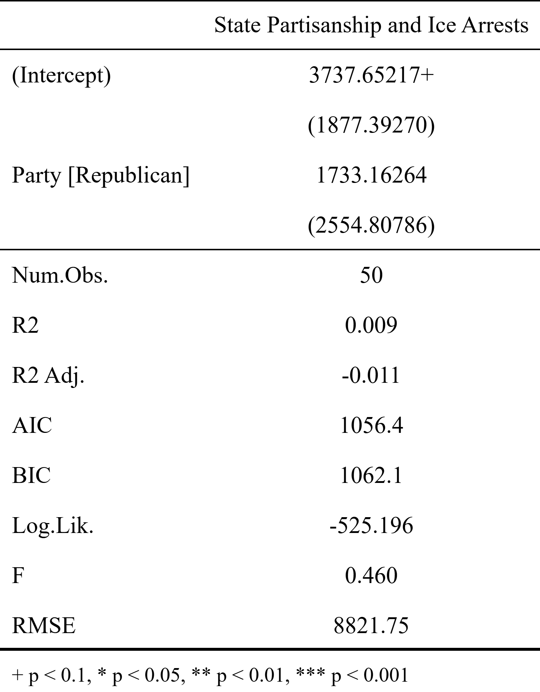
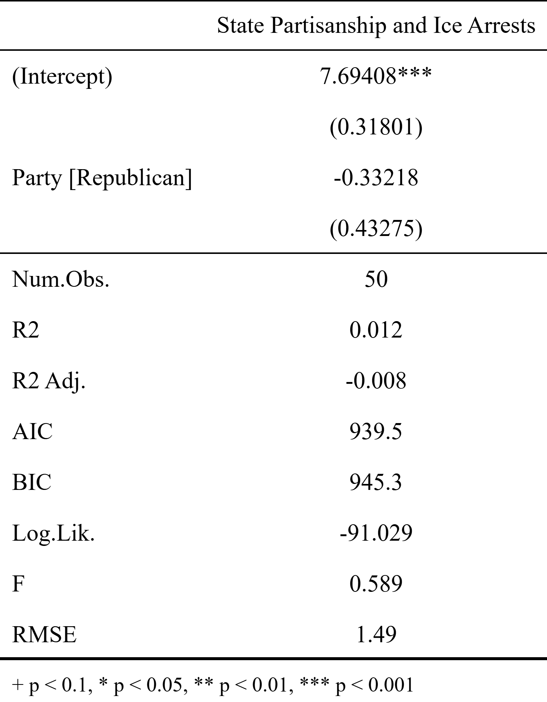
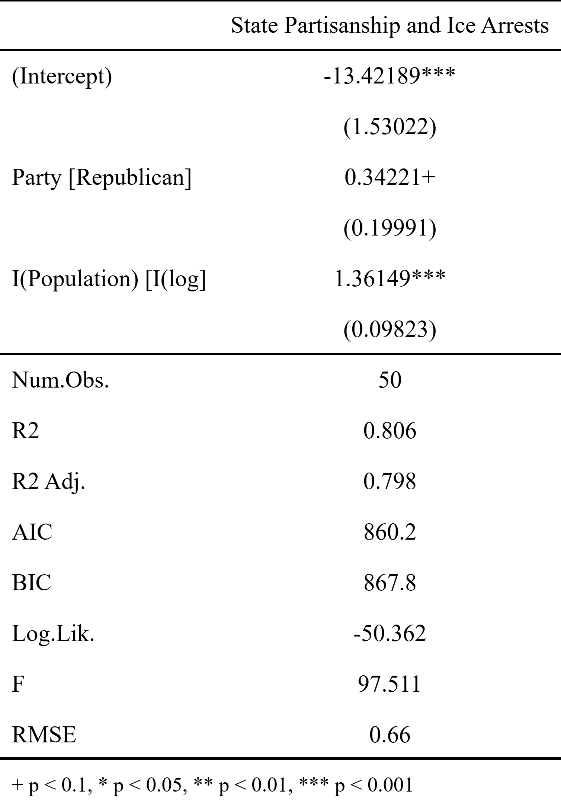

#######################
## Problem Set 1     ##
#######################

**Due Date**: January 16, 2026  
**Submission**: [https://canvas.northwestern.edu/courses/245562/assignments/1676620](https://canvas.northwestern.edu/courses/245562/assignments/1676620)

####################
## Problem 1      ##
####################

*Explain in your own words: What is regression trying to achieve? How does it differ from simply calculating the correlation between two variables?*

Regression is trying to estimate the conditional expectation function of an outcome variable ($y$) based on the value(s) of one or more right-hand-side variables ($X$). That is, regression is estimating the expected value of $y$ for a given set of values of $X$, which can be useful for forecasting or describing relationships. 

In comparison with a correlation, regression is directed: we are looking at a statistical relationship *from* $X$ *to* $y$, not an undirected relationship between $x$ and $y$ as in a correlation.

####################
## Problem 2      ##
####################

*In your experience and judgment, what is the difference between a good and a bad scatterplot? What are the goals of visualizations like scatterplots in the context of social science data analysis?*

A good scatterplot is clearly labeled, with the variables involved cleanly indicated on each axis and the purpose of the plot conveyed through the title. It is also set up in such a way that data points are easily distinguishable and legible. There is not a large mass of overlapping data points, for example, nor are categorical scores stacked on top of each other.

The goals of visualizations are to quickly and easily convey the structure of data and allow an audience to understand patterns and exceptions using as little effort as possible.

####################
## Problem 3      ##
####################

Let's figure out whether there have been equal numbers of ICE arrests in 2024 in states with Democratic and Republican governors. We have a dataset pulled from Wikipedia that lists details about governors, and the deportation data. Let's start by getting both of these loaded into our R workspace.

```{r}
governor_data <- read.csv("https://github.com/jnseawright/ps210/raw/refs/heads/main/Data/stategovs.csv")
ice_arrests <- read.csv("https://github.com/jnseawright/ps210/raw/refs/heads/main/Data/icearrests.csv")
```

Now what we want to do is create a new variable in the ICE data that records the partisanship of the state governor where the arrest happens.

```{r}
#This command creates a new empty variable called Party.
ice_arrests$Party <- NA

#This block of commands is going to loop through the ice_arrests database and 
#check the relevant partisanship of the governor for each arrest
for (i in 1:nrow(ice_arrests)){
  #This command is checking if a given arrest happened in one of the 50 states.
  #Some arrests have no recorded location, some happen in international travel,
  #some happen on military bases, etc. For those, we'll record the party as
  #missing.
  if (!ice_arrests$State[i] %in% levels(as.factor(governor_data$State)))
    ice_arrests$Party[i] <- NA
    #When the party isn't missing, we'll set it from the governor data.
    else ice_arrests$Party[i] <- governor_data$Party[governor_data$State==ice_arrests$State[i]]
}
```

**3a. Run a regression predicting state-level ICE arrests relative to the party controlling the state governorship. Interpret the results.**

```{r}
library(tidyverse)

state_ice <- ice_arrests %>%
  group_by(State) %>%
  summarise(
    Arrests = n(),
    Party = first(Party)
  )

state_ice$State[state_ice$State==""] <- "None"

icegov.lm <- lm(Arrests ~ Party, data=state_ice)

library(modelsummary)
library(kableExtra)

icegov.summary <- modelsummary( list("State Partisanship and Ice Arrests" = icegov.lm),
             output = "icegov.png",
             stars = TRUE,
             statistic = "std.error",  
             coef_rename = TRUE,
             escape = FALSE,
             fmt = fmt_decimal(5),
             gof_map = "all") 


```

 

We see that states with Republican governors on average have slightly more ICE arrests than states with Democratic governors. The difference is about 1,700. However, in a context where the standard deviation of the dependent variable (state counts of ICE arrests) is about 10,000, this difference is substantively pretty small. We can also see that it has a high standard error, and overall there is little evidence that state party politics has a connection to ICE activity in these data.

**3b. Before running your regression, create an appropriate visualization to explore the relationship between governor's party and ICE arrests. Consider using a boxplot, violin plot, or jittered scatterplot. Describe what you observe in the visualization and how it complements or contrasts with your regression results.**

I probably should have put this problem before part a!

```{r}
ggplot(state_ice, aes(x = Party, y = Arrests, fill = Party)) +
  geom_boxplot(alpha = 0.7, width = 0.5, outlier.shape = NA) +
  geom_jitter(width = 0.2, alpha = 0.5, size = 2, color = "gray30") +
  labs(
    title = "Distribution of Arrests by Political Party",
    subtitle = "Box plot with individual observations",
    y = "Number of Arrests",
    x = "Political Party"
  ) +
  scale_fill_brewer(palette = "Set2") +
  theme_minimal(base_size = 14) +
  theme(
    plot.title = element_text(face = "bold", hjust = 0.5),
    plot.subtitle = element_text(hjust = 0.5, color = "gray50"),
    legend.position = "none",
    panel.grid.major.x = element_blank()
  )
```

We see a large cluster of states with relatively low levels of arrests, and a small set of outlier states with high numbers of arrests. This sort of distribution might cause troubles for our regression, and we might want to revisit the analysis with a logged version of the dependent variable.

```{r}
ggplot(state_ice, aes(x = Party, y = log(Arrests), fill = Party)) +
    geom_boxplot(alpha = 0.7, width = 0.5, outlier.shape = NA) +
    geom_jitter(width = 0.2, alpha = 0.5, size = 2, color = "gray30") +
    labs(
        title = "Distribution of Arrests by Political Party",
        subtitle = "Box plot with individual observations",
        y = "Logged Number of Arrests",
        x = "Political Party"
    ) +
    scale_fill_brewer(palette = "Set2") +
    theme_minimal(base_size = 14) +
    theme(
        plot.title = element_text(face = "bold", hjust = 0.5),
        plot.subtitle = element_text(hjust = 0.5, color = "gray50"),
        legend.position = "none",
        panel.grid.major.x = element_blank()
    )
```

Here we see that states with Democratic and Republican governors appear to have similar numbers of arrests, but that Republican states might be a bit less predictable than Democratic states. In any case, we can reincorporate this insight into our regression. We don't expect major new insights, but it should be a better model because it is less fragile and should rely less heavily on a handful of highly influential observations.

```{r}
icegov2.lm <- lm(I(log(Arrests)) ~ Party, data=state_ice)

icegov2.summary <- modelsummary( list("State Partisanship and Ice Arrests" = icegov2.lm),
             output = "icegov2.png",
             stars = TRUE,
             statistic = "std.error",  
             coef_rename = TRUE,
             escape = FALSE,
             fmt = fmt_decimal(5),
             gof_map = "all") 


```

 


*Hint: You may need to aggregate the data to state level or sample appropriately for visualization given the dataset's size.*

####################
## Problem 4      ##
####################

A common feature of regression in social science applications is multivariate analysis. It might make sense to add state populations as a conditioning variable in the regression from the previous problem. Let's start by adding data on population to our ice_arrests dataset.

```{r}
state_pops <- read.csv("https://github.com/jnseawright/ps210/raw/refs/heads/main/Data/statepops.csv")
```

Now we can use a version of our code from above that copies in state populations instead of partisanship.

```{r}
#This command creates a new empty variable called Population.
ice_arrests$Population <- NA

#This block of commands is going to loop through the ice_arrests database and 
#check the relevant population of the state for each arrest
for (i in 1:nrow(ice_arrests)){
  #This command is checking if a given arrest happened in one of the 50 states.
  #Some arrests have no recorded location, some happen in international travel,
  #some happen on military bases, etc. For those, we'll record the population as
  #missing.
  if (!ice_arrests$State[i] %in% levels(as.factor(state_pops$State)))
    ice_arrests$Population[i] <- NA
    #When the population isn't missing, we'll set it from the state population data.
    else ice_arrests$Population[i] <-   
        state_pops$Population2024[state_pops$State==ice_arrests$State[i]]
}

#This variable often reads in with commas and gets treated as text, so we'll 
#make sure to convert it to an actual number.
ice_arrests$Population <- parse_number(ice_arrests$Population)
```

**4a. Run a regression predicting state-level ICE arrests as a function of which party controls the governorship and also state population. Once again, interpret your results, also describing any interesting comparisons with the bivariate results in Problem 3.**

```{r}
state_ice <- ice_arrests %>%
  group_by(State) %>%
  summarise(
    Arrests = n(),
    Party = first(Party),
    Population = first(Population)
  )

state_ice$State[state_ice$State==""] <- "None"

icegov3.lm <- lm(I(log(Arrests)) ~ Party + I(log(Population)), data=state_ice)

icegov3.summary <- modelsummary( list("State Partisanship and Ice Arrests" = icegov3.lm),
             output = "icegov3.png",
             stars = TRUE,
             statistic = "std.error",  
             coef_rename = TRUE,
             escape = FALSE,
             fmt = fmt_decimal(5),
             gof_map = "all") 


```

 

I've added in the population variable in logged form, so that it's on the same scale as the outcome and also because I expect it to have the same skewed distribution as the outcome. We see that there's a strong connection between state population and ICE arrests: larger states have more arrests, which makes intuitive sense.

When taking population and the skewed nature of the distribution into account, we see a possible marginal difference between Republican-governed and Democratic-governed states, with the former perhaps having somewhat more arrests given the population than the latter.

Compared to the bivariate regression with a logged dependent variable, the coefficient for having a Republican governor is about the same magnitude but in the opposite direction (0.34 in this model vs. -0.33 in the bivariate model). However, the estimation is substantially more precise, with the standard error now being about 0.2, compared with 0.43 in the bivariate model. This creates a situation in which there is now a nearly-significant positive coefficient as compared to the obviously insignificant negative coefficient of the bivariate model.

However, the coefficient is still substantively not too large and is still a bit uncertain in terms of precision. Taken as a whole, there is still not persuasive evidence that state party politics influences ICE enforcement practices.


**4b. Create a scatterplot of ICE arrests against state population, using color to distinguish between states with Democratic and Republican governors. Add regression lines (either separate lines for each party or one overall line) to visualize the relationship. Discuss how this visualization helps you understand the multivariate regression results. What patterns do you see that might not be apparent from the regression table alone?**

```{r}
ggplot(state_ice, aes(x = Population, y = log(Arrests), color = Party)) +
    geom_point(size = 3, alpha = 0.7) +
    geom_smooth(method = "lm", se = TRUE, alpha = 0.2, size = 1.2) +
    scale_color_manual(
        values = c(Democratic = "#0015BC", Republican = "#E9141D"),
        labels = c("Democratic Governor", "Republican Governor")
    ) +
    labs(
        title = "ICE Arrests vs State Population by Party",
        x = "State Population",
        y = "Logged Number of ICE Arrests",
        color = "Governor's Party"
    ) +
    scale_x_continuous(labels = scales::comma) +
    scale_y_continuous(labels = scales::comma) +
    theme_minimal(base_size = 14) +
    theme(
        plot.title = element_text(face = "bold", hjust = 0.5, size = 16),
        plot.subtitle = element_text(hjust = 0.5, color = "gray50"),
        legend.position = "bottom",
        legend.title = element_text(face = "bold"),
        panel.grid.minor = element_blank()
    )
```

Generally speaking, there is no clear separation in the points. The states with high populations are still doing a lot of work, even with the log transformation, and a relatively lower arrest rate in California --- the largest US state --- is obviously the most influential fact in this model. Do we want to draw strong statistical conclusions from California's comparatively different patterns, or does it deserve closer scrutiny as a stand-alone case? I don't think that's easy to answer from either the regression or these visualizations.

####################
## Problem 5      ##
####################

**Reflection question: Based on your analysis in Problems 3 and 4, what are at least two limitations of using governor's partisanship as a predictor of ICE arrests? Consider both methodological issues (e.g., measurement, confounding variables) and substantive concerns (e.g., causal mechanisms, political context).**

States may have a governor who is out of line with the underlying partisanship of the state as a whole. Think for example of periods when Massachusetts, California, or New York had a Republican governor but a Democratic supermajority in the state legislature and in most other domains.

It is conceivable that ICE enforcement is distinctively targeted toward demographically changing states, which may also be in partisan transition of various kinds. In this scenario, demographic change might cause both partisanship and ICE arrests.

ICE arrests in Republican states may reflect a lower effort level than the equivalent number of arrests in Democratic states, given the politics of sanctuary policies, etc. As such, this analysis may not clearly capture differences in the intensity of immigration enforcement.

The apparent importance of a single state, California, may point toward fragility in the analysis as a whole.

Etc.