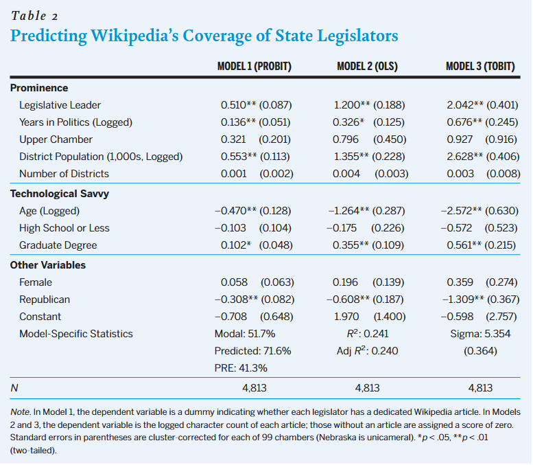

class: center, middle

```{css, echo=FALSE}
pre {
  max-height: 400px;
  overflow-y: auto;
}

pre[class] {
  max-height: 200px;
}
```

```{r, load_refs, include=FALSE, cache=FALSE}
# Initializes
library(RefManageR)

library(ggplot2)
library(dplyr)
library(readr)
library(nlme)
library(jtools)
library(mice)
library(knitr)
library(modelsummary)
library(kableExtra)
library(stringr)

BibOptions(check.entries = FALSE,
           bib.style = "authoryear", # Bibliography style
           max.names = 3, # Max author names displayed in bibliography
           sorting = "nyt", #Name, year, title sorting
           cite.style = "authoryear", # citation style
           style = "markdown",
           hyperlink = FALSE,
           dashed = FALSE)

```
```{r xaringan-themer, include=FALSE, warning=FALSE}
library(xaringanthemer,MnSymbol)
style_mono_accent(
  base_color = "#1c5253",
  header_font_google = google_font("Josefin Sans"),
  text_font_google   = google_font("Montserrat", "300", "300i"),
  code_font_google   = google_font("Fira Mono"),
  text_font_size = "1.6rem"
)
```

```{r setup, include=FALSE}
knitr::opts_chunk$set(warning = FALSE)

library(readr)
turnout <- read_csv("https://raw.githubusercontent.com/jnseawright/ps405/refs/heads/main/Data/turnout.csv")

```

* Up until this point, we've been thinking about models and parameters operating at the population level.

* To do empirical research, we're going to have to estimate: use finite amounts of data to come up with best guesses about population statistics.

---

*Plug-in principle:*

In a formula for a model of interest, replace population moments with their sample equivalents.

(E.g., replace expectations with sample means, replace covariances with sample covariances, replace variances with sample variances...)

---

Remember the regression model:

$$y = \beta_0 + \beta_1x_1 + \epsilon$$

Let's assume $y$ and $x_1$ both have mean 0, so that $\beta_0$ disappears.

$$y = \beta_1x_1 + \epsilon$$

Our approach is to choose $\beta_1$ to minimize $\text{E}(y - \beta_1x_1)^2$.

---

To minimize $\text{E}(y - \beta_1x_1)^2$, we take its derivative with respect to $\beta_1$ and set the result equal to zero.

$$\frac{\partial \text{E}(y - \beta_1x_1)^2}{\partial \beta_1} = 0$$
$$\text{E}(2(y - \beta_1x_1)(-x_1)) = 0$$
$$\text{E}(-2 x_1 y + 2\beta_1x_1^2) = 0$$
$$\text{E}(-2 x_1 y) + \text{E}(2\beta_1x_1^2) = 0$$
$$-2\text{E}(x_1 y) + 2\beta_1\text{E}(x_1^2) = 0$$
---

$$-2\text{E}(x_1 y) + 2\beta_1\text{E}(x_1^2) = 0$$

$$-\text{E}(x_1 y) + \beta_1\text{E}(x_1^2) = 0$$


$$-\text{cov}(x_1, y) + \beta_1\text{var}(x_1) = 0$$
$$\beta_1\text{var}(x_1) = \text{cov}(x_1, y)$$
$$\beta_1^* = \frac{\text{cov}(x_1, y)}{\text{var}(x_1)}$$
Then our plug-in principle estimate is:

$$\hat\beta = \frac{\sum_{i=1}^{N}(x_i * y_i)}{\sum_{i=1}^{N}(x_i^2)}$$

---

For multivariate models, the process of the argument is basically the same, but the setup uses matrix algebra and calculus. As we'll discuss a couple more times, the regression model in matrix form looks like this:

$$Y = \mathbb{X} \beta + \epsilon$$

Here, $Y$ and $\epsilon$ are $N$ by 1 vectors. $\mathbb{X}$ is an $N$ by $k$ matrix, where $k$ is one plus the number of independent variables in the regression. Finally, $\beta$ is a $k$ by 1 vector of coefficients (including the intercept).

---

It will turn out that the plug-in estimate here is:

$$\hat\beta = (\sum_{i=1}^N \mathbf{X}_{i}\mathbf{X}_{i}^T)^{-1}(\sum_{i=1}^N\mathbf{X}_{i}\mathbf{Y}_{i})$$

---

Consider our turnout regressions from a bit back:

```{r, echo = TRUE, eval=TRUE, out.width="90%", fig.retina = 1, fig.align='center'}
summary(lm(Turnout ~ GDP, data=turnout))
```


---

```{r, echo = TRUE, eval=TRUE, out.width="90%", fig.retina = 1, fig.align='center'}
with(turnout, cov(Turnout, GDP, use="complete")/var(GDP, use="complete"))
```

---

```{r, echo = TRUE, eval=TRUE, out.width="90%", fig.retina = 1, fig.align='center'}
summary(lm(Turnout ~ GDP + Temperature, data=turnout))
```

---

```{r, echo = TRUE, eval=TRUE, out.width="90%", fig.retina = 1, fig.align='center'}
xmat <- as.matrix(with(turnout, data.frame(Intercept=1, GDP=GDP, Temperature=Temperature)))
yvec <- turnout$Turnout
xmat
yvec
```


---

```{r, echo = TRUE, eval=TRUE, out.width="90%", fig.retina = 1, fig.align='center'}
xmat <- xmat[13:nrow(xmat),]
yvec <- yvec[13:length(yvec)]
```

---

```{r, echo = TRUE, eval=TRUE, out.width="90%", fig.retina = 1, fig.align='center'}
t(xmat)%*%xmat
t(xmat)%*%yvec
```

---

```{r, echo = TRUE, eval=TRUE, out.width="90%", fig.retina = 1, fig.align='center'}
solve(t(xmat)%*%xmat, tol=1e-20)
solve(t(xmat)%*%xmat, tol=1e-20)%*%t(xmat)%*%yvec
```

---


---

