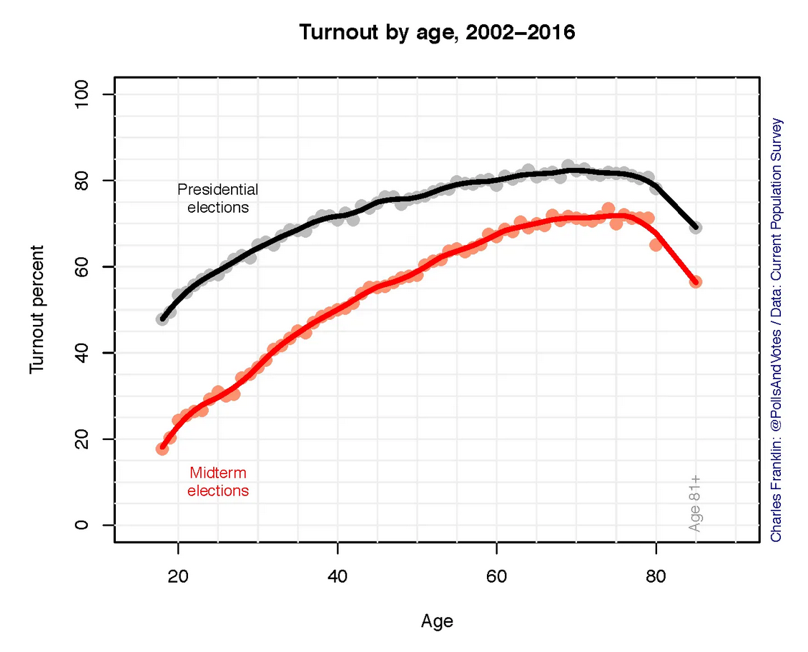
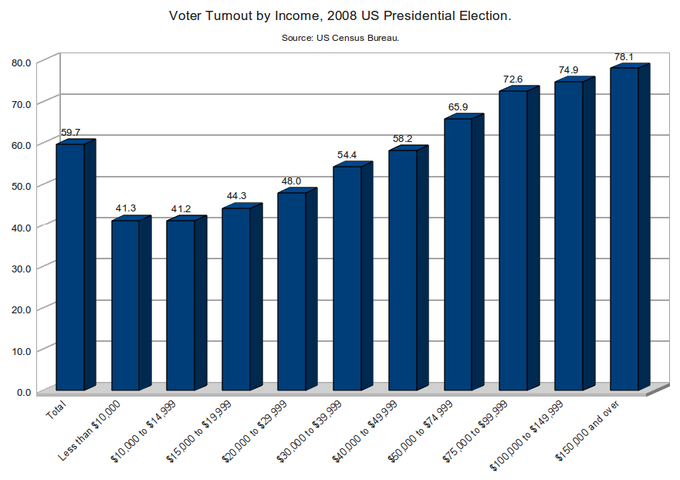
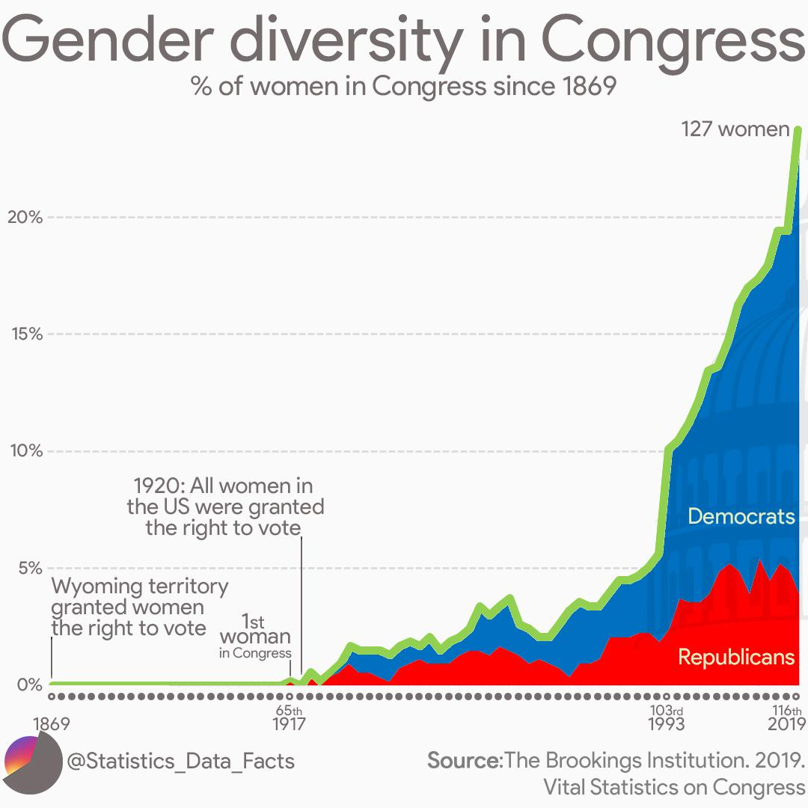
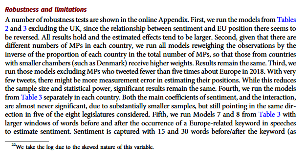
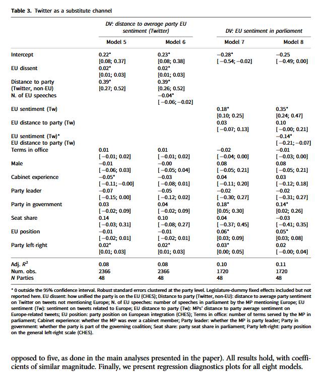
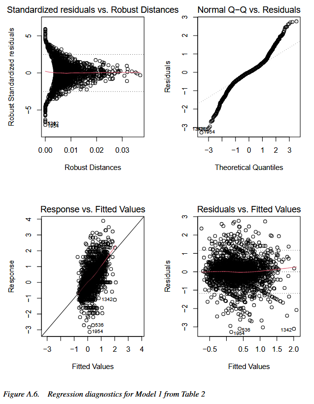

class: center, middle


```{css, echo=FALSE}
pre {
  max-height: 400px;
  overflow-y: auto;
}

pre[class] {
  max-height: 200px;
}
```

```{r, load_refs, include=FALSE, cache=FALSE}
# Initializes
library(RefManageR)

library(ggplot2)
library(dplyr)
library(readr)
library(nlme)
library(jtools)
library(mice)
library(knitr)
library(modelsummary)
library(kableExtra)
library(stringr)

BibOptions(check.entries = FALSE,
           bib.style = "authoryear", # Bibliography style
           max.names = 3, # Max author names displayed in bibliography
           sorting = "nyt", #Name, year, title sorting
           cite.style = "authoryear", # citation style
           style = "markdown",
           hyperlink = FALSE,
           dashed = FALSE)

library(rqog)
qogts <- read_qog(which_data="standard", data_type = "time-series")

```
```{r xaringan-themer, include=FALSE, warning=FALSE}
library(xaringanthemer,MnSymbol)
style_mono_accent(
  base_color = "#1c5253",
  header_font_google = google_font("Josefin Sans"),
  text_font_google   = google_font("Montserrat", "300", "300i"),
  code_font_google   = google_font("Fira Mono"),
  text_font_size = "1.6rem"
)

knitr::opts_chunk$set(warning = FALSE, message = FALSE)

```

### **The Problem**
- Regression models make strong assumptions

---
### **The Problem**

- Violations can lead to:
  - **Biased coefficients**
  - **Invalid inferences**
  - **Poor predictions**

---
# Key Assumptions of Regression

### **1. Validity** 
Data fit the concepts and populations in the research question
- Outcome measures the phenomenon
- Model includes relevant predictors
- Generalizes to target cases

---
# Key Assumptions of Regression

### **2. Representativeness**
Sample reflects population (conditional on X)
- Selection on X is OK
- Selection on Y is problematic
- Even with "all" data (e.g., all elections)


---
# Key Assumptions of Regression

### **3. Additivity & Linearity**
Predictors combine linearly
- Some political relationships are nonlinear
- Age × voting, income × participation
- Nonlinear relationships are fine if we can include them as linear terms

---
# Key Assumptions of Regression


### **4. Independence of Errors**
No autocorrelation (time/space)

---
# Key Assumptions of Regression


### **5. Equal Variance (Homoscedasticity)**
Constant prediction uncertainty

---
# Key Assumptions of Regression


### **6. Normality of Errors**
Least important for estimation

---
# Representativeness: Selection Bias

### **The Core Issue**
Selection on Y biases coefficients

---

```{r selection-example, echo=TRUE}
set.seed(123)
n <- 1000
pop_data <- data.frame(
  ideology = rnorm(n, 0, 1),
  income = rnorm(n, 50000, 15000)
)

# Make voting probability depend on ideology and income
prob_vote <- plogis(0.5 + 0.3*pop_data$ideology + pop_data$income/100000)
pop_data$vote <- rbinom(n, 1, prob_vote)

# Selection: only voters in sample
sample_data <- pop_data %>% 
  filter(vote == 1) %>% 
  slice_sample(n = 200)

cat("Population correlation (ideology, income):", 
    round(cor(pop_data$ideology, pop_data$income), 3), "\n")
cat("Sample correlation (ideology, income):", 
    round(cor(sample_data$ideology, sample_data$income), 3))
```


---
# Representativeness: Selection Bias

### **Political Science Examples**

1. **Survey non-response**
   - Political interest → participation → survey response
2. **Media coverage**
   - Extreme cases get coverage → biased perception

---
# Representativeness: Selection Bias

### **Political Science Examples**

3\. **Historical records**
  - Surviving documents ≠ all documents
  
4\. **Elite interviews**
  - Accessible elites ≠ all elites

---
# Representativeness: Selection Bias

### **Solutions**
- Weighting
- Selection models
- Multiple data sources

---
# Additivity & Linearity: Nonlinear Reality

| | | |
|:---:|:---:|:---:|
|  |  |  |

Always check for nonlinearity. Consider transformations or flexible models.

---
# Diagnostic Tool 1: Residual Plots

### **What to Plot**
```{r residual-code, eval=TRUE}
la_electoral <- read.csv("../Data/laelectoral.csv")

# After fitting model
fit <- lm(voteswoninc ~ gdpgrowthlag + votesinclag, data = la_electoral)

# Base R
plot(fit, which = 1)  # Residuals vs Fitted

# ggplot2
library(ggplot2)
election_data$residuals <- resid(fit)
election_data$fitted <- fitted(fit)

ggplot(election_data, aes(x = fitted, y = residuals)) +
  geom_point(alpha = 0.6) +
  geom_hline(yintercept = 0, linetype = "dashed") +
  geom_smooth(se = FALSE)
```

---

### **What to Look For**

```{r residual-patterns, echo=FALSE, fig.height=4}
set.seed(123)
par(mfrow = c(2, 2), mar = c(4, 4, 2, 2))

# Good residuals
x <- 1:100
y_good <- 2*x + rnorm(100, 0, 10)
fit_good <- lm(y_good ~ x)
plot(fitted(fit_good), resid(fit_good), main = "Good: No Pattern")

# Funnel shape (heteroscedasticity)
y_funnel <- 2*x + rnorm(100, 0, 0.2*x)
fit_funnel <- lm(y_funnel ~ x)
plot(fitted(fit_funnel), resid(fit_funnel), main = "Bad: Funnel Pattern")

# Curvilinear
y_curve <- 2*x + 0.1*x^2 + rnorm(100, 0, 10)
fit_curve <- lm(y_curve ~ x)
plot(fitted(fit_curve), resid(fit_curve), main = "Bad: Curved Pattern")
```

---
# Diagnostic Tool 2: Posterior Predictive Checks

### **The Idea**
1. Fit your model
2. Simulate new data from it
3. Compare simulated data to real data
4. If they look different → model problems

---
### **Bayesian Implementation**
```{r ppc-code, eval=FALSE}
# Using rstanarm
library(rstanarm)
fit_bayes <- stan_glm(vote ~ economy + war, 
                      data = election_data,
                      family = gaussian(),
                      seed = 123)
```

---

```{r ppc-code-2, eval=FALSE}
# Generate posterior predictions
y_rep <- posterior_predict(fit_bayes)

# Compare distributions
bayesplot::ppc_dens_overlay(election_data$vote, y_rep[1:50, ])
```

---

```{r ppc-example, echo=FALSE, fig.height=4.5}
# Simulate a PPC example
set.seed(123)
n <- 100
x <- rnorm(n)
true_y <- 1 + 0.5*x + rnorm(n, 0, 1)
observed <- true_y + rnorm(n, 0, 0.5)  # Add measurement error

# Simulate replications
reps <- matrix(NA, nrow = 20, ncol = n)
for(i in 1:20) {
  reps[i, ] <- 1 + 0.5*x + rnorm(n, 0, 1.2)  # Slightly wrong SD
}

# Plot
par(mfrow = c(1, 1))
plot(density(observed), main = "Posterior Predictive Check",
     xlab = "Outcome", ylab = "Density", lwd = 2, col = "blue",
     ylim = c(0, 0.4))
for(i in 1:10) {
  lines(density(reps[i, ]), col = rgb(0.5, 0.5, 0.5, 0.3))
}
legend("topright", legend = c("Observed", "Replications"),
       col = c("blue", "gray"), lwd = c(2, 1))
```

---
# Diagnostic Tool 3: Cross-Validation

### **Why CV?**
- In-sample fit ≠ out-of-sample performance
- Prevents overfitting
- Estimates predictive accuracy

---

### **Types of CV**
1. **Leave-One-Out (LOO)**
   - Each observation left out once
   - Computationally efficient approximation

2. **K-Fold** (e.g., 10-fold)
   - Random partitions
   - More stable with outliers

3. **Time-Series CV**
   - Train on past, test on future
   - Critical for political forecasting

---
### **Implementation in R**

```{r cv-code, eval=TRUE}
library(rstanarm)
library(loo)

# Fit Bayesian model
fit <- stan_glm(vdem_libdem ~ I(log(wdi_gdpcappppcon2017)) + wdi_gerp,
                data = qogts)

# LOO Cross-Validation
loo_result <- loo(fit)
print(loo_result)

# Compare models
fit2 <- stan_glm(vdem_libdem ~ I(log(wdi_gdpcappppcon2017)) + wdi_gerp + as.factor(ht_colonial), data = qogts)
loo2 <- loo(fit2)
loo_compare(loo_result, loo2)
```

---

### **Interpretation**
- `elpd_diff`: Difference in expected log predictive density
- Rule of thumb: `elpd_diff > 4` suggests meaningful difference

---
# $R^2$ and Explained Variance

$$R^2 = 1 - \frac{\sum_{i=1}^{n} e_{i}^2}{\sum_{i=1}^{n} y_{i}^2}$$
---

### **What $R^2$ Tells Us**
- Proportion of variance "explained"
- Range: 0 (worst) to 1 (best)

---

### **But in social science...**
- **Low $R^2$ is common.**
- Political behavior is noisy
- Measurement error, multiple causation, heterogeneity

---

```{r rsquared-examples, echo=FALSE}
# Example R² values from political science
examples <- data.frame(
  Study = c("Populism and Referenda (Werner and Jacobs 2022)",
           "Strongmen and Geographic Vote Choice (Hong et al. 2023)",
           "Explaining Populism (Schafer 2022)"),
  R2 = c(0.06, 0.84, 0.17),
  Interpretation = c("A bit low, but okay",
                    "Double-check the model",
                    "Normal for individual data")
)

knitr::kable(examples, format = "html") %>%
  kableExtra::kable_styling(full_width = FALSE)
```


---

```{r rsquared-examples-2, echo=FALSE}
# Example R² values from political science
examples <- data.frame(
  Study = c(
           "Supreme Court Legitimacy (Gibson 2025)",
           "Subnational Democratic Backsliding (Grumbach 2023)"),
  R2 = c(0.24, 0.68),
  Interpretation = c(
                    "Good for individual data",
                    "High numbers because aggregate")
)

knitr::kable(examples, format = "html") %>%
  kableExtra::kable_styling(full_width = FALSE)
```

---

### **Bayesian $R^2$**
- Mathematicaly different because the variance of Bayesian predicted values can sometimes be higher than the variance of the original data

---

```{r bayes-r2-code, eval=TRUE}
# Bayesian R2 with uncertainty
bayes_R2(fit)  # Returns posterior distribution
```

---

```{r bayes-r2-code-2, eval=TRUE}
summary(bayes_R2(fit))
```

---

### **Warning Signs**
- $R^2$ > 0.9 in social science: suspect too many variables or close to saturation
- $R^2$ changes dramatically with small changes: suspect multicollinearity or missing data issues

---
# Practical Workflow

## **The Diagnostic Pipeline**

### **Step 1: Before Modeling**
1. **Theory-driven variable selection**
2. **Check data quality**
3. **Visualize relationships**
4. **Consider transformations**

---

### **Step 2: During Modeling**
1. **Fit multiple specifications**
2. **Examine residuals**
3. **Test for nonlinearities**

---

### **Step 3: After Modeling**
1. **Posterior predictive checks**
2. **Cross-validation**
3. **Sensitivity analysis**
4. **Compare to simpler models**

---

### **Step 4: Reporting**
1. **Transparency about assumptions**
2. **Diagnostic results**
3. **Model limitations**
4. **Robustness checks**

```

---


---




---




---

{width=50%}
