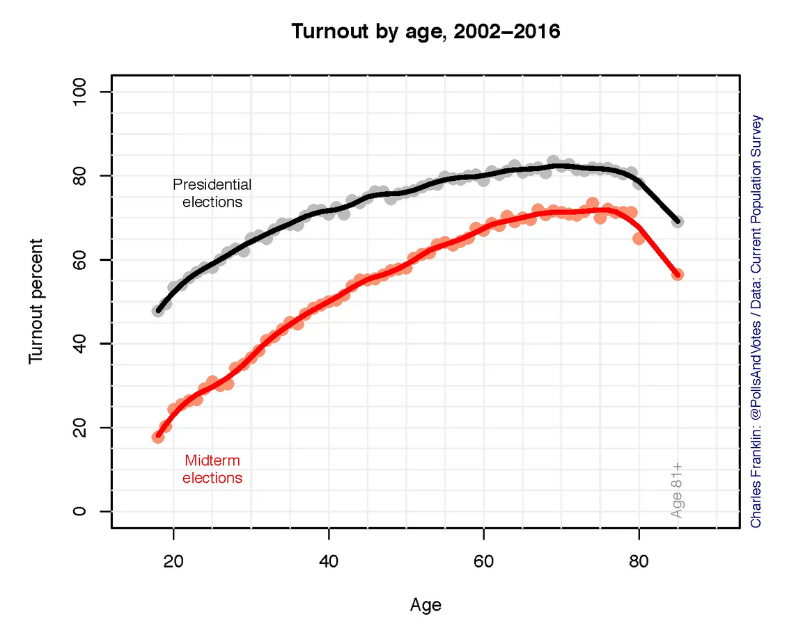
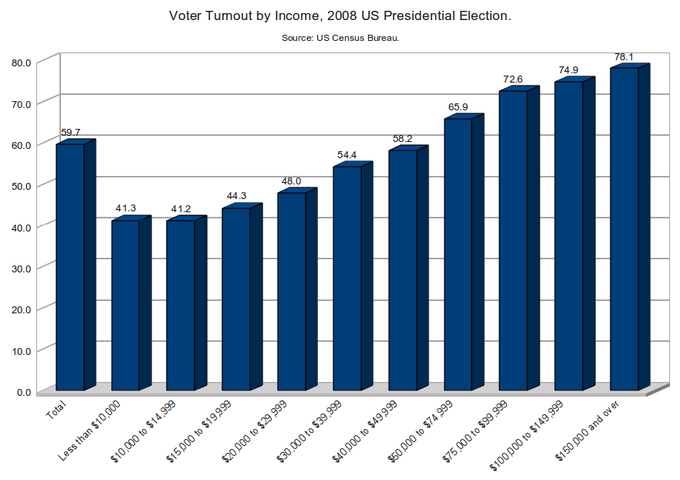
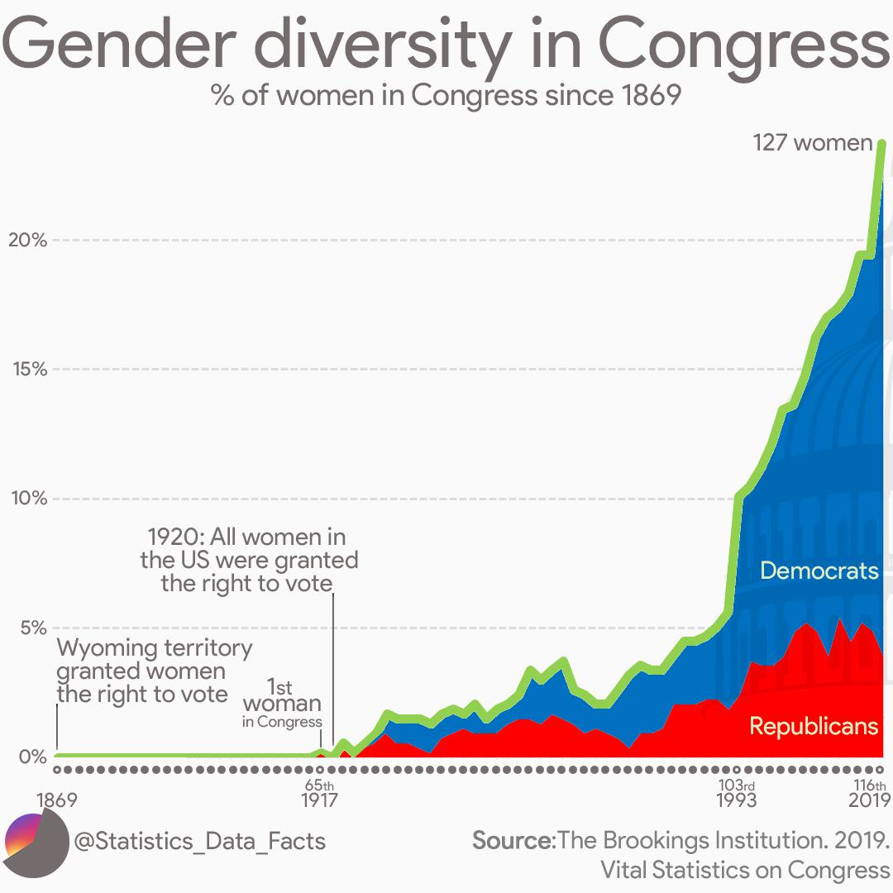
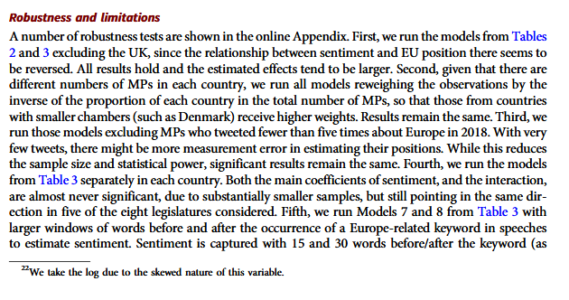
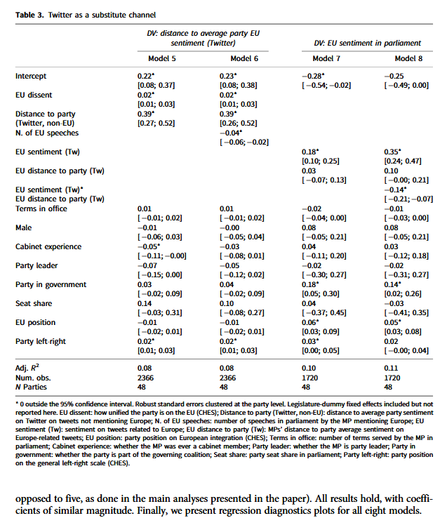
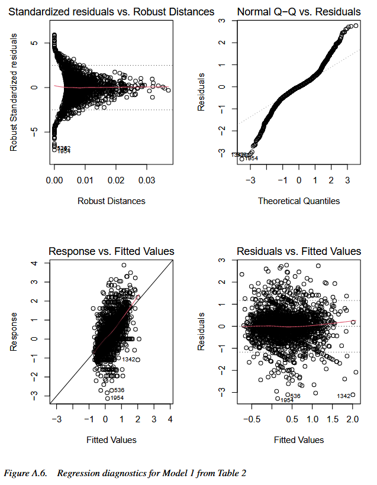

class: center, middle


```{css, echo=FALSE}
pre {
  max-height: 400px;
  overflow-y: auto;
}

pre[class] {
  max-height: 200px;
}
```

```{r, load_refs, include=FALSE, cache=FALSE}
# Initializes
library(RefManageR)

library(ggplot2)
library(dplyr)
library(readr)
library(nlme)
library(jtools)
library(mice)
library(knitr)
library(modelsummary)
library(kableExtra)
library(stringr)

BibOptions(check.entries = FALSE,
           bib.style = "authoryear", # Bibliography style
           max.names = 3, # Max author names displayed in bibliography
           sorting = "nyt", #Name, year, title sorting
           cite.style = "authoryear", # citation style
           style = "markdown",
           hyperlink = FALSE,
           dashed = FALSE)

library(rqog)
qogts <- read_qog(which_data="standard", data_type = "time-series")

```
```{r xaringan-themer, include=FALSE, warning=FALSE}
library(xaringanthemer,MnSymbol)
style_mono_accent(
  base_color = "#1c5253",
  header_font_google = google_font("Josefin Sans"),
  text_font_google   = google_font("Montserrat", "300", "300i"),
  code_font_google   = google_font("Fira Mono"),
  text_font_size = "1.6rem"
)

knitr::opts_chunk$set(warning = FALSE, message = FALSE)

```

### **The Problem**
- Regression models make strong assumptions

---
### **The Problem**

- Violations can lead to:
  - **Biased coefficients**
  - **Invalid inferences**
  - **Poor predictions**

---
# Key Assumptions of Regression

### **1. Validity** 
Data fit the concepts and populations in the research question
- Outcome measures the phenomenon
- Model includes relevant predictors
- Generalizes to target cases

---
# Key Assumptions of Regression

### **2. Representativeness**
Sample reflects population (conditional on X)
- Selection on X is OK
- Selection on Y is problematic
- Even with "all" data (e.g., all elections)


---
# Key Assumptions of Regression

### **3. Additivity & Linearity**
Predictors combine linearly
- Some political relationships are nonlinear
- Age × voting, income × participation
- Nonlinear relationships are fine if we can include them as linear terms

---
# Key Assumptions of Regression


### **4. Independence of Errors**
No autocorrelation (time/space)

---
# Key Assumptions of Regression


### **5. Equal Variance (Homoscedasticity)**
Constant prediction uncertainty

---
# Key Assumptions of Regression


### **6. Normality of Errors**
Least important for estimation

---
# Representativeness: Selection Bias

### **The Core Issue**
Selection on Y biases coefficients

---

```{r selection-example, echo=TRUE}
set.seed(123)
n <- 1000
pop_data <- data.frame(
  ideology = rnorm(n, 0, 1),
  income = rnorm(n, 50000, 15000)
)

# Make voting probability depend on ideology and income
prob_vote <- plogis(0.5 + 0.3*pop_data$ideology + pop_data$income/100000)
pop_data$vote <- rbinom(n, 1, prob_vote)

# Selection: only voters in sample
sample_data <- pop_data %>% 
  filter(vote == 1) %>% 
  slice_sample(n = 200)

cat("Population correlation (ideology, income):", 
    round(cor(pop_data$ideology, pop_data$income), 3), "\n")
cat("Sample correlation (ideology, income):", 
    round(cor(sample_data$ideology, sample_data$income), 3))
```


---
# Representativeness: Selection Bias

### **Political Science Examples**

1. **Survey non-response**
   - Political interest → participation → survey response
2. **Media coverage**
   - Extreme cases get coverage → biased perception

---
# Representativeness: Selection Bias

### **Political Science Examples**

3\. **Historical records**
  - Surviving documents ≠ all documents
  
4\. **Elite interviews**
  - Accessible elites ≠ all elites

---
# Representativeness: Selection Bias

### **Solutions**
- Weighting
- Selection models
- Multiple data sources

---
# Additivity & Linearity: Nonlinear Reality

| | | |
|:---:|:---:|:---:|
|  |  |  |

Always check for nonlinearity. Consider transformations or flexible models.

---
# Diagnostic Tool 1: Residual Plots

### **What to Plot**
```{r residual-code, eval=TRUE}
la_electoral <- read.csv("https://raw.githubusercontent.com/jnseawright/ps405/refs/heads/main/Data/laelectoral.csv")

# After fitting model
fit <- lm(voteswoninc ~ gdpgrowthlag + votesinclag, data = la_electoral)
```

---


```{r residual-code-2, eval=TRUE}
# Base R
plot(fit, which = 1)  # Residuals vs Fitted
```

---

```{r residual-code-25, eval=TRUE}
la_electoral$countryname[c(70,72,62)]

la_electoral$electiondate[c(70,72,62)]
```

---

```{r residual-code-3, eval=TRUE}
# ggplot2
library(ggplot2)
la_electoral$residuals <- resid(fit)
la_electoral$fitted <- fitted(fit)

residfit.plot <- ggplot(la_electoral, aes(x = fitted, y = residuals)) +
  geom_point(alpha = 0.6) +
  geom_hline(yintercept = 0, linetype = "dashed") +
  geom_smooth(se = FALSE)
```

---

```{r, echo = FALSE, eval=TRUE, out.width="80%", fig.retina = 1, fig.align='center'}
residfit.plot
```

---

### **What to Look For**

```{r residual-patterns, echo=FALSE, fig.height=16, fig.width=16}
set.seed(123)
par(mfrow = c(3,3), mar = c(1, 1, 1, 1))

# Good residuals
x <- 1:100
y_good <- 2*x + rnorm(100, 0, 10)
fit_good <- lm(y_good ~ x)
plot(fitted(fit_good), resid(fit_good), main = "Good: No Pattern")

# Funnel shape (heteroscedasticity)
y_funnel <- 2*x + rnorm(100, 0, 0.2*x)
fit_funnel <- lm(y_funnel ~ x)
plot(fitted(fit_funnel), resid(fit_funnel), main = "Bad: Funnel Pattern")

# Curvilinear
y_curve <- 2*x + 0.05*x^2 + rnorm(100, 0, 30)
fit_curve <- lm(y_curve ~ x)
plot(fitted(fit_curve), resid(fit_curve), main = "Bad: Curved Pattern")
```

---
# Diagnostic Tool 2: Posterior Predictive Checks

### **The Idea**
1. Fit your model
2. Simulate new data from it
3. Compare simulated data to real data
4. If they look different → model problems

---
### **Bayesian Implementation**
```{r ppc-code, eval=TRUE}
# Using rstanarm
library(rstanarm)
fit_bayes <- stan_glm(voteswoninc ~ gdpgrowthlag + votesinclag, 
                      data = la_electoral,
                      family = gaussian(),
                      seed = 123)
```

---

```{r ppc-code-2, eval=TRUE}
# Generate posterior predictions
y_rep <- posterior_predict(fit_bayes)

# Compare distributions
bayesplot::ppc_dens_overlay(la_electoral$voteswoninc, y_rep)
```

---
# Diagnostic Tool 3: Cross-Validation

### **Why CV?**
- In-sample fit ≠ out-of-sample performance
- Prevents overfitting
- Estimates predictive accuracy

---

### **Types of CV**
1. **Leave-One-Out (LOO)**
   - Each observation left out once
   - Computationally efficient approximation

2. **K-Fold** (e.g., 10-fold)
   - Random partitions
   - More stable with outliers

3. **Time-Series CV**
   - Train on past, test on future
   - Critical for political forecasting

---
### **Implementation in R**

```{r cv-code, eval=TRUE}
library(rstanarm)
library(loo)

# Fit Bayesian model
fit <- stan_glm(vdem_libdem ~ I(log(wdi_gdpcappppcon2017)) + wdi_gerp,
                data = qogts)

# LOO Cross-Validation
loo_result <- loo(fit)
print(loo_result)

# Compare models
fit2 <- stan_glm(vdem_libdem ~ I(log(wdi_gdpcappppcon2017)) + wdi_gerp + as.factor(ht_colonial), data = qogts)
loo2 <- loo(fit2)
loo_compare(loo_result, loo2)
```

---

### **Interpretation**
- `elpd_diff`: Difference in expected log predictive density
- Rule of thumb: `elpd_diff > 4` suggests meaningful difference

---

class: inverse
## Multicollinearity

### Definition
- High correlation among predictors.
- Not a violation of assumptions, but a data problem that affects precision.

### Consequences
- Large standard errors → coefficients may become insignificant even if important.
- Coefficients sensitive to small changes in data/model.
- Interpretation becomes difficult (partial effects not well estimated).

---

### Detecting Multicollinearity

**1. Variance Inflation Factor (VIF)**

\[
\text{VIF}_j = \frac{1}{1 - R_j^2}
\]

where \(R_j^2\) is from regressing \(X_j\) on all other predictors.

- Rule of thumb: VIF > 5–10 indicates problematic collinearity.
- Equivalent: tolerance \(< 0.1\)–0.2.

```{r vif-example}
# Using mtcars dataset
library(car)
data(mtcars)
fit_mpg <- lm(mpg ~ disp + hp + wt + qsec, data = mtcars)
vif(fit_mpg)  # from car package
```

---

### Detecting Multicollinearity (cont.)

**2. Condition Index** (from eigen decomposition of scaled X'X)
- Condition index > 30 suggests moderate to strong collinearity.
- Available via `collin.diag()` in `perturb` package or manually.

**3. Correlation Matrix** (simple pairwise correlations)
- High pairwise correlations (> 0.8) are a red flag, but multicollinearity can involve more than two predictors.

```{r cor-example}
cor(mtcars[, c("disp", "hp", "wt", "qsec")])
```

---

### Remedies for Multicollinearity

- **Do nothing** if only interested in prediction (VIF doesn't affect predictions).
- **Drop one of the correlated predictors** (theory-driven).
- **Combine variables** (e.g., index, PCA, factor analysis).
- **Ridge regression** (penalized estimation) or **LASSO**.
- **Collect more data** (often impractical).

---

class: inverse
## Autocorrelation (Serial Correlation)

### Definition
- Errors are correlated across observations (time series: ε_t correlated with ε_{t-1}; spatial: neighbors correlated).
- Violates **independence of errors** assumption.

### Consequences
- Standard errors biased (usually downward for positive autocorrelation) → t-statistics inflated → spurious significance.
- Coefficients remain unbiased but inefficient.

---

### Detecting Autocorrelation

**1. Residual Plot vs. Time/Order**
- Look for patterns (runs of positive/negative residuals).

```{r acf-plot, fig.height=4, fig.width=6}
# Example using economics dataset (from ggplot2)
data(economics)
economics$date <- as.Date(economics$date)
fit_ue <- lm(unemploy ~ pce + pop, data = economics)
economics$resid <- resid(fit_ue)

ggplot(economics, aes(x = date, y = resid)) +
  geom_line() +
  geom_hline(yintercept = 0, linetype = "dashed") +
  labs(title = "Residuals over time")
```

---

**2. Durbin–Watson Test**
- Tests for AR(1) autocorrelation.
- H₀: no autocorrelation (ρ = 0).
- Test statistic d ≈ 2(1 - ρ̂). d near 2 → no AR(1); d < 2 → positive autocorrelation; d > 2 → negative.
- But only detects first-order autocorrelation.

```{r dwtest}
library(lmtest)
dwtest(fit_ue)  # Durbin-Watson test
```

---

**3. Breusch–Godfrey Test**
- More general: tests for higher-order autocorrelation (AR(p) or MA(q)).
- Regress residuals on lagged residuals and original predictors.
- H₀: no autocorrelation up to order p.

```{r bgtest}
bgtest(fit_ue, order = 2)  # test for AR(2) autocorrelation
```

**4. ACF/PACF Plots of Residuals**
```{r acfplot, fig.height=4, fig.width=6}
acf(resid(fit_ue), main = "ACF of Residuals")
pacf(resid(fit_ue), main = "PACF of Residuals")
```

---

### Remedies for Autocorrelation

- **Include lagged dependent variable** (but careful with interpretation).
- **Use autoregressive error models** (e.g., `gls` with AR structure in `nlme`).
- **Newey-West standard errors** (HAC: heteroskedasticity and autocorrelation consistent).
- **First-differencing** for strong unit-root type persistence.
- **Panel data**: use fixed effects with clustered standard errors.

---

class: inverse
## Nonlinearity

### Definition
- The true relationship between Y and X is not linear, but we fit a linear model.
- Violates **linearity** and **additivity** assumptions.

### Consequences
- Biased coefficients and poor predictions.
- Misspecified functional form.

---

### Detecting Nonlinearity

**1. Residuals vs. Fitted Plot**
- Already covered: curved pattern suggests nonlinearity.

**2. Partial Residual Plots (Component + Residual)**
- Show relationship between Y and one X after accounting for other predictors.
- Smoother helps visualize nonlinearity.

```{r crplots, fig.height=4, fig.width=6}
fit_mpg2 <- lm(mpg ~ disp + hp + wt, data = mtcars)
crPlots(fit_mpg2, terms = ~ disp)  # partial residual for disp
```

---

**3. Ramsey's RESET Test (Regression Specification Error Test)**
- Adds powers of fitted values to the model and tests if they improve fit.
- H₀: model is correctly specified (no nonlinearity/omitted variables).

```{r reset}
resettest(fit_mpg2, power = 2:3, type = "fitted")
# significant p-value -> evidence of misspecification
```

**4. Visualizing with Scatterplots + Smoothers**
```{r scatter-smooth, fig.height=4, fig.width=6}
ggplot(mtcars, aes(x = wt, y = mpg)) +
  geom_point() +
  geom_smooth(method = "loess", se = FALSE) +
  geom_smooth(method = "lm", color = "red", se = FALSE)
```

---

### Remedies for Nonlinearity

- **Transform predictors** (log, square root, Box–Cox).
- **Add polynomial terms** (e.g., X², X³) – beware of overfitting.
- **Use splines** (e.g., `bs()` or `ns()` in `splines` package).
- **Generalized additive models (GAMs)** for flexible smooth terms.
- **Theory-driven nonlinear specifications** (e.g., diminishing returns).

---

class: inverse
## Normality of Errors

### Importance
- **Not required for unbiasedness or consistency** of OLS coefficients.
- Required for **exact finite-sample inference** (t- and F-tests) – but with large N, CLT kicks in.
- Violations can affect efficiency and prediction intervals.

### When to worry
- Small samples (n < 30–50).
- Extreme skew or heavy tails (outliers) that influence standard errors.

---

### Detecting Non‑Normality

**1. Q–Q Plot (Quantile–Quantile)**
- Plots sample quantiles against theoretical normal quantiles.
- Points follow line → normality.

```{r qqplot, fig.height=4, fig.width=6}
qqnorm(resid(fit_mpg2))
qqline(resid(fit_mpg2), col = "red")
```

**2. Shapiro–Wilk Test**
- Formal test; sensitive in large samples (often rejects even for trivial deviations).
- H₀: normally distributed.

```{r shapiro}
shapiro.test(resid(fit_mpg2))
```

---

**3. Histogram / Density Plot**
```{r dens, fig.height=4, fig.width=6}
ggplot(data.frame(resid = resid(fit_mpg2)), aes(x = resid)) +
  geom_histogram(aes(y = ..density..), bins = 20, fill = "skyblue", color = "black") +
  stat_function(fun = dnorm, args = list(mean = mean(resid(fit_mpg2)),
                                         sd = sd(resid(fit_mpg2))),
                color = "red", size = 1)
```

---

### Remedies for Non‑Normality

- **Transform the outcome variable** (log, Box–Cox) to make errors more normal.
- **Use robust standard errors** (already handle heteroscedasticity, but not non‑normality per se).
- **Bootstrapping** for inference (does not assume normality).
- **Quantile regression** (if interested in conditional quantiles, not just mean).
- In small samples, consider **nonparametric tests**.

Below are RMarkdown slides (using **xaringan**) covering **heteroscedasticity diagnostics**. They follow the style of your existing seminar and include definitions, detection methods (graphical and formal tests), and remedies. These can be inserted after your slides on outliers/influence.

---

## Detecting Heteroscedasticity

### 1. Graphical Checks

- **Residuals vs. Fitted** (already in your toolkit)  
  Look for a funnel shape: spread increases (or decreases) with fitted values.
- **Scale‑Location Plot** (√|standardized residuals| vs. fitted)  
  A rising line suggests heteroscedasticity.

```{r scale-location, fig.height=4, fig.width=6}
# Using a real dataset
la_electoral <- read.csv("https://raw.githubusercontent.com/jnseawright/ps405/refs/heads/main/Data/laelectoral.csv")
fit <- lm(voteswoninc ~ gdpgrowthlag + votesinclag, data = la_electoral)

# Base R scale-location plot (which = 3)
plot(fit, which = 3)
```

---

### 2. Formal Tests

#### Breusch–Pagan / Cook–Weisberg Test
- Regress squared residuals on predictors (or fitted values).
- H₀: homoscedasticity (all slope coefficients = 0).
- If p < 0.05, evidence of heteroscedasticity.

```{r bptest}
library(lmtest)
bptest(fit)  # studentized version (default)
# alternative: car::ncvTest(fit) – slightly different but similar idea
```

---

#### Goldfeld–Quandt Test
- Split data into two groups (e.g., low vs. high X).
- Compare error variances between groups.
- Useful when heteroscedasticity is related to a specific variable.

```{r gqtest}
gqtest(fit, order.by = ~ gdpgrowthlag, fraction = 0.2, alternative = "greater")
# orders by gdpgrowthlag, drops middle 20% of observations
```

---

#### White Test
- More general: regress squared residuals on predictors, their squares, and cross‑products.
- Detects both heteroscedasticity and nonlinearity.
- Implemented via `bptest(fit, ~ fitted(fit) + I(fitted(fit)^2))` or using `whitestrap` package.

```{r white-test, eval=FALSE}
# Manual White test (simplified)
bptest(fit, ~ poly(fitted(fit), 2))  # using fitted values as proxy
```

---

## What to Do If Heteroscedasticity Is Present?

### 1. Heteroscedasticity‑Consistent Standard Errors (HCSE)
- Also called **robust standard errors** (Huber‑White, sandwich estimator).
- Correct standard errors without changing coefficients.
- Easy in R: `lmtest::coeftest(fit, vcov = vcovHC(fit))`

```{r robust-se}
library(sandwich)
library(lmtest)

coeftest(fit, vcov = vcovHC(fit, type = "HC1"))  # HC1 is common
```

Compare with ordinary SEs:

```{r compare-se}
summary(fit)$coefficients          # original
coeftest(fit, vcov = vcovHC(fit))  # robust
```

---

### 2. Weighted Least Squares (WLS)
- If you know the form of heteroscedasticity (e.g., variance proportional to X), you can weight observations.
- Estimate weights (often from OLS residuals) then use `lm(..., weights = 1/var_hat)`.

```{r wls-example, eval=FALSE}
# Example: variance proportional to gdpgrowthlag
wts <- 1 / fitted(lm(abs(resid(fit)) ~ gdpgrowthlag, data = la_electoral))^2
fit_wls <- lm(voteswoninc ~ gdpgrowthlag + votesinclag, 
              data = la_electoral, weights = wts)
```

---

### 3. Transform the Outcome Variable
- Log, square root, or Box‑Cox transformation can stabilize variance.
- Especially useful when variance increases with the mean (common in count or positive‑skewed data).

```{r log-transform, eval=FALSE}
fit_log <- lm(log(voteswoninc) ~ gdpgrowthlag + votesinclag, data = la_electoral)
bptest(fit_log)  # check if heteroscedasticity reduced
```

---

### 4. Use Generalised Least Squares (GLS)
- Model the error variance explicitly (e.g., `nlme::gls` with `weights = varPower()`).
- More flexible but requires specifying variance structure.

```{r gls-example, eval=FALSE}
library(nlme)
fit_gls <- gls(voteswoninc ~ gdpgrowthlag + votesinclag,
               data = la_electoral,
               weights = varPower(form = ~ fitted(.)))
```

---

## Summary: Heteroscedasticity

- **Detect**: Residual plots, Breusch–Pagan, Goldfeld–Quandt, White test.
- **Consequences**: Biased standard errors, invalid inference.
- **Remedies**:
  - Robust standard errors (quick fix, widely accepted)
  - Weighted Least Squares (if variance structure known)
  - Transform Y (log, Box‑Cox)
  - Model variance explicitly (GLS)

**Rule of thumb**: Always check for heteroscedasticity in cross‑sectional data. If present, report robust standard errors as a matter of course.


---
# Outliers/Influential Cases

We have already covered this; diagnostics include:

*   Cook's Distance
*   DFBETA

---
# $R^2$ and Explained Variance

$$R^2 = 1 - \frac{\sum_{i=1}^{n} e_{i}^2}{\sum_{i=1}^{n} y_{i}^2}$$
---

### **What $R^2$ Tells Us**
- Proportion of variance "explained"
- Range: 0 (worst) to 1 (best)

---

### **But in social science...**
- **Low $R^2$ is common.**
- Political behavior is noisy
- Measurement error, multiple causation, heterogeneity

---

```{r rsquared-examples, echo=FALSE}
# Example R² values from political science
examples <- data.frame(
  Study = c("Populism and Referenda (Werner and Jacobs 2022)",
           "Strongmen and Geographic Vote Choice (Hong et al. 2023)",
           "Explaining Populism (Schafer 2022)"),
  R2 = c(0.06, 0.84, 0.17),
  Interpretation = c("A bit low, but okay",
                    "Double-check the model",
                    "Normal for individual data")
)

knitr::kable(examples, format = "html") %>%
  kableExtra::kable_styling(full_width = FALSE)
```


---

```{r rsquared-examples-2, echo=FALSE}
# Example R² values from political science
examples <- data.frame(
  Study = c(
           "Supreme Court Legitimacy (Gibson 2025)",
           "Subnational Democratic Backsliding (Grumbach 2023)"),
  R2 = c(0.24, 0.68),
  Interpretation = c(
                    "Good for individual data",
                    "High numbers because aggregate")
)

knitr::kable(examples, format = "html") %>%
  kableExtra::kable_styling(full_width = FALSE)
```

---

### **Bayesian $R^2$**
- Mathematicaly different because the variance of Bayesian predicted values can sometimes be higher than the variance of the original data

---

```{r bayes-r2-code, eval=TRUE}
# Bayesian R2 with uncertainty
bayes_R2(fit)  # Returns posterior distribution
```

---

```{r bayes-r2-code-2, eval=TRUE}
summary(bayes_R2(fit))
```

---

### **Warning Signs**
- $R^2$ > 0.9 in social science: suspect too many variables or close to saturation
- $R^2$ changes dramatically with small changes: suspect multicollinearity or missing data issues

---
# Practical Workflow

## **The Diagnostic Pipeline**

### **Step 1: Before Modeling**
1. **Theory-driven variable selection**
2. **Check data quality**
3. **Visualize relationships**
4. **Consider transformations**

---

### **Step 2: During Modeling**
1. **Try to start with the most complicated specification you might need and simplify down with tests rather than the other way around**
2. **Examine residuals**
3. **Test for nonlinearities**

---

### **Step 3: After Modeling**
1. **Posterior predictive checks**
2. **Cross-validation**
3. **Sensitivity analysis**
4. **Compare to simpler models**

---

### **Step 4: Reporting**
1. **Transparency about assumptions**
2. **Diagnostic results**
3. **Model limitations**
4. **Robustness checks**

```

---


---




---




---

{width=50%}
