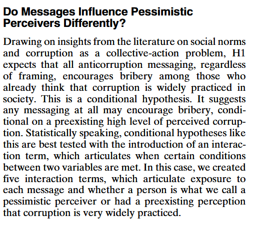
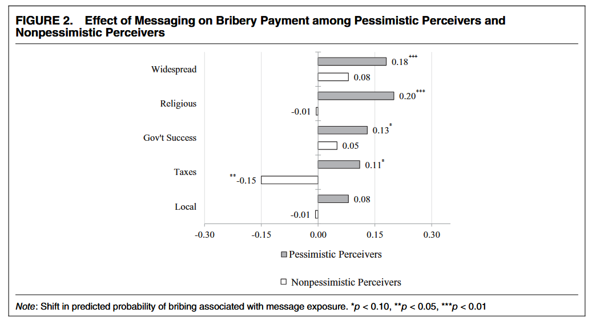

class: center, middle


```{css, echo=FALSE}
pre {
  max-height: 400px;
  overflow-y: auto;
}

pre[class] {
  max-height: 200px;
}
```

```{r, load_refs, include=FALSE, cache=FALSE}
# Initializes
library(RefManageR)

library(ggplot2)
library(dplyr)
library(readr)
library(nlme)
library(jtools)
library(mice)
library(knitr)
library(modelsummary)
library(kableExtra)
library(stringr)

BibOptions(check.entries = FALSE,
           bib.style = "authoryear", # Bibliography style
           max.names = 3, # Max author names displayed in bibliography
           sorting = "nyt", #Name, year, title sorting
           cite.style = "authoryear", # citation style
           style = "markdown",
           hyperlink = FALSE,
           dashed = FALSE)

library(rqog)
qogts <- read_qog(which_data="standard", data_type = "time-series")

```
```{r xaringan-themer, include=FALSE, warning=FALSE}
library(xaringanthemer,MnSymbol)
style_mono_accent(
  base_color = "#1c5253",
  header_font_google = google_font("Josefin Sans"),
  text_font_google   = google_font("Montserrat", "300", "300i"),
  code_font_google   = google_font("Fira Mono"),
  text_font_size = "1.6rem"
)

knitr::opts_chunk$set(warning = FALSE, message = FALSE)

```


Let's think about the relationship across countries between wealth and democracy.

---

```{r, echo = FALSE, eval=TRUE, out.width="80%", fig.retina = 1, fig.align='center'}
# Load required libraries
library(tidyverse)
library(rqog)
library(countrycode)
library(scales)
library(ggrepel)

# Load QOG standard time-series data
qog_data <- read_qog(which_data = "standard", data_type = "time-series")

# Clean and prepare the data
democracy_data <- qog_data %>%
  # Select relevant variables
  # vdem_libdem: V-Dem Liberal Democracy Index (0-1)
  # gle_cgdpc: GDP per capita (PPP, constant 2017 USD)
  select(country = cname, 
         year = year,
         libdem = vdem_libdem,  # Correct variable name
         gdp_pc = gle_cgdpc,
         # Other useful variables for potential interactions
         region = ht_region,
         oil_rents = wdi_oilrent,
         corruption = ti_cpi,
         polity2 = p_polity2,
	 colonial = ht_colonial) %>%
  # Filter for most recent year with data
  group_by(country) %>%
  filter(!is.na(libdem), !is.na(gdp_pc)) %>%
  # Take latest available year (typically 2022 for V-Dem in recent QOG)
  filter(year == max(year, na.rm = TRUE)) %>%
  ungroup() %>%
  # Remove rows with missing values
  drop_na(libdem, gdp_pc) %>%
  # Create logged GDP per capita
  mutate(log_gdp_pc = log(gdp_pc),
         # Create democracy categories for visualization
         democracy_level = case_when(
           libdem >= 0.8 ~ "Liberal Democracy (0.8-1.0)",
           libdem >= 0.6 ~ "Electoral Democracy (0.6-0.8)",
           libdem >= 0.4 ~ "Electoral Autocracy (0.4-0.6)",
           libdem >= 0.2 ~ "Closed Autocracy (0.2-0.4)",
           libdem < 0.2 ~ "Hard Autocracy (0.0-0.2)"
         ),
         democracy_level = factor(democracy_level,
                                  levels = c("Liberal Democracy (0.8-1.0)",
                                             "Electoral Democracy (0.6-0.8)",
                                             "Electoral Autocracy (0.4-0.6)",
                                             "Closed Autocracy (0.2-0.4)",
                                             "Hard Autocracy (0.0-0.2)")),
         # Convert region code to readable names
         region_name = case_when(
           region == 1 ~ "Eastern Europe and Post-Soviet",
           region == 2 ~ "Latin America",
           region == 3 ~ "Middle East and North Africa",
           region == 4 ~ "Sub-Saharan Africa",
           region == 5 ~ "Western Europe and North America",
           region == 6 ~ "Asia and Pacific"
         ),
         # Create a label for selected countries (for annotation)
         label = ifelse(country %in% c(
           "United States", "China", "India", "Russia",
           "Sweden", "South Africa", "Brazil", "Saudi Arabia",
           "North Korea", "Switzerland", "Singapore", "Venezuela",
           "Hungary", "Poland", "Turkey", "Iran",
           "Norway", "Botswana", "United Arab Emirates"
         ), country, NA))%>%
  mutate(never_colonized = ifelse(colonial ==0 ,
                               "Never Colonized", "Former Colony"))

# Basic scatterplot
p_basic <- ggplot(democracy_data, aes(x = log_gdp_pc, y = libdem)) +
  geom_point(alpha = 0.6, size = 2.5, color = "#3366CC") +
  geom_smooth(method = "lm", se = TRUE, color = "#CC3333", 
              fill = "#FF9999", alpha = 0.3, size = 1.2) +
  labs(
    title = "Modernization Theory: Economic Development and Liberal Democracy",
    subtitle = "Log GDP per capita (PPP) vs. V-Dem Liberal Democracy Index (0-1)",
    x = "Log GDP per capita (PPP, constant 2017 USD)",
    y = "Liberal Democracy Index (0-1)",
    caption = paste("Source: QOG Standard Time-Series Data |", 
                    "Most recent year available per country")
  ) +
  theme_minimal(base_size = 14) +
  theme(
    plot.title = element_text(face = "bold", size = 16, hjust = 0.5),
    plot.subtitle = element_text(size = 12, color = "gray40", hjust = 0.5),
    axis.title = element_text(face = "bold"),
    panel.grid.minor = element_blank()
  ) +
  scale_y_continuous(limits = c(0, 1), breaks = seq(0, 1, 0.2))

print(p_basic)
```

---

```{r, echo = FALSE, eval=TRUE, out.width="80%", fig.retina = 1, fig.align='center'}
p_labeled <- ggplot(democracy_data, aes(x = log_gdp_pc, y = libdem)) +
  geom_point(aes(color = region_name), alpha = 0.7, size = 3) +
  geom_smooth(method = "lm", se = FALSE, color = "gray40", 
              linetype = "dashed", size = 0.8) +
  scale_color_brewer(palette = "Set2") +
  labs(
    title = "Regions in the Modernization Relationship",
    x = "Log GDP per capita (PPP)",
    y = "Liberal Democracy Index",
    color = "Region",
    caption = "Dashed line: Global linear relationship"
  ) +
  theme_minimal(base_size = 14) +
  theme(
    plot.title = element_text(face = "bold", size = 16, hjust = 0.5),
    plot.subtitle = element_text(size = 12, color = "gray40", hjust = 0.5),
    axis.title = element_text(face = "bold"),
    legend.position = "bottom",
    legend.text = element_text(size = 10)
  ) +
  scale_y_continuous(limits = c(0, 1), breaks = seq(0, 1, 0.2))

print(p_labeled)
```

---

```{r, echo = FALSE, eval=TRUE, out.width="80%", fig.retina = 1, fig.align='center'}
# Version highlighting potential interactions
# Create a binary indicator for oil dependence (top quartile)
oil_threshold <- quantile(democracy_data$oil_rents, 0.75, na.rm = TRUE)

p_interaction <- democracy_data %>%
  mutate(oil_dependent = ifelse(oil_rents > oil_threshold & !is.na(oil_rents),
                               "High Oil Rents", "Low/No Oil Rents")) %>%
  ggplot(aes(x = log_gdp_pc, y = libdem, color = oil_dependent)) +
  geom_point(alpha = 0.6, size = 2.5) +
  geom_smooth(method = "lm", se = FALSE, size = 1.2) +
  scale_color_manual(values = c("High Oil Rents" = "#E69F00",
                                "Low/No Oil Rents" = "#56B4E9")) +
  labs(
    title = "Testing an Interaction: Oil Wealth as Moderator",
    subtitle = "GDP-Democracy relationship appears weaker in oil-dependent states",
    x = "Log GDP per capita (PPP)",
    y = "Liberal Democracy Index",
    color = "Oil Rents (% of GDP)",
    caption = "Orange: Countries in top quartile of oil rents\nBlue: All other countries"
  ) +
  theme_minimal(base_size = 14) +
  theme(
    plot.title = element_text(face = "bold", size = 16, hjust = 0.5),
    plot.subtitle = element_text(size = 12, color = "gray40", hjust = 0.5),
    axis.title = element_text(face = "bold"),
    legend.position = "bottom"
  ) +
  scale_y_continuous(limits = c(0, 1), breaks = seq(0, 1, 0.2))

print(p_interaction)
```

---

```{r, echo = FALSE, eval=TRUE, out.width="80%", fig.retina = 1, fig.align='center'}
p_colonial_interaction <- democracy_data %>%
  mutate(never_colonized = ifelse(colonial ==0 ,
                               "Never Colonized", "Former Colony")) %>%
  ggplot(aes(x = log_gdp_pc, y = libdem, color = never_colonized)) +
  geom_point(alpha = 0.6, size = 2.5) +
  geom_smooth(method = "lm", se = FALSE, size = 1.2) +
  scale_color_manual(values = c("Never Colonized" = "#E69F00",
                                "Former Colony" = "#56B4E9")) +
  labs(
    title = "Testing an Interaction: Colonialism as Moderator",
    subtitle = "GDP-Democracy relationship appears weaker in former colonies",
    x = "Log GDP per capita (PPP)",
    y = "Liberal Democracy Index",
    color = "Oil Rents (% of GDP)",
    caption = "Orange: Countries that were never colonized\nBlue: Former colonies"
  ) +
  theme_minimal(base_size = 14) +
  theme(
    plot.title = element_text(face = "bold", size = 16, hjust = 0.5),
    plot.subtitle = element_text(size = 12, color = "gray40", hjust = 0.5),
    axis.title = element_text(face = "bold"),
    legend.position = "bottom"
  ) +
  scale_y_continuous(limits = c(0, 1), breaks = seq(0, 1, 0.2))

print(p_colonial_interaction)
```

---

How can we set up a regression to look at relationships like this?

Before we start, it's important to distinguish between:

1. *Moderators*: background variables that change the relationship between a right-hand-side variable of interest and an outcome, but are not themselves part of any causal story connecting those two variables.

2. *Mediators*: third variables that are part of the story of how the right-hand-side variable affects the outcome.

---
We need more complicated tools of statistical analysis to study mediators.

---
###Moderator

```{r, echo = FALSE, eval=TRUE, out.width="80%", fig.retina = 1, fig.align='center'}
library(DiagrammeR)
library(DiagrammeRsvg)

# Moderator diagram
moderator_diagram <- grViz("
digraph {
  graph [rankdir = LR, layout = dot]
  node [shape = box, style = filled, fillcolor = lightblue]
  
  X [label = 'X (GDP)']
  Y [label = 'Y (Democracy)']
  M [label = 'M (Oil Wealth)', fillcolor = lightyellow]
  
  // Main effect
  X -> Y [label = 'β₁']
  
  // Moderation effect
  M -> X [label = 'Moderates', style = dashed, color = red]
  
  // Direct effect of moderator
  M -> Y [label = 'β₂']
}
")

# Display in RMarkdown
moderator_diagram
```

---
###Mediator

```{r, echo = FALSE, eval=TRUE, out.width="80%", fig.retina = 1, fig.align='center'}
library(DiagrammeR)

mediator_diagram <- grViz('
digraph {
  graph [rankdir = LR]
  node [shape = box, style = filled, fillcolor = lightblue]
  
  X [label = "X (GDP)", fillcolor = palegreen]
  M [label = "M (Education)", fillcolor = lightyellow]
  Y [label = "Y (Democracy)", fillcolor = lightblue]
  
  // Mediation paths
  X -> M [label = "α", color = blue]
  M -> Y [label = "β", color = blue]
  
  // Direct effect (optional)
  X -> Y [label = "Direct effect", style = dashed, color = gray]
}
')

mediator_diagram
```

---

No moderator present:

$$Y_{i} = \beta_{0} + \beta_{1} \text{logGDP}_{i} + \beta_{2} \text{Colonized}_{i} + e_{i}$$

---

Moderator included:

$$\scriptsize Y_{i} = \beta_{0} + \beta_{1} \text{logGDP}_{i} + \beta_{2} \text{Colonized}_{i} + \beta_{3} \text{logGDP}_{i}*\text{Colonized}_{i} + e_{i}$$

---

What does the model mean when the moderator is present? There are two possibilities to consider. Either $\text{Colonized}_{i} = 0$ or $\text{Colonized}_{i} = 1$. Let's first look at what the model turns into for a case where $\text{Colonized}_{i} = 0$:

$$\small Y_{i} = \beta_{0} + \beta_{1} \text{logGDP}_{i} + \beta_{2} * 0 + \beta_{3} \text{logGDP}_{i}*0 + e_{i}$$

---

This is just a bivariate regression of democracy on logGDP, with intercept $\beta_{0}$ and slope $\beta_{1}$. For cases where Colonized is zero, the extra terms drop out.

---

Now let's look at what the model turns into for a case where $\text{Colonized}_{i} = 1$:

$$\scriptsize Y_{i} = \beta_{0} + \beta_{1} \text{logGDP}_{i} + \beta_{2} * 1 + \beta_{3} \text{logGDP}_{i}*1 + e_{i}$$


$$\small Y_{i} = (\beta_{0} + \beta_{2}) + (\beta_{1} + \beta_{3}) * \text{logGDP}_{i} + e_{i}$$

---

This is still just a bivariate regression of democracy on logGDP, with a different intercept $\beta_{0} + \beta_{2}$ and slope $\beta_{1} + \beta_{3}$. For cases where Colonized is one, the extra terms shift the intercept and slope away from where they are for cases with Colonized equal to zero.

---

Interpretation is a bit more complicated when our interaction involves a continuous variable:

$$\scriptsize Y_{i} = \beta_{0} + \beta_{1} \text{logGDP}_{i} + \beta_{2} \text{OilRent}_{i} + \beta_{3} \text{logGDP}_{i}*\text{OilRent}_{i} + e_{i}$$

---

Here, the intercept and the slope vary as a continuous function of OilRent:

$$\text{Intercept}_{i} = \beta_{0} + \beta_{2} \text{OilRent}_{i}$$

$$\text{Slope}_{\text{logGDP},i} = \beta_{1} + \beta_{3} \text{OilRent}_{i}$$

---

Because intercepts and slopes depend on sums of multiple regression parameters and vary across values of the interaction variable, the default standard errors and significance tests reported for regressions often don't answer the questions we're interested in when there is an interaction term.

---

* The standard significance tests reported in regression tables don't include the algebraic transformations necessary to produce the actual intercept and slope formulas that we calculated above.

* Think about the model with oil rents as an interaction term. To test whether logged GDP matters at typical oil rent levels, we must compute the conditional effect $(\beta_1 + \beta_3*\text{OilRents})$ and its standard error, which incorporates the variances and covariance of $\beta_1$ and $\beta_3$.

---

* The only way to get a standard regression result out of this conditional effect is if $\text{OilRents} = 0$. Then the conditional effect is just $\beta_1$, and the typical regression standard errors will be correct.

---

```{r, echo = TRUE, eval=TRUE, out.width="80%", fig.retina = 1, fig.align='center'}
democracy.interactlm <- lm(libdem ~ log_gdp_pc + never_colonized + log_gdp_pc:never_colonized, data=democracy_data)
summary(democracy.interactlm)
```

---

```{r, echo = TRUE, eval=TRUE, out.width="60%", fig.retina = 1, fig.align='center'}
library(sjPlot)
library(sjmisc)
library(ggplot2)
plot_model(democracy.interactlm, type = "pred", terms = c("log_gdp_pc", "never_colonized"))
```

---

```{r, echo = TRUE, eval=TRUE, out.width="60%", fig.retina = 1, fig.align='center'}
democracy.interactlm2 <- lm(libdem ~ log_gdp_pc + oil_rents + log_gdp_pc:oil_rents, data=democracy_data)
summary(democracy.interactlm2)
```

---

```{r, echo = TRUE, eval=TRUE, out.width="60%", fig.retina = 1, fig.align='center'}
library(ggeffects)
plot(ggpredict(democracy.interactlm2, terms=c("log_gdp_pc", "oil_rents")))
```

---

```{r, echo = TRUE, eval=TRUE, out.width="60%", fig.retina = 1, fig.align='center'}
meplot <- function(model,var1,var2,int,vcov,ci=.95,
                   xlab=var2,ylab=paste("Marginal Effect of",var1),
                   main="Marginal Effect Plot",
                   me_lty=1,me_lwd=1,me_col="black",
                   ci_lty=1,ci_lwd=.5,ci_col="black",
                   yint_lty=2,yint_lwd=1,yint_col="black"){
  require(ggplot2)
  alpha <- 1-ci
  z <- qnorm(1-alpha/2)
  beta.hat <- coef(model)
  cov <- vcov
  z0 <- seq(min(model.frame(model)[,var2],na.rm=T),max(model.frame(model)[,var2],na.rm=T),length.out=1000)
  dy.dx <- beta.hat[var1] + beta.hat[int]*z0
  se.dy.dx <- sqrt(cov[var1,var1] + z0^2*cov[nrow(cov),ncol(cov)] + 2*z0*cov[var1,ncol(cov)])
  upr <- dy.dx + z*se.dy.dx
  lwr <- dy.dx - z*se.dy.dx
  ggplot(data=NULL,aes(x=z0, y=dy.dx)) +
    labs(x=xlab,y=ylab,title=main) +
    geom_line(aes(z0, dy.dx),size = me_lwd, 
              linetype = me_lty, 
              color = me_col) +
    geom_line(aes(z0, lwr), size = ci_lwd, 
              linetype = ci_lty, 
              color = ci_col) +
    geom_line(aes(z0, upr), size = ci_lwd, 
              linetype = ci_lty, 
              color = ci_col) +
    geom_hline(yintercept=0,linetype=yint_lty,
               size=yint_lwd,
               color=yint_col)
}
```

---

```{r, echo = TRUE, eval=TRUE, out.width="60%", fig.retina = 1, fig.align='center'}
meplot(democracy.interactlm2,var1 = "log_gdp_pc", var2 = "oil_rents", int= "log_gdp_pc:oil_rents", vcov=vcov(democracy.interactlm2))
```

---
  
Power analysis is a little more complicated when there is an interaction.

* We're testing $\beta_3$ (the interaction, a complex parameter) rather than $\beta_1$ (the main slope, a comparatively straightforward quantity)

* Interaction effects typically require about four times the sample size of main effects

---

```{r, echo = TRUE, eval=TRUE, out.width="60%", fig.retina = 1, fig.align='center'}
library(InteractionPoweR)
power_interaction_r2(N=seq(100,300,by=10),r.x1.y=0.1, r.x2.y=.1,r.x1x2.y=0.1,r.x1.x2=.1)
```

---


---



---

