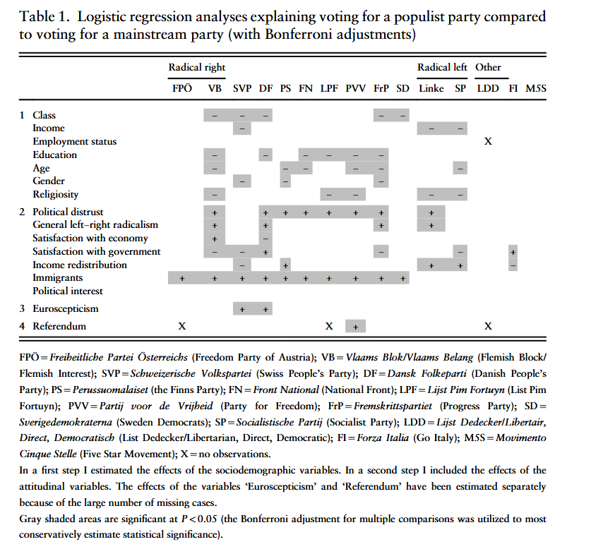
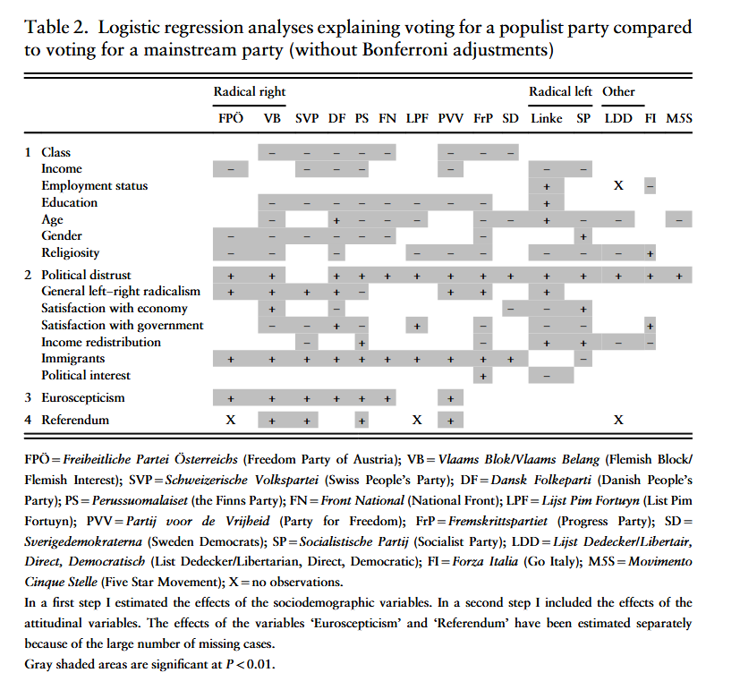
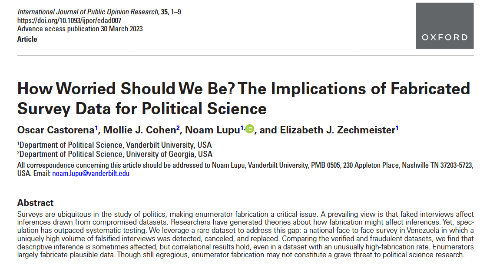
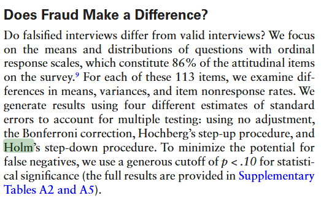
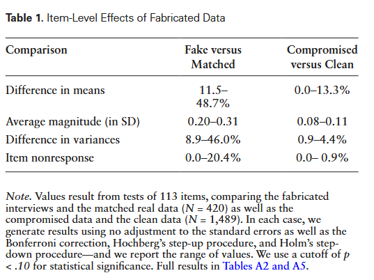
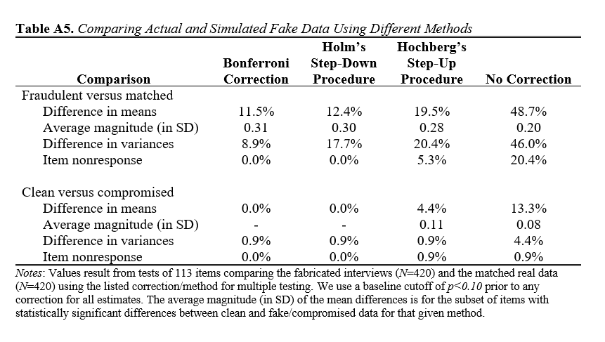

class: center, middle

```{css, echo=FALSE}
pre {
  max-height: 400px;
  overflow-y: auto;
}

pre[class] {
  max-height: 200px;
}
```

```{r, load_refs, include=FALSE, cache=FALSE}
# Initializes
library(RefManageR)

library(ggplot2)
library(dplyr)
library(readr)
library(nlme)
library(jtools)
library(mice)
library(knitr)
library(modelsummary)
library(kableExtra)
library(stringr)

BibOptions(check.entries = FALSE,
           bib.style = "authoryear", # Bibliography style
           max.names = 3, # Max author names displayed in bibliography
           sorting = "nyt", #Name, year, title sorting
           cite.style = "authoryear", # citation style
           style = "markdown",
           hyperlink = FALSE,
           dashed = FALSE)

```
```{r xaringan-themer, include=FALSE, warning=FALSE}
library(xaringanthemer,MnSymbol)
style_mono_accent(
  base_color = "#1c5253",
  header_font_google = google_font("Josefin Sans"),
  text_font_google   = google_font("Montserrat", "300", "300i"),
  code_font_google   = google_font("Fira Mono"),
  text_font_size = "1.6rem"
)
```

Last time, we saw that researchers test regression results by rejecting $H_{0}$ when the probability associated with it is very low. By convention, there are thresholds at 0.05, 0.01, and 0.001 about which people get emotional.

---

Consider the probability of getting a heads on a coin toss.

Now consider [this](https://www.youtube.com/watch?v=gOwLEVQGbrM).

---

```{r, echo = TRUE, eval=TRUE, out.width="90%", fig.retina = 1, fig.align='center'}
set.seed(42)  # For reproducibility
single_experiment <- rbinom(17, size = 1, prob = 0.5)
cat("Number of heads in one experiment:", sum(single_experiment), "\n")
cat("Probability of 17 heads: ", 0.5^17, " (1 in", round(1/0.5^17), ")\n")
```

---

All right, but what if I flip the coin as many times as I want and count streaks after the fact?

```{r, echo = TRUE, eval=TRUE, out.width="90%", fig.retina = 1, fig.align='center'}
set.seed(123)
found_perfect_streak <- FALSE
experiments_run <- 0

while(!found_perfect_streak) {
  experiments_run <- experiments_run + 1
  current_experiment <- rbinom(17, size = 1, prob = 0.5)
  if(sum(current_experiment) == 17) {
    found_perfect_streak <- TRUE
    cat("Found 17 heads after", experiments_run, "experiments\n")
    cat("That's", experiments_run * 17, "total coin flips\n")
  }
}
```

---

```{r, echo = TRUE, eval=TRUE, out.width="90%", fig.retina = 1, fig.align='center'}
set.seed(42)
n_experiments <- 1000
results <- replicate(n_experiments, sum(rbinom(17, 1, 0.5)))

max_heads <- max(results)
cat("In", n_experiments, "experiments, the maximum heads was:", max_heads, "\n")
cat("Probability of getting at least", max_heads, "heads by chance:",
    mean(results >= max_heads), "\n")
```

---
###The Multiple Comparisons Problem

Every significance test we carry out is [a chance to falsely conclude that a relationship is meaningful due to chance](https://xkcd.com/882/).

---

If we aren't careful, most times that we pay attention to multiple significance tests related to the same data and the same problem, we are at risk of finding false precision in our results.

---
###Why This Happens

Remember that we noted 0.05 as a probability level in significance tests that leads to excitement. This is often written as $\alpha = 0.05$. If our significance test has been done well, meeting the assumptions we talked about last time, the probability of getting a result of 0.05 or less on a single significance test that corresponds with a population regression slope that is actually 0 is 0.05.

So this won't happen very often, and if we have a single result below this level, we can treat it seriously with meaningful confidence.

---

However, suppose that we carry out 20 independent significance tests --- including 20 unrelated independent variables in our regression, for example. Now, we can think of each significance test as being like a coin flip in our example above. The chance of finding at least one heads --- at least one value randomly below 0.05 even though the population regression slope is zero --- is going to be much higher than 0.05:

```{r, echo = TRUE, eval=TRUE, out.width="90%", fig.retina = 1, fig.align='center'}
1 - (0.95)^20
```

---

```{r, echo = FALSE, eval=TRUE, out.width="80%", fig.retina = 1, fig.align='center'}
n_tests <- 1:50
prob_at_least_one <- 1 - (0.95)^n_tests

plot(n_tests, prob_at_least_one, type = "l", 
     xlab = "Number of Independent Tests", 
     ylab = "Probability of ≥1 False Positive",
     main = "The Multiple Testing Problem",
     col = "darkred", lwd = 2)
abline(h = 0.05, lty = 2, col = "gray")
abline(v = 20, lty = 2, col = "gray")
text(20, 0.7, "20 tests: 64% risk", pos = 4)
```

---

We have two main measures of failure when carrying out multiple comparisons:

1. The *family-wide error rate*, which is the probability of incorrectly rejecting even one null hypothesis.

2. The *false discovery rate*, which is the expected proportion of false discoveries (i.e., findings for which we reject the null hypothesis) among all discoveries.

---
###Family-Wide Error Rate

$$\text{FWER} = \text{Pr}(\text{at least one false positive})$$
Intuition: “What’s the chance that any of my ‘significant’ findings is just noise?”

Use case: When you need strong control over false positives across all tests (e.g., confirmatory studies, many RCTs).

---
###False-Discovery Rate

$$\text{FDR} = \text{E}(\frac{\text{False Positives}}{\text{All Positives}})$$

---
###Bonferroni

The first and simplest way to correct the family-wide error rate is the Bonferroni correction: just divide $\alpha$ by the number of tests you're carrying out.

Suppose our target significance level is $\alpha$ and we're carrying out $m$ total tests. Then the Bonferroni correction is to set our actual target significance level for each individual test at $\frac{\alpha}{m}$ but interpret the results as still just implying a family-wide error rate of not more than $\alpha$.

---

To see why, consider our example of 20 independent tests from earlier. We want $\alpha = 0.05$, so our Bonferroni-corrected target will be $\frac{0.05}{20} = 0.0025$.

```{r, echo = TRUE, eval=TRUE, out.width="90%", fig.retina = 1, fig.align='center'}
1 - (1 - 0.0025)^20
```

---

If our tests are not independent, the Bonferroni correction will typically be too conservative.

---
### Holm Correction: A Stepwise Improvement

Bonferroni is conservative because it treats all tests equally. Holm's step-down procedure is more powerful while still controlling FWER:

1. Order p-values: $(p_{(1)} \leq p_{(2)} \leq \cdots \leq p_{(m)})$
2. Compare $p_{(k)}$ to $\frac{\alpha}{m+1-k}$
3. Reject all hypotheses up to the first non-rejection

---

```{r holm-example, echo=TRUE, eval=TRUE}
# Example: Three tests with p-values 0.004, 0.020, 0.122
p_vals <- c(0.004, 0.020, 0.122)
alpha <- 0.05
m <- length(p_vals)

# Holm correction manually
sorted_p <- sort(p_vals)
holm_thresholds <- alpha/(m + 1 - 1:m)

cat("Sorted p-values:", sorted_p, "\n")
cat("Holm thresholds:", round(holm_thresholds, 3), "\n")
cat("Significant under Holm:", sorted_p <= holm_thresholds, "\n")
```

---

```{r holm-example-2, echo=TRUE, eval=TRUE}
# Using p.adjust
holm_adjusted <- p.adjust(p_vals, method = "holm")
cat("Holm-adjusted p-values:", round(holm_adjusted, 3), "\n")
```

---

### False Discovery Rate: Benjamini-Hochberg

While FWER controls "any false positive," FDR controls the *proportion* of false positives among discoveries. Less conservative when many tests are expected to be true positives.

---

**Benjamini-Hochberg Procedure:**
1. Order p-values: $(p_{(1)} \leq \cdots \leq p_{(m)})$
2. Find largest $(k)$ where $(p_{(k)} \leq \frac{k}{m}\alpha)$
3. Reject all hypotheses 1 through $(k)$

---

```{r bh-example, echo=TRUE, eval=TRUE}
# Same three p-values
p_vals <- c(0.004, 0.020, 0.122)
m <- length(p_vals)

# BH thresholds
bh_thresholds <- (1:m)/m * alpha

cat("BH thresholds:", round(bh_thresholds, 3), "\n")
cat("Significant under BH:", p_vals <= bh_thresholds, "\n")

# Using p.adjust
bh_adjusted <- p.adjust(p_vals, method = "BH")
cat("BH-adjusted p-values:", round(bh_adjusted, 3), "\n")
```

---

### Comparing Correction Methods

```{r compare-corrections, echo=TRUE, eval=TRUE, fig.height=4}
set.seed(8747)
# Simulate 100 tests: 50 null true (mean=0), 50 false (mean=0.5)
n_tests <- 100
effects <- c(rep(0, 50), rep(0.5, 50))
p_vals <- 2*pnorm(-abs(rnorm(n_tests, mean = effects)))

# Apply corrections
corrections <- list(
  "None" = p_vals,
  "Bonferroni" = p.adjust(p_vals, "bonferroni"),
  "Holm" = p.adjust(p_vals, "holm"),
  "BH" = p.adjust(p_vals, "BH")
)

# Count significant at alpha=0.05
sig_counts <- sapply(corrections, function(p) sum(p <= 0.05))
```

---

```{r compare-corrections-2, echo=TRUE, eval=TRUE, fig.height=4}
barplot(sig_counts, 
        main = "Significant Tests Under Different Corrections",
        ylab = "Number Significant (α=0.05)",
        col = c("#1c5253", "#d3bccc", "#b3dee2", "#f0b7b3"),
        ylim = c(0, 5))
```

---


### When to Use Which Correction?

**FWER methods (Bonferroni, Holm):**
- Confirmatory research
- Small number of tests
- Severe consequences of false positives
- Clinical trials, policy evaluations

**FDR methods (Benjamini-Hochberg):**
- Exploratory research
- Many tests (e.g., genomics, large-scale surveys)
- Willing to accept some false positives to find more true effects

---

### Indexing: Reducing Multiple Outcomes

When you measure many related outcomes, combine them into an index:

**Mean Effects Index (Kling, Liebman, & Katz, 2004):**
1. Reorient outcomes so higher = better
2. Standardize each outcome by control group: $(z_{ik} = \frac{y_{ik} - \bar{y}_k^{control}}{SD_k^{control}})$
3. Average z-scores for each unit

---

**Advantages:**
- Increases power when effects are consistent
- Handles missing data gracefully
- Reduces multiple comparisons problem

---

```{r index-example, echo=TRUE, eval=TRUE, fig.height=4}
set.seed(123)
n <- 200
k <- 5
treatment <- sample(0:1, n, replace = TRUE)

# Generate correlated outcomes using factor model (simpler approach)
common_factor <- rnorm(n)  # Common factor induces correlation
outcomes <- matrix(NA, n, k)

# Each outcome = common factor + unique component + treatment effect
for (j in 1:k) {
  outcomes[, j] <- 0.7 * common_factor + 0.3 * rnorm(n) + treatment * 0.3
}

# Create mean effects index
control_mean <- colMeans(outcomes[treatment == 0, ])
control_sd <- apply(outcomes[treatment == 0, ], 2, sd)

z_scores <- sweep(outcomes, 2, control_mean) / control_sd
index <- rowMeans(z_scores)

# Compare individual tests vs. index
cat("Testing each outcome individually:\n")
individual_pvals <- numeric(k)
for (j in 1:k) {
  individual_pvals[j] <- summary(lm(outcomes[, j] ~ treatment))$coefficients[2, 4]
  cat(paste0("Outcome ", j, ": p = ", round(individual_pvals[j], 4), "\n"))
}

cat("\nTesting composite index:\n")
index_model <- lm(index ~ treatment)
index_p <- summary(index_model)$coefficients[2, 4]
cat("Index p-value:", round(index_p, 4), "\n")
cat("Index estimate:", round(coef(index_model)[2], 3), "\n")

# Bonferroni correction for individual tests
cat("\nBonferroni-corrected thresholds (α=0.05/5=0.01):\n")
cat("Significant after Bonferroni:", sum(individual_pvals < 0.01), "out of", k, "\n")
```

---

### Design-Based Approaches

**Pre-analysis plans (PAPs):**
- Specify hypotheses and analysis plan before seeing data
- Define "families" of tests for correction
- Distinguish confirmatory vs. exploratory analyses

---

**Advantages of PAPs:**
- Clarifies multiple comparisons problem
- Prevents data dredging
- Increases credibility of results

---

**Replication:**
- The ultimate test: can others reproduce your findings?
- Particularly important when dealing with multiple comparisons

---

 
---

 

---

 

---


---



---



---



---

### Practical Recommendations

1. **Specify your family of tests** before analysis
2. **Use appropriate correction** based on your goals:
   - FWER for strong control (Holm > Bonferroni)
   - FDR for exploratory work
3. **Consider indexing** for related outcomes
4. **Document all tests** conducted (even non-significant ones)
5. **Be transparent** about corrections (or lack thereof)

```{r final-summary, echo=FALSE, eval=TRUE}
# Quick reference table
methods_df <- data.frame(
  Method = c("Bonferroni", "Holm", "Benjamini-Hochberg", "Indexing", "PAPs"),
  Controls = c("FWER", "FWER", "FDR", "Reduces tests", "Design-based"),
  When_To_Use = c("Few tests, independent", "Few tests, any dependency", 
                   "Many tests, exploratory", "Related outcomes", 
                   "Pre-registered studies"),
  R_Function = c('p.adjust(, "bonf")', 'p.adjust(, "holm")', 
                 'p.adjust(, "BH")', 'Custom function', 'NA')
)

knitr::kable(methods_df, caption = "Multiple Comparisons Toolkit")
```

---

### Resources for Further Learning

1. **R functions:** `p.adjust()` in base R
2. **Packages:** `multcomp`, `qvalue`, `onlineFDR`
3. **Reading:** 
   - Benjamini & Hochberg (1995) *Journal of the Royal Statistical Society*
   - Anderson (2008) *Multiple Inference and Gender Differences...*
   - EGAP's "10 Things to Know About Multiple Comparisons"

**Remember:** No correction method is perfect. The best approach combines statistical correction with thoughtful design and transparent reporting.

