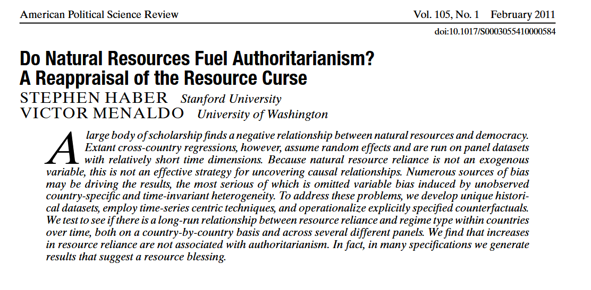
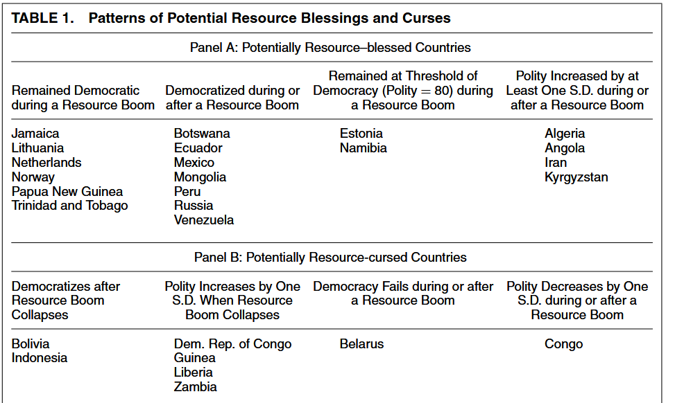
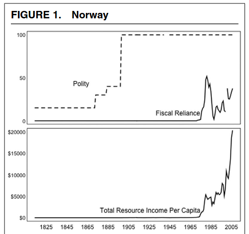
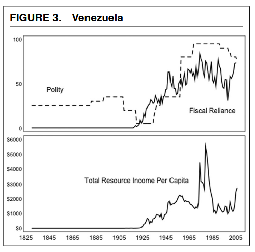

class: center, middle

```{css, echo=FALSE}
pre {
  max-height: 400px;
  overflow-y: auto;
}

pre[class] {
  max-height: 200px;
}
```

```{r, load_refs, include=FALSE, cache=FALSE}
# Initializes
library(RefManageR)

library(ggplot2)
library(dplyr)
library(readr)
library(nlme)
library(jtools)
library(mice)
library(knitr)
library(modelsummary)
library(kableExtra)
library(stringr)

BibOptions(check.entries = FALSE,
           bib.style = "authoryear", # Bibliography style
           max.names = 3, # Max author names displayed in bibliography
           sorting = "nyt", #Name, year, title sorting
           cite.style = "authoryear", # citation style
           style = "markdown",
           hyperlink = FALSE,
           dashed = FALSE)

```
```{r xaringan-themer, include=FALSE, warning=FALSE}
library(xaringanthemer,MnSymbol)
style_mono_accent(
  base_color = "#1c5253",
  header_font_google = google_font("Josefin Sans"),
  text_font_google   = google_font("Montserrat", "300", "300i"),
  code_font_google   = google_font("Fira Mono"),
  text_font_size = "1.6rem"
)
```

```{r setup, include=FALSE}
knitr::opts_chunk$set(warning = FALSE)

library(readr)
turnout <- read_csv("https://raw.githubusercontent.com/jnseawright/ps405/refs/heads/main/Data/turnout.csv")

```

Consider the following two linear predictors:

$$y = \beta_0 + \beta_1x_1 + \beta_2x_2 + u$$

$$y = \beta^*_0 + \beta^*_1x_1 + u^*$$

---

How does $\beta^*_1x_1$ relate to $\beta_1x_1$?

---

Remember the regression formula:

$$\beta^*_1 = \frac{\text{Cov}(x_1, y)}{\text{Var}(x_1)}$$

---

Let's plug in our more complicated linear predictor:

$$\beta^*_1 = \frac{\text{Cov}(X_1, \beta_0 + \beta_1x_1 + \beta_2x_2 + u)}{\text{Var}(x_1)}$$

---

Covariance is linear, so we can simplify:

$$\scriptsize\beta^*_1 = \frac{\text{Cov}(x_1, \beta_0) + \text{Cov}(x_1, \beta_1x_1) + \text{Cov}(x_1, \beta_2x_2) + \text{Cov}(x_1, u)}{\text{Var}(x_1)}$$

---

1. $\text{Cov}(X_1, \beta_0) = 0$ because $\beta_0$ is a constant.

2. $\text{Cov}(X_1, \beta_1x_1) = \beta_1 \text{Var} (x_1)$

3. $\text{Cov}(x_1, \beta_2x_2) = \beta_2 \text{Cov}(x_1, x_2)$

4. $\text{Cov}(x_1, u) = 0$ because that's the error.

---

$$\beta^*_1 = \frac{\beta_1 \text{Var} (x_1) + \beta_2 \text{Cov}(x_1, x_2)}{\text{Var}(x_1)}$$

$$\beta^*_1 = \frac{\beta_1 \text{Var} (x_1)}{\text{Var}(x_1)} + \frac{\beta_2 \text{Cov}(x_1, x_2)}{\text{Var}(x_1)}$$

$$\beta^*_1 = \beta_1 + \beta_2 \frac{\text{Cov}(x_1, x_2)}{\text{Var}(x_1)}$$

---

This term:

$$\beta_2 \frac{\text{Cov}(x_1, x_2)}{\text{Var}(x_1)}$$

is the coefficient for $x_2$ times the coefficient in a regression of $x_2$ on $x_1$.

---

If we think of the larger linear predictor, with both $x$ variables as in some sense the "true" model, then this difference between the models is a bias, with the smaller model being worse by the amount shown on the previous slide.

People call this *omitted variable bias.*

---

```{r, echo = TRUE, eval=TRUE, out.width="90%", fig.retina = 1, fig.align='center'}
head(turnout)
```

---

```{r, echo = TRUE, eval=TRUE, out.width="90%", fig.retina = 1, fig.align='center'}
lm(Turnout ~ GDP, data=turnout)
```

---

```{r, echo = TRUE, eval=TRUE, out.width="90%", fig.retina = 1, fig.align='center'}
summary(lm(Turnout ~ GDP, data=turnout))
```

---

```{r, echo = TRUE, eval=TRUE, out.width="90%", fig.retina = 1, fig.align='center'}
lm(Turnout ~ GDP + Temperature, data=turnout)
```

---

```{r, echo = TRUE, eval=TRUE, out.width="90%", fig.retina = 1, fig.align='center'}
summary(lm(Turnout ~ GDP + Temperature, data=turnout))
```

---

```{r, echo = TRUE, eval=TRUE, out.width="90%", fig.retina = 1, fig.align='center'}
-4.975e-09 - (-3.525e-09)
```

---

One question we might reasonably have is whether the relationship between GDP and turnout is actually linear.

---

```{r, echo = TRUE, eval=TRUE, out.width="90%", fig.retina = 1, fig.align='center'}
turnoutlm <- lm(Turnout ~ GDP, data=turnout)
```

---

```{r, echo = TRUE, eval=TRUE, out.width="70%", fig.retina = 1, fig.align='center'}
plot(turnoutlm, which = 1)
```

---

```{r, echo = TRUE, eval=TRUE, out.width="70%", fig.retina = 1, fig.align='center'}
turnoutlm.nonlinear <- lm(Turnout ~ GDP + I(GDP^2) + I(GDP^3), data=turnout)
```

---

```{r, echo = TRUE, eval=TRUE, out.width="70%", fig.retina = 1, fig.align='center'}
summary(turnoutlm.nonlinear)
```

---

```{r, echo = TRUE, eval=TRUE, out.width="70%", fig.retina = 1, fig.align='center'}
library(ggplot2)
library(ggExtra)

beta0 <- turnoutlm.nonlinear$coefficients[1]  # Intercept
beta1 <- turnoutlm.nonlinear$coefficients[2] # GDP
beta2 <- turnoutlm.nonlinear$coefficients[3]  # GDP^2
beta3 <- turnoutlm.nonlinear$coefficients[4] # GDP^3

gdp_seq <- seq(min(turnout$GDP), max(turnout$GDP), length.out = 1000) 

tempdensity <- data.frame(simgdp = runif(1000,min(turnout$GDP),1e+07), simturnout = sample(turnout$Turnout, 1000, replace=TRUE))

# Calculate predicted turnout using the cubic polynomial
turnout_pred <- beta0 + 
                beta1 * gdp_seq + 
                beta2 * gdp_seq^2 + 
                beta3 * gdp_seq^3

# Create data frame for plotting
plot_data <- data.frame(GDP = gdp_seq, Turnout = turnout_pred)

# Create the plot
turnoutplot <- ggplot(plot_data, aes(x = GDP, y = Turnout)) +
  geom_line(linewidth = 1.2, color = "steelblue") +
  labs(
    title = "Estimated Nonlinear CEF: Turnout ~ GDP",
    x = "GDP",
    y = "Predicted Turnout"
  ) +
  geom_point(data=tempdensity, aes(x=simgdp, y=simturnout), alpha = 0) +
  theme_minimal() +
  theme(
    plot.title = element_text(hjust = 0.5, face = "bold"),
    plot.subtitle = element_text(hjust = 0.5, size = 9),
    panel.grid.minor = element_blank()
  ) +
  scale_y_continuous(limits = c(min(turnout_pred) - 0.1, max(turnout_pred) + 0.1),
                     breaks = seq(0, 1, by = 0.1))
```

---

```{r, echo = FALSE, eval=TRUE, out.width="70%", fig.retina = 1, fig.align='center'}
ggMarginal(turnoutplot)
```

---

```{r, echo = FALSE, eval=TRUE, out.width="70%", fig.retina = 1, fig.align='center'}
turnoutplot <- turnoutplot + geom_abline(intercept = 0.64, slope = -1.8e-08,color="red")
ggMarginal(turnoutplot)
```

---

```{r, echo = FALSE, eval=TRUE, out.width="70%", fig.retina = 1, fig.align='center'}
gdp_seq <- seq(min(turnout$GDP), max(turnout$GDP), length.out = 1000) 

tempdensity <- data.frame(simgdp = runif(1000,1e+07,2e+07), simturnout = sample(turnout$Turnout, 1000, replace=TRUE))

# Calculate predicted turnout using the cubic polynomial
turnout_pred <- beta0 + 
                beta1 * gdp_seq + 
                beta2 * gdp_seq^2 + 
                beta3 * gdp_seq^3

# Create data frame for plotting
plot_data <- data.frame(GDP = gdp_seq, Turnout = turnout_pred)

# Create the plot
turnoutplot <- ggplot(plot_data, aes(x = GDP, y = Turnout)) +
  geom_line(linewidth = 1.2, color = "steelblue") +
  labs(
    title = "Estimated Nonlinear CEF: Turnout ~ GDP",
    x = "GDP",
    y = "Predicted Turnout"
  ) +
  geom_point(data=tempdensity, aes(x=simgdp, y=simturnout), alpha = 0) +
  theme_minimal() +
  theme(
    plot.title = element_text(hjust = 0.5, face = "bold"),
    plot.subtitle = element_text(hjust = 0.5, size = 9),
    panel.grid.minor = element_blank()
  ) +
  scale_y_continuous(limits = c(min(turnout_pred) - 0.1, max(turnout_pred) + 0.1),
                     breaks = seq(0, 1, by = 0.1))

ggMarginal(turnoutplot)
```

---

```{r, echo = FALSE, eval=TRUE, out.width="70%", fig.retina = 1, fig.align='center'}
turnoutplot <- turnoutplot + geom_abline(intercept = 0.385, slope = 1.2e-08,color="maroon")
ggMarginal(turnoutplot)
```

---

```{r, echo = FALSE, eval=TRUE, out.width="70%", fig.retina = 1, fig.align='center'}
gdp_seq <- seq(min(turnout$GDP), max(turnout$GDP), length.out = 1000) 

tempdensity <- data.frame(simgdp = runif(1000,2e+07,3e+07), simturnout = sample(turnout$Turnout, 1000, replace=TRUE))

# Calculate predicted turnout using the cubic polynomial
turnout_pred <- beta0 + 
                beta1 * gdp_seq + 
                beta2 * gdp_seq^2 + 
                beta3 * gdp_seq^3

# Create data frame for plotting
plot_data <- data.frame(GDP = gdp_seq, Turnout = turnout_pred)

# Create the plot
turnoutplot <- ggplot(plot_data, aes(x = GDP, y = Turnout)) +
  geom_line(linewidth = 1.2, color = "steelblue") +
  labs(
    title = "Estimated Nonlinear CEF: Turnout ~ GDP",
    x = "GDP",
    y = "Predicted Turnout"
  ) +
  geom_point(data=tempdensity, aes(x=simgdp, y=simturnout), alpha = 0) +
  theme_minimal() +
  theme(
    plot.title = element_text(hjust = 0.5, face = "bold"),
    plot.subtitle = element_text(hjust = 0.5, size = 9),
    panel.grid.minor = element_blank()
  ) +
  scale_y_continuous(limits = c(min(turnout_pred) - 0.1, max(turnout_pred) + 0.1),
                     breaks = seq(0, 1, by = 0.1))

ggMarginal(turnoutplot)
```

---

```{r, echo = FALSE, eval=TRUE, out.width="70%", fig.retina = 1, fig.align='center'}
turnoutplot <- turnoutplot + geom_abline(intercept = 0.786, slope = -0.7e-08,color="seagreen")
ggMarginal(turnoutplot)
```

---



---




---



---


