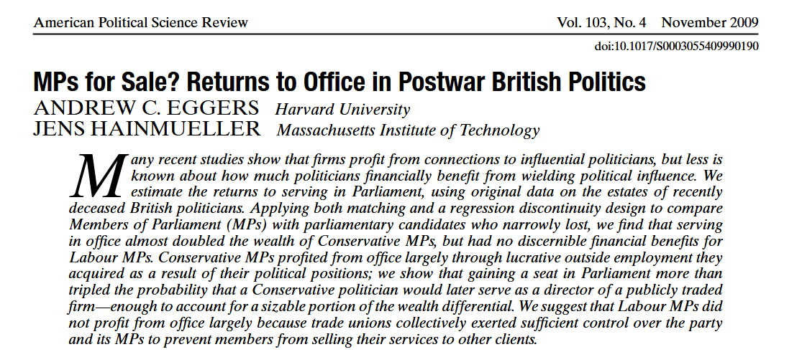
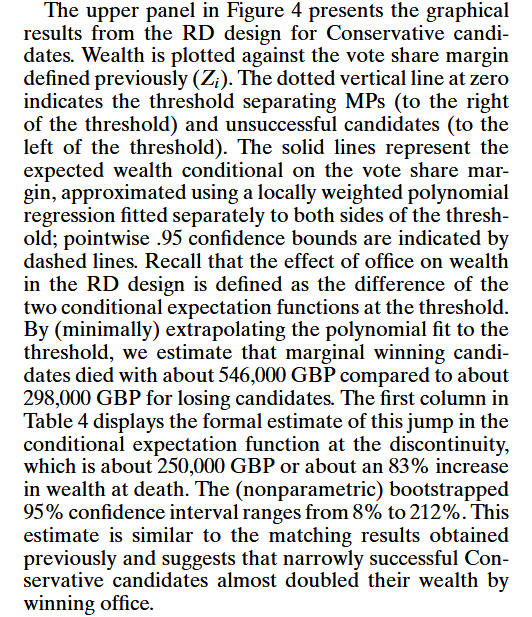
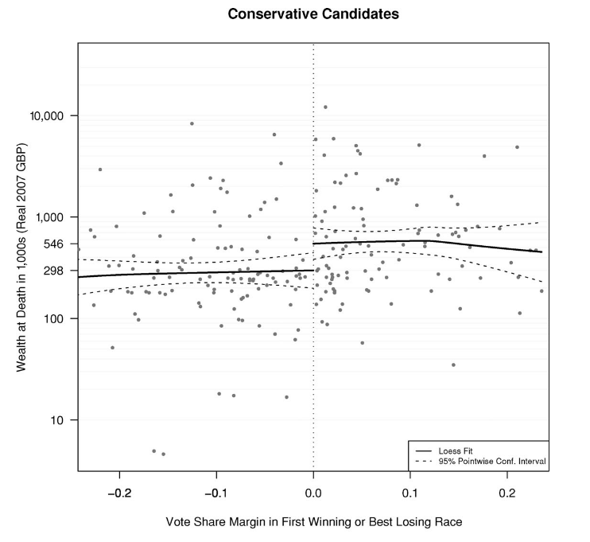
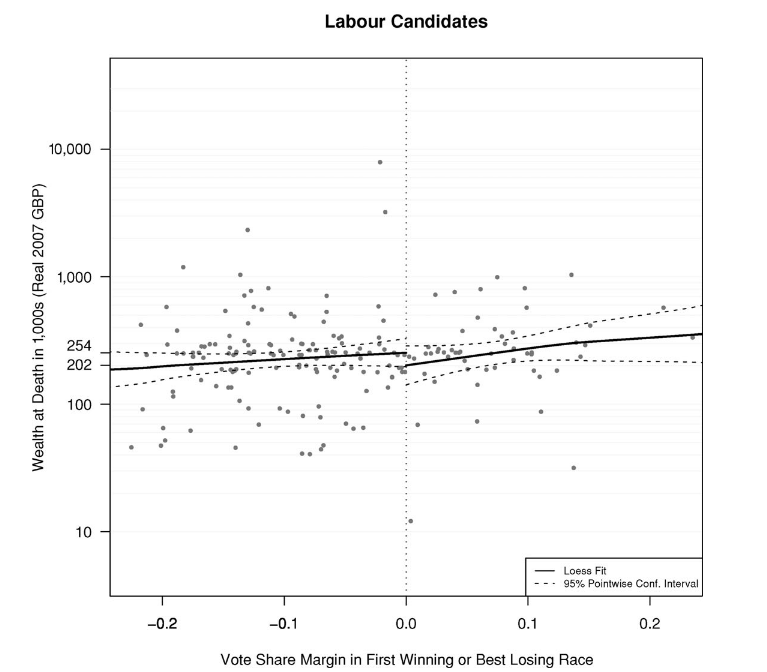

class: center, middle

```{css, echo=FALSE}
pre {
  max-height: 400px;
  overflow-y: auto;
}

pre[class] {
  max-height: 200px;
}
```

```{r, load_refs, include=FALSE, cache=FALSE}
# Initializes
library(RefManageR)

library(ggplot2)
library(dplyr)
library(readr)
library(nlme)
library(jtools)
library(mice)
library(knitr)
library(modelsummary)
library(kableExtra)

BibOptions(check.entries = FALSE,
           bib.style = "authoryear", # Bibliography style
           max.names = 3, # Max author names displayed in bibliography
           sorting = "nyt", #Name, year, title sorting
           cite.style = "authoryear", # citation style
           style = "markdown",
           hyperlink = FALSE,
           dashed = FALSE)

```
```{r xaringan-themer, include=FALSE, warning=FALSE}
library(xaringanthemer,MnSymbol)
style_mono_accent(
  base_color = "#1c5253",
  header_font_google = google_font("Josefin Sans"),
  text_font_google   = google_font("Montserrat", "300", "300i"),
  code_font_google   = google_font("Fira Mono"),
  text_font_size = "1.6rem"
)
```

```{r setup, include=FALSE}
knitr::opts_chunk$set(warning = FALSE)
```

A good goal in data analysis is summarizing the average value we would expect an outcome variable to take on given the values of a set of predictor variables.

---

Let's go back to the election and economy example from last time. We might ask: what is the average vote share for different levels of economic growth?

---


```{r, echo = FALSE, eval=TRUE, out.width="90%", fig.retina = 1, fig.align='center'}
library(tidyverse)
library(rosdata)
data("hibbs")
```

```{r, echo = TRUE, eval=TRUE, out.width="90%", fig.retina = 1, fig.align='center'}
econvoteplot <- ggplot(hibbs, aes(x = growth, y = vote, label = year)) +
     geom_text(size = 3) +
     scale_x_continuous(labels = function(x) paste0(x, "%")) +
     scale_y_continuous(labels = function(x) paste0(x, "%")) +
     labs(title = "Forecasting the Election from the Economy",
          x = "Average recent growth in personal income",
          y = "Incumbent party's vote share") +
     geom_vline(xintercept = 1, color = "gray50", linetype = "dashed", alpha = 0.7) +
     geom_vline(xintercept = 2, color = "gray50", linetype = "dashed", alpha = 0.7) +
     geom_vline(xintercept = 3, color = "gray50", linetype = "dashed", alpha = 0.7) +
     theme_minimal()
```

---

```{r, echo = FALSE, eval=TRUE, out.width="80%", fig.retina = 1, fig.align='center'}
econvoteplot 
```

---

Imagine that we have an unlimited number of elections, such that we can make the vertical lines closer and closer together. Eventually, we can generate a smooth function relating the growth in income to an average vote share.

---
##Conditional Expectation Function (CEF)

$$\mu(x_{i}) = E(y|x_{i})$$

---

We don't know the CEF relating economic growth to incumbent vote share, because there aren't infinite past US elections.

---
##Approximating the CEF

1. Stepwise means

---

```{r, echo = TRUE, eval=TRUE, out.width="90%", fig.retina = 1, fig.align='center'}
means <- c(
  mean(hibbs$vote[hibbs$growth <= 1], na.rm = TRUE),
  mean(hibbs$vote[hibbs$growth > 1 & hibbs$growth <= 2], na.rm = TRUE),
  mean(hibbs$vote[hibbs$growth > 2 & hibbs$growth <= 3], na.rm = TRUE),
  mean(hibbs$vote[hibbs$growth > 3], na.rm = TRUE)
)
```

---

```{r, echo = TRUE, eval=TRUE, out.width="90%", fig.retina = 1, fig.align='center'}
econvoteplot <- ggplot(hibbs, aes(x = growth, y = vote, label = year)) +
     geom_text(size = 3) +
     scale_x_continuous(labels = function(x) paste0(x, "%")) +
     scale_y_continuous(labels = function(x) paste0(x, "%")) +
     labs(title = "Forecasting the Election from the Economy",
          x = "Average recent growth in personal income",
          y = "Incumbent party's vote share") +
     geom_vline(xintercept = 1, color = "gray50", linetype = "dashed", alpha = 0.7) +
     geom_vline(xintercept = 2, color = "gray50", linetype = "dashed", alpha = 0.7) +
     geom_vline(xintercept = 3, color = "gray50", linetype = "dashed", alpha = 0.7) +
     geom_segment(aes(x = c(-Inf), xend = c(1), y = means[1], yend = means[1]),
               color = "blue", alpha = 0.7)+
     geom_segment(aes(x = c(1), xend = c(2), y = means[2], yend = means[2]),
               color = "blue", alpha = 0.7)+
     geom_segment(aes(x = c(2), xend = c(3), y = means[3], yend = means[3]),
               color = "blue", alpha = 0.7)+
     geom_segment(aes(x = c(3), xend = c(Inf), y = means[4], yend = means[4]),
               color = "blue", alpha = 0.7)+
     theme_minimal()
```

---

```{r, echo = FALSE, eval=TRUE, out.width="80%", fig.retina = 1, fig.align='center'}
econvoteplot 
```

---

```{r, echo = TRUE, eval=TRUE, out.width="90%", fig.retina = 1, fig.align='center'}
means
```

---
##Approximating the CEF

1. Stepwise means
2. Assumptions

---

Suppose that we somehow knew:

$$\mu(x_{i}) = E(y|x_{i}) = a + b x_{i}$$

---

What's a good way to figure out the line that we should use to fill in the two unknowns?

---

```{r, echo = TRUE, eval=TRUE, out.width="90%", fig.retina = 1, fig.align='center'}
econvoteplot <- ggplot(hibbs, aes(x = growth, y = vote, label = year)) +
     geom_text(size = 3) +
     scale_x_continuous(labels = function(x) paste0(x, "%")) +
     scale_y_continuous(labels = function(x) paste0(x, "%")) +
     labs(title = "Forecasting the Election from the Economy",
          x = "Average recent growth in personal income",
          y = "Incumbent party's vote share") +
     geom_abline(intercept = 58, slope = -5, color = "purple") +
     theme_minimal()
```

---

```{r, echo = FALSE, eval=TRUE, out.width="80%", fig.retina = 1, fig.align='center'}
econvoteplot 
```

---

```{r, echo = TRUE, eval=TRUE, out.width="90%", fig.retina = 1, fig.align='center'}
econvoteplot <- ggplot(hibbs, aes(x = growth, y = vote, label = year)) +
     geom_text(size = 3) +
     scale_x_continuous(labels = function(x) paste0(x, "%")) +
     scale_y_continuous(labels = function(x) paste0(x, "%")) +
     labs(title = "Forecasting the Election from the Economy",
          x = "Average recent growth in personal income",
          y = "Incumbent party's vote share") +
     geom_abline(intercept = 46, slope = 4, color = "salmon") +
     theme_minimal()
```


---

We don't want to just be arbitrarily drawing lines. We want the *best linear approximation of the CEF.*


---

$$m(x_{i}) = \beta_{0} + \beta_{1} x_{i}$$ 

where:

$$(\beta_{0}, \beta_{1}) = \text{arg min}_{\beta_{0}, \beta_{1}\in \mathbb{R}^{2}}E(y_{i} - \beta_{0} - \beta_{1} x_{i})^2$$

---

The version of $m(x_{i})$ from the last slide is often called the *best linear predictor (BLP) of Y on X.*

---

If the CEF is linear, then the BLP will equal the CEF. If not, they will be different, sometimes very different.

---

```{r, echo = TRUE, eval=TRUE, out.width="90%", fig.retina = 1, fig.align='center'}
#devtools::install_github("ropengov/rqog")
library(rqog)
qogts <- read_qog(which_data = "standard", data_type = "time-series")

```

---

```{r, echo = TRUE, eval=TRUE, out.width="90%", fig.retina = 1, fig.align='center'}
demeconplot <- ggplot(qogts, aes(x = wdi_gdpcappppcon2017, y = vdem_libdem)) +
     geom_point() +
     scale_x_continuous(labels = function(x) paste0(x, "%")) +
     scale_y_continuous(labels = function(x) paste0(x, "%")) +
     labs(title = "Modernization Theory and Democracy",
          x = "Per Capita GDP in Constant 2017 Dollars",
          y = "VDem Liberal Democracy Score") +
     theme_minimal()
```

---

```{r, echo = FALSE, eval=TRUE, out.width="80%", fig.retina = 1, fig.align='center'}
demeconplot 
```

---

```{r, echo = TRUE, eval=TRUE, out.width="90%", fig.retina = 1, fig.align='center'}
demeconplot.shapes <- ggplot(qogts, aes(x = wdi_gdpcappppcon2017, y = vdem_libdem)) +
     geom_point() +
     scale_x_continuous(labels = function(x) paste0(x, "%")) +
     scale_y_continuous(labels = function(x) paste0(x, "%")) +
     labs(title = "Modernization Theory and Democracy",
          x = "Per Capita GDP in Constant 2017 Dollars",
          y = "VDem Liberal Democracy Score") +
     geom_smooth(method=lm, color="purple") +
     geom_smooth(method=loess, color="blue") +
     theme_minimal()
```

---

```{r, echo = FALSE, eval=TRUE, out.width="80%", fig.retina = 1, fig.align='center'}
demeconplot.shapes 
```

---

We can generalize the best linear predictor to multivariate situations:

$$m(\mathbb{X}) = \beta_{0} + \beta_{1} X_{1} + \beta_{2} X_{2} + \cdots + \beta_{k} X_{k}$$ 

---

```{r, echo = FALSE, eval=TRUE, out.width="80%", fig.retina = 1, fig.align='center'}
coords <- read.csv("https://gist.githubusercontent.com/metal3d/5b925077e66194551df949de64e910f6/raw/c5f20a037409d96958553e2eb6b8251265c6fd63/country-coord.csv")

qogts$latitude <- NA

for (i in 1:nrow(qogts)){
  if (qogts$ccodealp[i] %in% coords$Alpha.3.code)
    qogts$latitude[i] <- coords$Latitude..average.[coords$Alpha.3.code==qogts$ccodealp[i]]
}

```

---

```{r, echo = TRUE, eval=TRUE, out.width="90%", fig.retina = 1, fig.align='center'}
demlatplot.shapes <- ggplot(qogts, aes(x = latitude, y = vdem_libdem)) +
     geom_point() +
     scale_x_continuous(labels = function(x) paste0(x, "%")) +
     scale_y_continuous(labels = function(x) paste0(x, "%")) +
     labs(title = "Geography and Democracy",
          x = "Latitude",
          y = "VDem Liberal Democracy Score") +
     geom_smooth(method=lm, color="purple") +
     geom_smooth(method=loess, color="blue") +
     theme_minimal()
```

---

```{r, echo = FALSE, eval=TRUE, out.width="80%", fig.retina = 1, fig.align='center'}
demlatplot.shapes 
```

---

```{r, echo = TRUE, eval=TRUE, out.width="70%", fig.retina = 1, fig.align='center'}
dem.lm <- lm(vdem_libdem ~ latitude + wdi_gdpcappppcon2017, data = qogts)
```

---
###Population

* The CEF and the BLP are at the population level.
* A good (rough) way to think about this is that they are what you would get if you had infinite cases measured perfectly.

---
###Model

* Even at the population level, we sometimes use models.
* A *model* is a simplified mathematical representation that stands in for and helps explore a more complex, often unknown, and harder to understand true descriptive relationship.

---

* If the CEF involves multiple variables, the 
* A *model* is a simplified mathematical representation that stands in for and helps explore a more complex, often unknown, and harder to understand true descriptive relationship.


---

```{r, echo = TRUE, eval=TRUE, out.width="70%", fig.retina = 1, fig.align='center'}
library(plotly)
iv.1 <- seq(-3, 3, length.out = 50)
iv.2 <- seq(-3, 3, length.out = 50)
dv <- outer(iv.1, iv.2, function(iv.1, iv.2) iv.1^3 - iv.2^2)

ourplot3d <- plot_ly(x = ~iv.1, y = ~iv.2, z = ~dv, type = "surface") %>%
    layout(scene = list(
        xaxis = list(title = "First IV"),
        yaxis = list(title = "Second IV"),
        zaxis = list(title = "DV")
    ))
```

---

```{r, echo = FALSE, eval=TRUE, out.width="80%", fig.retina = 1, fig.align='center'}
ourplot3d 
```


---

```{r, echo = TRUE, eval=TRUE, out.width="70%", fig.retina = 1, fig.align='center'}
df <- expand.grid(iv.1 = iv.1, iv.2 = iv.2)
df$dv <- as.vector(dv)
lm_model <- lm(dv ~ iv.1 + iv.2, data = df)

dv_blp <- matrix(predict(lm_model, newdata = df), nrow = length(iv.1), ncol = length(iv.2))
```

---

```{r, echo = TRUE, eval=TRUE, out.width="70%", fig.retina = 1, fig.align='center'}
ourplot3d <- plot_ly() %>%
  # Original surface
  add_surface(x = ~iv.1, y = ~iv.2, z = ~dv, 
              colorscale = "Blues", 
              opacity = 0.8,
              name = "Original Function") %>%
  # BLP surface
  add_surface(x = ~iv.1, y = ~iv.2, z = ~dv_blp, 
              colorscale = "Reds", 
              opacity = 0.8,
              name = "Best Linear Predictor") %>%
  layout(
    scene = list(
      xaxis = list(title = "First IV"),
      yaxis = list(title = "Second IV"),
      zaxis = list(title = "DV")
    ),
    legend = list(x = 0.8, y = 0.9)
  )
```

---

```{r, echo = FALSE, eval=TRUE, out.width="80%", fig.retina = 1, fig.align='center'}
ourplot3d 
```
  
---
###Regularity Conditions

For the BLP to exist, the following must be true:

* $E[Y^2] < \infty$
* $E ||\mathbb{X}||^2 < \infty$
* The columns of $\mathbb{X}$ are linearly independent.

---

It may seem weird to think of distributions with non-finite means/variances, but they do exist!

The classic example is the Cauchy distribution, which is also the Student's T distribution with 1 degree of freedom.

---

```{r, echo = TRUE, eval=TRUE, out.width="70%", fig.retina = 1, fig.align='center'}
rcauchy(100)
```

---

 

---



---



---

 