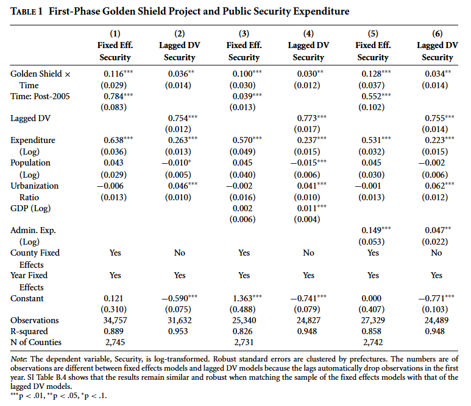

class: center, middle


```{css, echo=FALSE}
pre {
  max-height: 400px;
  overflow-y: auto;
}

pre[class] {
  max-height: 200px;
}
```

```{r, load_refs, include=FALSE, cache=FALSE}
# Initializes
library(RefManageR)

library(ggplot2)
library(dplyr)
library(readr)
library(nlme)
library(jtools)
library(mice)
library(knitr)
library(modelsummary)
library(kableExtra)
library(stringr)
library(ggplot2)
library(dplyr)
library(sandwich)
library(lmtest)
library(clubSandwich)
library(fixest)
library(modelsummary)
library(AER)

BibOptions(check.entries = FALSE,
           bib.style = "authoryear", # Bibliography style
           max.names = 3, # Max author names displayed in bibliography
           sorting = "nyt", #Name, year, title sorting
           cite.style = "authoryear", # citation style
           style = "markdown",
           hyperlink = FALSE,
           dashed = FALSE)

library(rqog)
qogts <- read_qog(which_data="standard", data_type = "time-series")

```
```{r xaringan-themer, include=FALSE, warning=FALSE}
library(xaringanthemer,MnSymbol)
style_mono_accent(
  base_color = "#1c5253",
  header_font_google = google_font("Josefin Sans"),
  text_font_google   = google_font("Montserrat", "300", "300i"),
  code_font_google   = google_font("Fira Mono"),
  text_font_size = "1.6rem"
)

knitr::opts_chunk$set(warning = FALSE, message = FALSE)

```

### **Why political data rarely satisfies textbook assumptions**

---
# The Problem: Why We Need Robust SEs

.pull-left[
### **Classical OLS Assumption:**
$$
\text{Var}(\epsilon_i | X) = \sigma^2
$$
Constant variance (homoskedasticity)

### **Political Reality:**
- Some groups are more predictable than others
- Richer districts have more variation in outcomes
- Survey error varies by respondent type
- Time-series volatility changes over time

**This is heteroskedasticity**
]

.pull-right[
```{r hetero-example, echo=FALSE, fig.height=4.5}
set.seed(123)
n <- 200
x <- runif(n, 10, 100)
# Heteroskedastic errors: variance increases with x
sigma <- 0.1 * x
y <- 2 + 0.5*x + rnorm(n, 0, sigma)

par(mfrow = c(1, 2))
plot(x, y, pch = 19, col = rgb(0, 0, 0, 0.5),
     main = "Heteroskedastic Data",
     xlab = "X (e.g., District Income)",
     ylab = "Y (e.g., Vote Share)")
abline(lm(y ~ x), col = "red", lwd = 2)

plot(fitted(lm(y ~ x)), resid(lm(y ~ x)),
     pch = 19, col = rgb(0, 0, 0, 0.5),
     main = "Residual Plot (Funnel Shape)",
     xlab = "Fitted Values",
     ylab = "Residuals")
abline(h = 0, col = "red", lty = 2)
```
**Consequence:** Standard errors are wrong → confidence intervals wrong → p-values wrong
]

---
# Consequences of Ignoring Heteroskedasticity

.pull-left[
### **What Happens?**
1. **OLS coefficients remain unbiased**
2. **But variance estimates are biased:**
   - Can be too small (common) → false significance
   - Can be too large → missed findings

### **Examples from Political Science:**
- **Wealth and voting:** Richer districts show more variation in turnout
- **Media effects:** Highly engaged voters more predictable
- **Policy adoption:** Early adopters differ from late adopters
- **Conflict studies:** Some countries more volatile

**Bottom line:** We overstate precision
]

.pull-right[
```{r consequences, echo=FALSE}
# Simulate the problem
set.seed(123)
n <- 100
reps <- 1000

# Store results
results <- data.frame(
  homoskedastic = numeric(reps),
  heteroskedastic = numeric(reps)
)

for(i in 1:reps) {
  x <- rnorm(n)
  # Homoskedastic case
  y_homo <- 0.5*x + rnorm(n, 0, 1)
  fit_homo <- lm(y_homo ~ x)
  
  # Heteroskedastic case
  y_hetero <- 0.5*x + rnorm(n, 0, abs(x) + 0.5)
  fit_hetero <- lm(y_hetero ~ x)
  
  results$homoskedastic[i] <- summary(fit_homo)$coefficients[2, 2]
  results$heteroskedastic[i] <- summary(fit_hetero)$coefficients[2, 2]
}

cat("Average SE (homoskedastic):", round(mean(results$homoskedastic), 3), "\n")
cat("Average SE (heteroskedastic):", round(mean(results$heteroskedastic), 3), "\n")
cat("\nTypical underestimation:", 
    round((mean(results$homoskedastic) - mean(results$heteroskedastic)) / 
            mean(results$heteroskedastic) * 100, 1), "%")
```

```{r consequence-plot, echo=FALSE, fig.height=3}
# Plot comparison
library(tidyr)
results_long <- pivot_longer(results, everything())

ggplot(results_long, aes(x = value, fill = name)) +
  geom_density(alpha = 0.5) +
  labs(x = "Estimated Standard Error",
       y = "Density",
       title = "SE Estimates Under Different Conditions") +
  scale_fill_manual(values = c("blue", "red"),
                    labels = c("Homoskedastic", "Heteroskedastic")) +
  theme_minimal() +
  theme(legend.position = "bottom")
```
]

---
# What Are Robust Standard Errors?

.pull-left[
### **Huber-White (Sandwich) Estimator**
Developed by Huber (1967) and White (1980)

**Regular OLS variance:**
$$
\text{Var}(\hat{\beta}) = (X'X)^{-1} \sigma^2
$$

**Robust (HC) variance:**
$$
\text{Var}(\hat{\beta}) = (X'X)^{-1} X' \Omega X (X'X)^{-1}
$$
where $\Omega = \text{diag}(e_i^2)$ for HC0

### **Intuition:**
- Weight observations by their residual size
- Bigger residuals → more uncertainty in that region
- Adapts to heteroskedasticity
]

.pull-right[
### **Flavors of HC Estimators**
```{r hc-types, echo=FALSE}
hc_types <- data.frame(
  Type = c("HC0", "HC1", "HC2", "HC3", "HC4"),
  Formula = c("e_i²", "n/(n-k) e_i²", 
              "e_i²/(1-h_ii)", "e_i²/(1-h_ii)²",
              "e_i²/(1-h_ii)^δ"),
  Description = c("Basic White", 
                  "Small sample correction",
                  "Leverage adjustment",
                  "More conservative",
                  "Designed for outliers")
)

knitr::kable(hc_types, 
             col.names = c("Type", "Weight", "Description"),
             caption = "Common HC Estimators")
```

### **Political Science Convention:**
- **HC1** or **HC2** most common
- **HC3** when worried about outliers
- **Stata default:** HC1
- **R common practice:** HC3 (more conservative)
]

---
# Implementation in R: The `sandwich` Package

.pull-left[
### **Basic Implementation**
```{r r-implementation, eval=FALSE}
library(sandwich)
library(lmtest)

# Fit regular model
model <- lm(vote_share ~ income + education, 
            data = election_data)

# Regular SEs
summary(model)

# Robust SEs (HC3 default)
coeftest(model, vcov = vcovHC)

# Different HC types
coeftest(model, vcov = vcovHC(model, type = "HC0"))
coeftest(model, vcov = vcovHC(model, type = "HC1"))
coeftest(model, vcov = vcovHC(model, type = "HC3"))
```

### **Using `modelsummary`**
```{r modelsummary-ex, eval=FALSE}
library(modelsummary)

modelsummary(
  list("OLS" = model, 
       "Robust SE" = model),
  vcov = list("iid", "HC3"),
  stars = TRUE
)
```
]

.pull-right[
### **Complete Example**
```{r full-r-example, eval=FALSE}
# Load data
data("CASchools", package = "AER")
# Simulate heteroskedasticity
CASchools$testscore <- 
  CASchools$read + CASchools$math + 
  rnorm(nrow(CASchools), 0, 
        abs(CASchools$income)/1000)

# Fit model
model <- lm(testscore ~ income + english, 
            data = CASchools)

# Compare SEs
library(modelsummary)
models <- list(
  "Regular" = model,
  "HC0" = model,
  "HC1" = model,
  "HC2" = model,
  "HC3" = model
)

msummary(models,
         vcov = c("iid", "HC0", "HC1", "HC2", "HC3"),
         fmt = 2,
         stars = TRUE,
         output = "markdown")
```
]

---
# Implementation in Stata

.pull-left[
### **Basic Syntax**
```stata
* Regular OLS
regress vote_share income education

* With robust SEs
regress vote_share income education, vce(robust)

* With clustered SEs
regress vote_share income education, vce(cluster state)

* Save results for table
eststo clear
eststo: reg vote_share income education
eststo: reg vote_share income education, vce(robust)
esttab using results.rtf, se ar2 replace
```

### **The `reghdfe` Package**
```stata
* Install if needed
ssc install reghdfe

* Fixed effects with clustered SEs
reghdfe vote_share income education, ///
  absorb(state year) vce(cluster state)
```

**Stata Tip:** `vce(robust)` uses HC1 by default
]

.pull-right[
### **Comparing Outputs**
```{r stata-comparison, echo=FALSE}
# Create simulated comparison table
comparison <- data.frame(
  Variable = c("income", "education", "Constant"),
  Coefficient = c(0.45, 0.32, 12.5),
  SE_Regular = c(0.12, 0.08, 2.1),
  SE_Robust = c(0.18, 0.12, 3.2),
  p_Regular = c(0.000, 0.000, 0.000),
  p_Robust = c(0.012, 0.008, 0.000)
)

comparison$Sig_Regular <- ifelse(comparison$p_Regular < 0.05, "Yes", "No")
comparison$Sig_Robust <- ifelse(comparison$p_Robust < 0.05, "Yes", "No")

knitr::kable(comparison, 
             caption = "Example: How SEs Change Inference",
             digits = 3) %>%
  kableExtra::kable_styling(full_width = FALSE)
```

### **Key Insight:**
Robust SEs often (but not always) increase standard errors, making findings **less significant**. This is more honest given real-world data.
]

---
# Clustered Standard Errors

.pull-left[
### **When Observations Are Not Independent**
Common in political science:
1. **Panel data:** Multiple observations per country
2. **Survey data:** Respondents within states
3. **Experimental data:** Treatments assigned to groups
4. **Spatial data:** Nearby locations correlated

### **The Problem:**
Within-cluster correlation → underestimation of variance

**Example:** If all respondents in Texas share unobserved factors, we don't have 100 independent observations, but 1 cluster of 100 correlated observations
]

.pull-right[
### **Clustering Formula**
$$
\text{Var}(\hat{\beta}) = (X'X)^{-1} \left( \sum_{c=1}^C X_c' e_c e_c' X_c \right) (X'X)^{-1}
$$
where $c$ indexes clusters

### **Implementation in R:**
```{r cluster-r, eval=FALSE}
# Using sandwich and lmtest
coeftest(model, 
         vcov = vcovCL(model, 
                       cluster = ~state))

# Using fixest package (fast!)
library(fixest)
model_fe <- feols(vote_share ~ income + education,
                  data = election_data,
                  cluster = ~state)

# Using clubSandwich for multi-way clustering
library(clubSandwich)
coef_test(model, 
          vcov = "CR2", 
          cluster = election_data$state)
```
]

---
# Multi-Way Clustering

.pull-left[
### **Complex Dependencies**
Sometimes observations cluster in multiple ways:
1. **States and years** (Cameron, Gelbach & Miller, 2011)
2. **Individual and time** (two-way FE)
3. **Industry and region**

### **Example:**
Studying campaign contributions:
- Donors within states (geographic correlation)
- Donors within industries (sector correlation)
- Need to account for both

### **R Implementation:**
```{r multiway-cluster, eval=FALSE}
# Using clubSandwich
vcov_multi <- vcovCR(model,
                     type = "CR2",
                     cluster = election_data[, c("state", "year")])

coeftest(model, vcov = vcov_multi)

# Using lfe (older but works)
library(lfe)
model_multi <- felm(vote_share ~ income + education |
                      state + year,
                    data = election_data)
summary(model_multi, robust = TRUE)
```
]

.pull-right[
### **When to Cluster?**
.center[
```{r clustering-rules, echo=FALSE}
rules <- data.frame(
  Data_Structure = c("Cross-section", 
                     "Panel (country-year)",
                     "Survey (individuals in states)",
                     "Experimental (treatments in groups)",
                     "Time series",
                     "Network/spatial"),
  Clustering = c("No clustering or heteroskedasticity-robust",
                 "Cluster by country",
                 "Cluster by state (or primary sampling unit)",
                 "Cluster by treatment group",
                 "Newey-West (HAC) errors",
                 "Spatial HAC or Conley errors"),
  R_Package = c("sandwich", "plm/sandwich", "survey/sandwich", 
                "clubSandwich", "sandwich", "spatialreg")
)

knitr::kable(rules, 
             caption = "Clustering Guidelines for Political Data") %>%
  kableExtra::kable_styling(font_size = 10)
```
]

**Rule of thumb:** Cluster at the level of treatment assignment or at the level where you suspect correlation.
]

---
# Practical Considerations for Political Scientists

.pull-left[
### **1. Sample Size Matters**
- Robust SEs need reasonable N
- Clustering needs sufficient clusters (>50)
- With few clusters, use wild bootstrap

### **2. Fixed Effects + Clustering**
- Include fixed effects for within-cluster variation
- Cluster at higher level than FE
- Example: State-year data → state FE, cluster by state

### **3. Pre-testing is Problematic**
Don't test for heteroskedasticity then decide
- Tests have low power
- Type II errors common
- **Better:** Always use robust SEs as default
]

.pull-right[
### **4. Reporting Standards**
```{r reporting-standards, eval=FALSE}
# In RMarkdown, use modelsummary
modelsummary(
  list("OLS" = model_ols,
       "Robust SE" = model_robust,
       "Clustered" = model_cluster),
  vcov = list("iid", "HC3", ~state),
  stars = TRUE,
  gof_map = c("nobs", "r.squared"),
  output = "kableExtra"
)
```

### **5. Common Pitfalls**
- Clustering at wrong level
- Ignoring serial correlation in time series
- Using robust SEs with instrumental variables
- Forgetting about multi-way clustering

**Journal Expectations:** Most top journals require some form of robust SEs
]

---
# Special Case: Time Series (HAC Errors)

.pull-left[
### **Newey-West Standard Errors**
For autocorrelated errors in time series:

```{r newey-west, eval=FALSE}
# Using sandwich package
coeftest(model, 
         vcov = NeweyWest(model, 
                          lag = 4,  # Lags to consider
                          prewhite = FALSE))

# Rule of thumb: L = T^(1/4)
# For 100 time periods: L ≈ 3

# Using dynlm for time series models
library(dynlm)
model_ts <- dynlm(vote_share ~ L(vote_share) + economy,
                  data = election_ts)
coeftest(model_ts, vcov = NeweyWest)
```

### **When to Use:**
- Annual election data
- Monthly approval ratings
- Quarterly economic indicators
]

.pull-right[
### **Political Science Examples**
1. **Presidential approval:** Autocorrelated over time
2. **Policy diffusion:** Spatial and temporal correlation
3. **Electoral cycles:** Seasonal patterns

```{r hac-example, echo=FALSE, fig.height=3.5}
# Simulate time series with autocorrelation
set.seed(123)
T <- 100
time <- 1:T
y <- arima.sim(model = list(ar = 0.7), n = T)
x <- rnorm(T)
y <- 0.5*x + y  # Add relationship

par(mfrow = c(1, 2))
acf(resid(lm(y ~ x)), main = "ACF of Residuals")
pacf(resid(lm(y ~ x)), main = "PACF of Residuals")
```

**Diagnostic:** Check ACF/PACF plots of residuals. If autocorrelation present, use HAC errors.
]

---
# Robust SEs with Instrumental Variables

.pull-left[
### **The Challenge**
IV models already have complex variance structure
- Need heteroskedasticity-robust IV SEs
- Stata: `ivregress 2sls y x1 (x2 = z), vce(robust)`
- R: Use `ivreg` from AER package

```{r iv-robust, eval=FALSE}
library(AER)

# IV regression with robust SEs
iv_model <- ivreg(vote_share ~ income + education |
                    income + instrument,
                  data = election_data)

# Get robust SEs
coeftest(iv_model, 
         vcov = vcovHC(iv_model, type = "HC3"))

# Clustered SEs for IV
library(sandwich)
coeftest(iv_model,
         vcov = vcovCL(iv_model, 
                       cluster = ~state))
```
]

.pull-right[
### **Warning: Weak Instruments**
Robust SEs don't solve weak instrument problems
- First-stage F-stat still matters
- Use Kleibergen-Paap rk Wald F statistic for robust version

### **Political Science Applications:**
1. **Natural experiments:** Clustered treatment assignment
2. **Shift-share instruments:** Need careful SEs
3. **Border discontinuity:** Spatial correlation

**Best practice:** Report both conventional and robust SEs in IV models, check for consistency.
]

---
# Limitations and When NOT to Use Robust SEs

.pull-left[
### **1. Very Small Samples**
- HC estimators biased in tiny samples
- N < 30: Consider alternatives
- Better: Use exact methods or permutation tests

### **2. Weighted Data**
- Survey weights already account for heterogeneity
- Don't double-adjust
- Use design-based SEs instead

### **3. Nonlinear Models**
- GLMs (logit, probit) have different variance structure
- Use sandwich estimators designed for GLMs
- Or use quasi-likelihood methods
]

.pull-right[
### **4. Model Misspecification**
Robust SEs don't fix:
- Omitted variable bias
- Functional form misspecification
- Measurement error
- Simultaneity

**They're not a magic bullet!**

### **5. Efficiency Loss**
- Robust SEs are less efficient when homoskedasticity holds
- But cost is small in large samples
- **Tradeoff:** Robustness vs. efficiency

**Political science default:** Use robust SEs unless you have strong reason not to
]

---
# Workflow for Political Science Research

.center[
## **Step-by-Step Approach**
]

.pull-left[
### **Step 1: Exploratory Analysis**
1. Plot residuals vs. fitted values
2. Check for funnel patterns
3. Identify likely clustering structure
4. Test for autocorrelation (time series)

### **Step 2: Model Specification**
1. Start with theory-driven model
2. Include relevant fixed effects
3. Consider functional form
4. **Always plan** for robust SEs
]

.pull-right[
### **Step 3: Estimation**
```{r workflow-code, eval=FALSE}
# Template code
library(fixest)  # Fast and user-friendly

model <- feols(
  y ~ x1 + x2 | fe1 + fe2,  # Formula with FEs
  data = my_data,
  cluster = ~cluster_var,    # Clustering
  vcov = "hetero"           # Robust SEs
)

# Alternative: lm + sandwich
model_lm <- lm(y ~ x1 + x2, data = my_data)
coeftest(model_lm, vcov = vcovCL, 
         cluster = ~cluster_var)
```

### **Step 4: Reporting**
1. Always report which SEs used
2. Justify clustering choice
3. Show robustness to different SE choices
4. Provide code for replication
]

---
# Real Example: Election Forecasting

.pull-left[
```{r election-forecast-example, eval=FALSE}
# Load election data
library(forecast)
data("presidentialElections", package = "pscl")

# Model with heteroskedasticity
model <- lm(vote ~ growth + incumbent + war,
            data = presidentialElections)

# Compare SEs
library(modelsummary)
models <- list(
  "Standard" = model,
  "HC3" = coeftest(model, vcov = vcovHC),
  "Clustered by Year" = coeftest(model, 
                                 vcov = vcovCL,
                                 cluster = ~year)
)

msummary(models,
         estimate = "{estimate} ({std.error})",
         statistic = NULL,
         output = "markdown")
```
]

.pull-right[
### **Findings:**
1. Economic growth effect remains significant
2. Incumbency advantage SE increases 30%
3. War variable becomes insignificant with robust SEs

### **Lesson:**
What seemed like strong findings with regular SEs become more nuanced with proper inference.

### **Replication Package:**
Always include code for SE calculation in replication materials. Journals increasingly check this.
]

---
class: inverse, center, middle

# Summary & Best Practices

---
# Key Takeaways

.pull-left[
### **1. Default to Robust SEs**
- Political data is heteroskedastic
- Little cost, big benefit
- Use HC3 in R, `vce(robust)` in Stata

### **2. Cluster Appropriately**
- At level of treatment assignment
- Or at level of suspected correlation
- More clusters = better

### **3. Don't Rely on Tests**
- Breusch-Pagan, White tests have low power
- Just use robust SEs
]

.pull-right[
### **4. Report Transparently**
```stata
* Good: 
reg y x, vce(cluster state)

* Better:
reg y x i.state i.year, vce(cluster state)
```

### **5. Know the Limitations**
- Small samples problematic
- Doesn't fix misspecification
- Efficiency tradeoff minimal

### **Final Advice:**
> "When in doubt, cluster. When really in doubt, cluster at a higher level and use robust SEs too."
> — Anonymous political methodologist
]

---
# Further Resources

.pull-left[
### **Reading List**
1. **Angrist & Pischke** (2009) *Mostly Harmless Econometrics*
   - Chapter 8 on robust SEs

2. **Cameron & Trivedi** (2005) *Microeconometrics*
   - Comprehensive treatment

3. **Wooldridge** (2010) *Econometric Analysis*
   - Clear explanations

4. **Recent advances:**
   - MacKinnon & White (1985) on HC3
   - Cameron, Gelbach & Miller (2011) on multi-way
]

.pull-right[
### **Software Guides**
- **R:** `vignette("sandwich", package = "sandwich")`
- **Stata:** `help regress` and `help vce_option`
- **Python:** `statsmodels` with `cov_type='HC3'`

### **Political Science Examples**
1. **AJPS replication packages:** See how top journals do it
2. **ICPSR workshops:** Regular training on robust inference
3. **Your professor's code:** Ask for examples!

### **Practice Dataset:**
```{r practice-data, eval=FALSE}
# ANES data example
library(anesrake)
# Or use your own research data
```
]

---
class: inverse, center, middle

# Questions & Discussion

<br>

### **Next Week:**
- Fixed effects and difference-in-differences
- Bring your own data for consultation

<br>

**Office Hours:** [Time] | **Email:** [Your Email]

---
# Appendix: Common Problems & Solutions

```{r appendix, eval=FALSE}
# Problem 1: Too few clusters
# Solution: Wild cluster bootstrap
library(fwildclusterboot)
boot_model <- boottest(model, 
                       clustid = "state",
                       B = 9999)
summary(boot_model)

# Problem 2: Multi-way FE with clustering
# Solution: lfe or fixest
library(fixest)
model_multi <- feols(y ~ x1 + x2 | state + year,
                     data = data,
                     cluster = ~state + year)

# Problem 3: Spatial correlation
# Solution: Conley SEs
library(spatialreg)
# Or use custom code from Hsiang (2010)
```

### **Stata Equivalents:**
```stata
* Wild bootstrap
boottest, cluster(state) reps(9999)

* Multi-way clustering
reghdfe y x, absorb(state year) vce(cluster state year)
```

**Remember:** The goal is honest inference, not finding significance.
```

---


---

