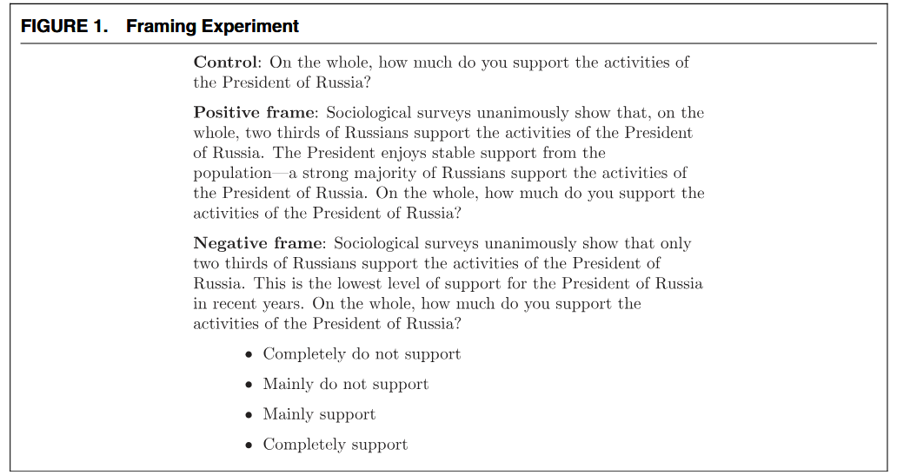
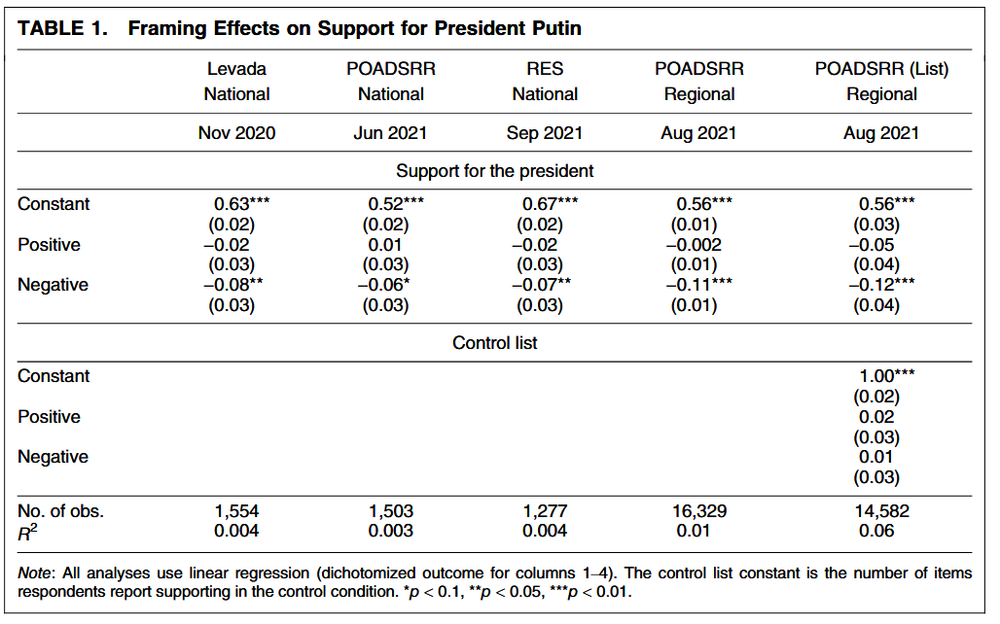

class: center, middle

```{css, echo=FALSE}
pre {
  max-height: 400px;
  overflow-y: auto;
}

pre[class] {
  max-height: 200px;
}
```

```{r, load_refs, include=FALSE, cache=FALSE}
# Initializes
library(RefManageR)

library(ggplot2)
library(dplyr)
library(readr)
library(nlme)
library(jtools)
library(mice)
library(knitr)
library(modelsummary)
library(kableExtra)
library(stringr)

BibOptions(check.entries = FALSE,
           bib.style = "authoryear", # Bibliography style
           max.names = 3, # Max author names displayed in bibliography
           sorting = "nyt", #Name, year, title sorting
           cite.style = "authoryear", # citation style
           style = "markdown",
           hyperlink = FALSE,
           dashed = FALSE)

```
```{r xaringan-themer, include=FALSE, warning=FALSE}
library(xaringanthemer,MnSymbol)
style_mono_accent(
  base_color = "#1c5253",
  header_font_google = google_font("Josefin Sans"),
  text_font_google   = google_font("Montserrat", "300", "300i"),
  code_font_google   = google_font("Fira Mono"),
  text_font_size = "1.6rem"
)
```

Our sample estimate $\hat \beta_{OLS}$ is not usually going to be exactly the same as the population best linear predictor. Why should we use $\hat \beta_{OLS}$ when we know it will usually be wrong?

---

1. We don't know the population-level best linear predictor, and we usually don't have any good way of accessing it.

2. $\hat \beta_{OLS}$ may not be exactly equal to the population-level best linear predictor in most individual applications, but it still has some good statistical properties that we can discuss.

---

Assume:

1. $(Y_i,\mathbf{X}_i)$ are iid random vectors.

2. $\text{E}(Y^2) < \infty$

3. $\text{E}(||\mathbf{X}||^2) < \infty$

4. $\text{E}(\mathbf{X} \mathbf{X}^T)$ is positive definite

---

These four assumptions mean:

1. Our observations are independent draws from the overall population, and don't depend on each other.

2. The outcome variable has a distribution with finite mean and variance.

3. The right-hand-side variables have finite means, variances, and covariances.

4. There is no linear dependence or perfect multicollinearity.

---

Recall that:

$$\hat \beta_{OLS} = (\mathbf{X}^T\mathbf{X})^{-1}\mathbf{X}^TY$$

The best linear predictor represents $Y$ as:

$$Y = \mathbf{X} \beta + \epsilon$$
Let's insert the formula for $Y$ from the BLP into the formula for $\hat \beta_{OLS}$:

$$\hat \beta_{OLS} = (\mathbf{X}^T\mathbf{X})^{-1}\mathbf{X}^T(\mathbf{X} \beta + \epsilon)$$

---

Now, let's multiply terms through:

$$\hat \beta_{OLS} = (\mathbf{X}^T\mathbf{X})^{-1}\mathbf{X}^T\mathbf{X} \beta + (\mathbf{X}^T\mathbf{X})^{-1}\mathbf{X}^T\epsilon$$

We see that $(\mathbf{X}^T\mathbf{X})^{-1}\mathbf{X}^T\mathbf{X} = I$, which is the matrix equivalent of terms in the top and bottom of a fraction canceling out. So:

$$\hat \beta_{OLS} = \beta + (\mathbf{X}^T\mathbf{X})^{-1}\mathbf{X}^T\epsilon$$

---

What can we say about the estimation error part, $(\mathbf{X}^T\mathbf{X})^{-1}\mathbf{X}^T\epsilon$?

Let's look at what happens to the sample average of $\mathbf{X}^T\mathbf{X}$ as the sample size gets very large.

Because we have assumed that the observations are independent and identically distributed, because we have assumed that the $\mathbf{X}$ variables have finite moments, and because we have assumed that $\text{E}(\mathbf{X} \mathbf{X}^T)$ is positive definite, the law of large numbers applies.

---

This means that the sample average will tend to converge to the population value as the sample size goes to infinity.

$$\frac{1}{n}\sum_{i=1}^{n}\mathbf{X_i}\mathbf{X_i}^T \overset{p}{\to} \text{E}(\mathbf{X} \mathbf{X}^T)$$

And we know that $\text{E}(\mathbf{X} \mathbf{X}^T)$ is just some constant matrix.

---

We still have to think about the second part, $\mathbf{X}^T\epsilon$.

For the same reasons as before, the law of large numbers applies here, and we can analyze the sample average as the sample size goes to infinity:

$$\frac{1}{n}\sum_{i=1}^{n}\mathbf{X_i}^T\epsilon_{i} \overset{p}{\to} \text{E}(\mathbf{X} \epsilon)$$

But remember that we created the best linear predictor on purpose so that the errors of prediction, $\epsilon$, will have no linear relationship with $\mathbf{X}$. That is to say, by construction, $\text{E}(\mathbf{X} \epsilon) = 0$.

For that reason, 

$$\frac{1}{n}\sum_{i=1}^{n}\mathbf{X_i}^T\epsilon_{i} \overset{p}{\to} 0$$
---

Putting the two pieces together, we have the result that, as the sample size goes to infinity, the estimation error in $\hat \beta_{OLS}$ converges in probability to the product of (the inverse of) a constant positive definite matrix and zero. This product, in turn, is going to turn out to be zero. Under the four assumptions discussed earlier, this gives us:

$$\hat \beta_{OLS} \overset{p}{\to} \beta$$

People call this property *consistency*.

---

What about the distribution of the estimation errors?

We can use the *central limit theorem*.

Setup:

1. We have i.i.d. random vectors $Z_1, Z_2, \ldots,Z_n$.

2. We are interested in a function of the data $g(Z)$ such that $\text{E}g(Z)=0$ and therefore $\text{Var}(g(Z))=\text{E}g(Z)g(Z)^T$

3. $\text{E}(||g(Z_{i})||^2) < \infty$

---

Implication:

$$\frac{1}{\sqrt{n}}\sum_{i=1}^{n}g(Z_{i}) \overset{d}{\to} \mathcal{N}(0,\text{Var}(g(Z)))$$

---

Let's apply the central limit theorem to our errors of estimation. We will connect the theorem to our situation as follows.

* Our i.i.d. random vectors $Z_{i}$ are made up of observations of $(Y_{i},\mathbf{X}_{i})$.

* Our function $G(Z_{i}) = X_{i} \epsilon_{i}$, which we can do because $X_{i}$ is part of $Z$ and $\epsilon_{i}$ comes from regression, which can be calculated with the data from $Z$.

---

Then the theorem implies:

$$\frac{1}{\sqrt{n}}\sum_{i=1}^{n}(X_{i} \epsilon_{i}) \overset{d}{\to} \mathcal{N}(0,\text{Var}(X_{i} \epsilon_{i}))$$

Doing the matrix math, it turns out that we can connect this back to what we really care about, the OLS estimator:

$$\sqrt{n}(\hat \beta_{OLS} - \beta) \overset{d}{\to} \mathcal{N}(0,\text{E}(X_{i} X_{i}^T)^{-1} \text{E}(e_i^2 X_{i} X_{i}^T)\text{E}(X_{i} X_{i}^T)^{-1}$$

This is all very enlightening, but without estimates of the key quantities, it may not be too useful.

---

The expression $\text{E}(X_{i} X_{i}^T)^{-1} \text{E}(e_i^2 X_{i} X_{i}^T)\text{E}(X_{i} X_{i}^T)^{-1}$ is a bit unwieldy.

* $V = \text{E}(X_{i} X_{i}^T)^{-1} \text{E}(e_i^2 X_{i} X_{i}^T)\text{E}(X_{i} X_{i}^T)^{-1}$

* $Q_{\mathbf{X} \mathbf{X}} = \text{E}(X_{i} X_{i}^T)$

* $\Omega = \text{E}(e_i^2 X_{i} X_{i}^T)$

$$V = Q_{\mathbf{X} \mathbf{X}}^{-1} \Omega Q_{\mathbf{X} \mathbf{X}}^{-1}$$
---

Let's create plug-in estimates of $Q_{\mathbf{X} \mathbf{X}}$ and $\Omega$.

$$Q_{\mathbf{X} \mathbf{X}} = \text{E}(X_{i} X_{i}^T)$$

$$\hat Q_{\mathbf{X} \mathbf{X}} = \frac{1}{n} \sum_{i=1}^{n} (X_{i} X_{i}^T)$$

---

$$\Omega = \text{E}(e_i^2 X_{i} X_{i}^T)$$

$$\hat \Omega = \frac{1}{n} \sum_{i=1}^{n}(\hat e_i^2 X_{i} X_{i}^T)$$

---

Under very similar conditions to the assumptions we've been working with so far, the law of large numbers will produce the result that:

$$\hat Q_{\mathbf{X} \mathbf{X}} \overset{p}{\to} Q_{\mathbf{X} \mathbf{X}}$$

$$\hat \Omega \overset{p}{\to} \Omega$$

Thus, we can reasonably use:

$$\hat V = \hat Q_{\mathbf{X} \mathbf{X}}^{-1} \hat \Omega \hat Q_{\mathbf{X} \mathbf{X}}^{-1}$$

as an estimate of the variance of $\hat \beta_{OLS}$.

---

So what do we do with this? A whole variance matrix is a lot of information, usually, and may not give easy-to-understand answers about the precision of the estimates we care about the most.

Usually, people focus on the *standard error* of one coefficient (or one at a time, etc.).

---

$$\text{se} (\hat\beta_{j}) = \sqrt{\frac{(\hat V_{\beta})_{j j}} {n}}$$

---

We can test hypotheses (usually in social science as follows):

$$H_{0} : \beta_{j} = 0$$
$$H_{1} : \beta_{j} \neq 0$$

---

$$\frac{\hat \beta_{j}}{\text{se} (\hat\beta_{j})}\overset{d}{\to} \mathcal{N}(0,1)$$

So, with very large samples, we can compare estimates of this ratio to the standard normal distribution and reject $H_{0}$ when we get very small probability numbers.

---

```{r, echo = TRUE, eval=TRUE, out.width="90%", fig.retina = 1, fig.align='center'}
library(rqog)
library(lmtest)
library(sandwich)
qogts <- read_qog(which_data="standard", data_type = "time-series")
deminternet.lm <- lm(vdem_libdem ~ wdi_broadb + I(log(wdi_gdpcappppcon2017)), data=qogts)
robust_deminternet_vcov <- vcovHC(deminternet.lm, type = "HC3")
coeftest(deminternet.lm, vcov = robust_deminternet_vcov)
```

---

```{r, echo = TRUE, eval=TRUE, out.width="90%", fig.retina = 1, fig.align='center'}
library(estimatr)
deminternet.robust <- lm_robust(vdem_libdem ~ wdi_broadb + I(log(wdi_gdpcappppcon2017)), data=qogts, se_type = "HC3")
summary(deminternet.robust)
```

---

Suppose we don't have a very large, almost infinite sample. What then?

Perhaps it's true that the actual CEF is linear! Let's assume the following:

$$Y = \mathbf{X}\beta + \epsilon$$

$$\text{E}(\epsilon | \mathbf{X}) = 0$$

Let's also impose that $\text{E}(X X^T) > 0$ and is invertible, i.e., positive definite.

---

Then we can say some more serious stuff about $\hat \beta_{OLS}$ for finite samples.

To start with,

$$\text{E}(\hat \beta_{OLS}|\mathbf{X}) = \beta$$

Remember that:

$$\hat \beta_{OLS} = \beta + (\mathbf{X}^T\mathbf{X})^{-1}\mathbf{X}^T\epsilon$$

Let's take the conditional expectation of $\hat \beta_{OLS}$ given $\mathbf{X}$:

$$\text{E}(\hat \beta_{OLS}|\mathbf{X}) = \text{E}(\beta + (\mathbf{X}^T\mathbf{X})^{-1}\mathbf{X}^T\epsilon | \mathbf{X})$$

$$\text{E}(\hat \beta_{OLS}|\mathbf{X}) = \beta + \text{E}((\mathbf{X}^T\mathbf{X})^{-1}\mathbf{X}^T\epsilon | \mathbf{X})$$

$$\text{E}(\hat \beta_{OLS}|\mathbf{X}) = \beta + (\mathbf{X}^T\mathbf{X})^{-1}\mathbf{X}^T \text{E}(\epsilon | \mathbf{X})$$

$$\text{E}(\hat \beta_{OLS}|\mathbf{X}) = \beta + 0$$

---

Variance estimation and significance testing follow the same logic as under very large samples.

---

Let's add a new assumption, and impose that all of the errors in our regression have identical variance:

$$\text{E}(e_{i}^2|\mathbf{X_{i}}) = \text{E}(e_{i}^2) = \sigma^2$$

This assumption has the ever-popular name of *homoskedasticity*.

---

If we stack this assumption on top of our linear CEF assumptions, it turns out that there's a simpler way to get the variance of $\hat \beta_{OLS}:$

$$\text{Var}(\hat \beta_{OLS} | \mathbf{X}) = \sigma^2 (\mathbf{X}^T\mathbf{X})^{-1}$$

We can estimate $\sigma^2$:

$$\hat \sigma^2 = \frac{1}{n - k - 1}\sum_{i=1}^{n}\hat e_{i}^2$$

Furthermore, under these assumptions, there is no linear unbiased estimator with lower variance than $\hat \beta_{OLS}$.

---

One last assumption. Let's suppose that our error terms are exactly normally distributed:

$$e_{i} | \mathbf{X_{i}} \sim \mathcal{N}(0,\sigma^2)$$
Then it will turn out that:

$$\hat \beta_{OLS} | \mathbf{X_{i}} \sim\mathcal{N}(\beta,\sigma^2 (\mathbf{X}^T\mathbf{X})^{-1})$$

$$\frac{\hat \beta_{j}- \beta_{j}} {(\hat V_{\hat \beta})_{JJ}/\sqrt{n}} \sim t_{n-k-1}$$

---

So, let's review.

1. We can make a very strong argument for using regression with few assumptions when we have large samples.

2. If our large samples also involve independent, identically distributed draws from the population, we can make a very strong argument for setting up significance tests without adding many assumptions at all.

3. If our sample isn't that large but the CEF is linear and we meet the other assumptions, regression will work well on average and we can still do significance tests.

---

4. If we add homoskedasticity, we get simpler estimates of standard errors and the result that regression is the best linear unbiased estimator (BLUE).

5. If we assume that errors are conditionally normally distributed, we get exact distributions for test statistics.

---


---



---


