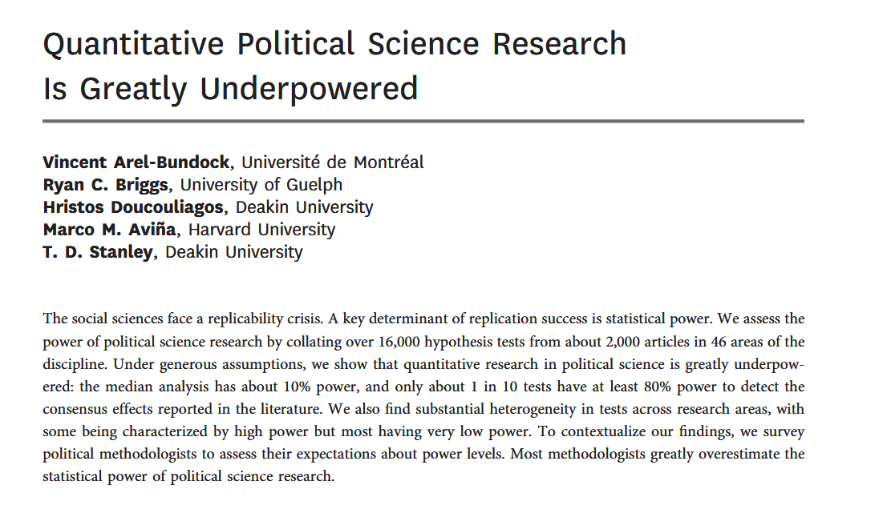
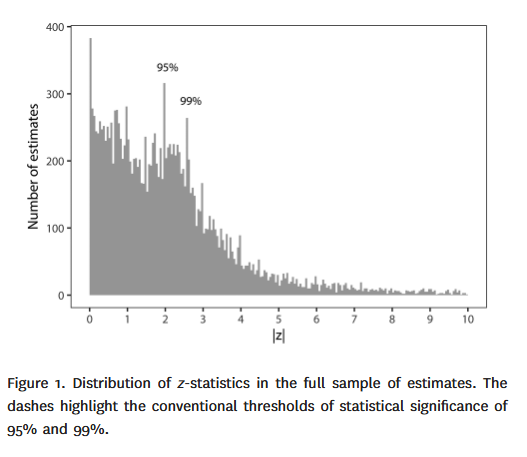
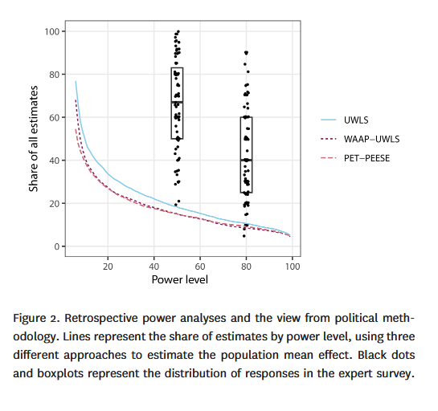
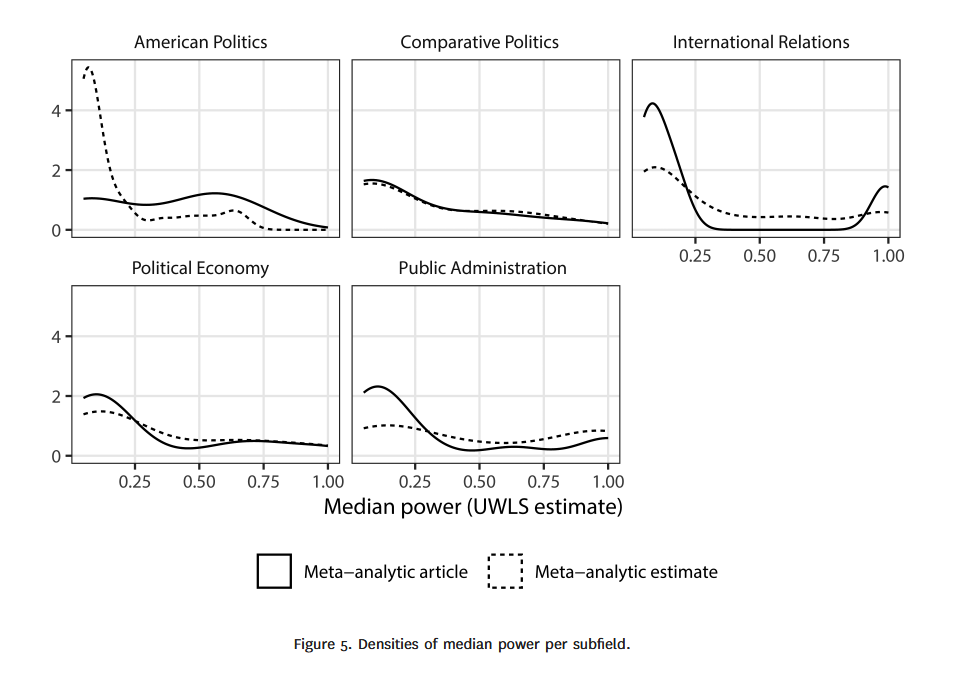

class: center, middle

```{css, echo=FALSE}
pre {
  max-height: 400px;
  overflow-y: auto;
}

pre[class] {
  max-height: 200px;
}
```

```{r, load_refs, include=FALSE, cache=FALSE}
# Initializes
library(RefManageR)

library(ggplot2)
library(dplyr)
library(readr)
library(nlme)
library(jtools)
library(mice)
library(knitr)
library(modelsummary)
library(kableExtra)
library(stringr)

BibOptions(check.entries = FALSE,
           bib.style = "authoryear", # Bibliography style
           max.names = 3, # Max author names displayed in bibliography
           sorting = "nyt", #Name, year, title sorting
           cite.style = "authoryear", # citation style
           style = "markdown",
           hyperlink = FALSE,
           dashed = FALSE)

```
```{r xaringan-themer, include=FALSE, warning=FALSE}
library(xaringanthemer,MnSymbol)
style_mono_accent(
  base_color = "#1c5253",
  header_font_google = google_font("Josefin Sans"),
  text_font_google   = google_font("Montserrat", "300", "300i"),
  code_font_google   = google_font("Fira Mono"),
  text_font_size = "1.6rem"
)

knitr::opts_chunk$set(warning = FALSE, message = FALSE)

```

If we want a good estimate of $\hat \beta_1$, with a small standard error and a good chance of statistically significant results if the population value of $\beta_1$ is not close to zero, how large should we make our sample?

---
###Statistical Power

*Statistical power* is the probability, before data are gathered, that a particular test will pass a threshold at some predetermined significance level (typically a p-value below 0.05), given some assumed population parameter.

$$\small\text{Power} = \text{Pr}_{\text{Prior}} (\text{Reject } H_{0} | \text{a specific version of }H_{1} \text{ is true})$$

---
###Problems with Low Power

1. *High Rate of False Negatives*: You will frequently fail to reject the null hypothesis (Type II errors), even when a meaningful effect exists. This leads to missed discoveries and can bias the literature through publication bias.

2. *"Significant" Results are Often Misleading*: When you do find a statistically significant result (p < 0.05) in a low-power study, the estimated effect is likely exaggerated or could be a false positive. The low signal-to-noise ratio (high standard errors) means that passing the high statistical threshold often requires a large, luck-driven estimate.

---

```{r, echo = FALSE, eval=TRUE, out.width="80%", fig.retina = 1, fig.align='center'}
# Illustration of Winner's Curse: Critical Regions vs. True Effect

library(ggplot2)
library(patchwork)

set.seed(2024)

# Simulation parameters
true_effect <- 0.05       # True population effect (e.g., beta coefficient)
sigma <- 1               # Standard deviation of the estimator
alpha <- 0.05           # Two-tailed significance level
n <- 100                # Sample size
se <- sigma / sqrt(n)   # Standard error

# Critical values for two-tailed test
z_critical <- qnorm(1 - alpha/2)
critical_left <- -z_critical * se
critical_right <- z_critical * se

# Create data for plotting
x_vals <- seq(true_effect - 4*se, true_effect + 4*se, length.out = 1000)
null_center <- 0

# Data for the null distribution (centered at 0)
null_data <- data.frame(
  x = seq(null_center - 4*se, null_center + 4*se, length.out = 1000),
  y = dnorm(seq(null_center - 4*se, null_center + 4*se, length.out = 1000), 
            mean = null_center, sd = se)
)

# Data for the alternative distribution (centered at true effect)
alt_data <- data.frame(
  x = x_vals,
  y = dnorm(x_vals, mean = true_effect, sd = se)
)

# Calculate power explicitly for this scenario
power <- 1 - pnorm(critical_right, mean = true_effect, sd = se) + 
  pnorm(critical_left, mean = true_effect, sd = se)

# Create the main visualization
p_main <- ggplot() +
  
  # Plot alternative distribution (true effect)
  geom_line(data = alt_data, aes(x = x, y = y), 
            color = "#2E86AB", linewidth = 1.5) +
  
  # Fill the rejection regions under the alternative distribution
  geom_area(data = subset(alt_data, x <= critical_left), 
            aes(x = x, y = y), fill = "#E63946", alpha = 0.7) +
  geom_area(data = subset(alt_data, x >= critical_right), 
            aes(x = x, y = y), fill = "#E63946", alpha = 0.7) +
  
  # True effect
  geom_vline(xintercept = true_effect, 
             linetype = "solid", color = "#2E86AB", linewidth = 1.2) +
  
  # Critical values
  geom_vline(xintercept = critical_left, 
             linetype = "dashed", color = "#E63946", linewidth = 0.8) +
  geom_vline(xintercept = critical_right, 
             linetype = "dashed", color = "#E63946", linewidth = 0.8) +
  
  annotate("text", x = true_effect, y = max(alt_data$y) * 1.1,
           label = paste0("True effect\n(β = ", true_effect, ")"), 
           color = "#2E86AB", size = 4, fontface = "bold") +
  
  annotate("text", x = critical_right + 0.02, y = dnorm(critical_right, true_effect, se) * 1.5,
           label = paste0("Critical value\n(", round(critical_right, 2), ")"), 
           color = "#E63946", size = 3.5, hjust = 0) +
  
  # Shade and label the power region
  annotate("rect", xmin = critical_right, xmax = true_effect + 4*se, 
           ymin = 0, ymax = max(alt_data$y) * 0.3,
           alpha = 0.1, fill = "#E63946") +
  
  annotate("text", x = critical_right + 0.1, y = max(alt_data$y) * 0.15,
           label = paste0("Right rejection region\n", round(100*(1 - pnorm(critical_right, true_effect, se)), 1), "% of distribution"),
           color = "#E63946", size = 3.5, hjust = 0) +
  
  # Label the non-rejection region
  annotate("rect", xmin = critical_left, xmax = critical_right, 
           ymin = 0, ymax = max(alt_data$y) * 0.3,
           alpha = 0.1, fill = "#457B9D") +
  
  annotate("text", x = true_effect, y = max(alt_data$y) * 0.15,
           label = paste0("Non-rejection region\n", round(100*(pnorm(critical_right, true_effect, se) - 
                                                               pnorm(critical_left, true_effect, se)), 1), "% of distribution"),
           color = "#457B9D", size = 3.5, hjust = 0.5) +
  
  # Add arrows showing the gap
  annotate("segment", x = true_effect, xend = critical_right, 
           y = max(alt_data$y) * 0.8, yend = max(alt_data$y) * 0.8,
           arrow = arrow(length = unit(0.2, "cm"), ends = "both"), 
           color = "black", size = 0.8) +
  
  annotate("text", x = (true_effect + critical_right)/2, y = max(alt_data$y) * 0.85,
           label = paste0("Gap = ", round(critical_right - true_effect, 2)), 
           color = "black", size = 3.5, fontface = "bold") +
  
  # Labels and themes
  labs(
    title = "The 'Winner's Curse'",
    subtitle = paste0("Distribution of sample estimates when true β = ", true_effect, 
                     " | N = ", n, " | SE = ", round(se, 2), 
                     " | Power = ", round(100*power, 1), "%"),
    x = "Estimated Coefficient (β)",
    y = "Density",
    caption = "Red regions: Statistically significant results (p < 0.05)\nBlue curve: Sampling distribution around true effect"
  ) +
  
  theme_minimal(base_size = 13) +
  theme(
    plot.title = element_text(face = "bold", size = 15, hjust = 0.5),
    plot.subtitle = element_text(size = 11, hjust = 0.5, margin = margin(b = 15)),
    plot.caption = element_text(size = 10, color = "gray40", hjust = 0),
    axis.title = element_text(face = "bold"),
    panel.grid.minor = element_blank()
  ) 


# Display the plot
print(p_main)
```

---

```{r, echo = FALSE, eval=TRUE, out.width="80%", fig.retina = 1, fig.align='center'}
# Illustration of Winner's Curse: Critical Regions vs. True Effect

library(ggplot2)
library(patchwork)

set.seed(2024)

# Simulation parameters
true_effect <- 0.05       # True population effect (e.g., beta coefficient)
sigma <- 1               # Standard deviation of the estimator
alpha <- 0.05           # Two-tailed significance level
n <- 800                # Sample size
se <- sigma / sqrt(n)   # Standard error

# Critical values for two-tailed test
z_critical <- qnorm(1 - alpha/2)
critical_left <- -z_critical * se
critical_right <- z_critical * se

# Create data for plotting
x_vals <- seq(true_effect - 4*se, true_effect + 4*se, length.out = 1000)
null_center <- 0

# Data for the null distribution (centered at 0)
null_data <- data.frame(
  x = seq(null_center - 4*se, null_center + 4*se, length.out = 1000),
  y = dnorm(seq(null_center - 4*se, null_center + 4*se, length.out = 1000), 
            mean = null_center, sd = se)
)

# Data for the alternative distribution (centered at true effect)
alt_data <- data.frame(
  x = x_vals,
  y = dnorm(x_vals, mean = true_effect, sd = se)
)

# Calculate power explicitly for this scenario
power <- 1 - pnorm(critical_right, mean = true_effect, sd = se) + 
  pnorm(critical_left, mean = true_effect, sd = se)

# Create the main visualization
p_main <- ggplot() +
  
  # Plot alternative distribution (true effect)
  geom_line(data = alt_data, aes(x = x, y = y), 
            color = "#2E86AB", linewidth = 1.5) +
  
  # Fill the rejection regions under the alternative distribution
  geom_area(data = subset(alt_data, x <= critical_left), 
            aes(x = x, y = y), fill = "#E63946", alpha = 0.7) +
  geom_area(data = subset(alt_data, x >= critical_right), 
            aes(x = x, y = y), fill = "#E63946", alpha = 0.7) +
  
  # True effect
  geom_vline(xintercept = true_effect, 
             linetype = "solid", color = "#2E86AB", linewidth = 1.2) +
  
  # Critical values
  geom_vline(xintercept = critical_left, 
             linetype = "dashed", color = "#E63946", linewidth = 0.8) +
  geom_vline(xintercept = critical_right, 
             linetype = "dashed", color = "#E63946", linewidth = 0.8) +
  
  annotate("text", x = true_effect, y = max(alt_data$y) * 1.1,
           label = paste0("True effect\n(β = ", true_effect, ")"), 
           color = "#2E86AB", size = 4, fontface = "bold") +
  
  annotate("text", x = critical_right + 0.02, y = dnorm(critical_right, true_effect, se) * 1.5,
           label = paste0("Critical value\n(", round(critical_right, 2), ")"), 
           color = "#E63946", size = 3.5, hjust = 0) +
  
  # Shade and label the power region
  annotate("rect", xmin = critical_right, xmax = true_effect + 4*se, 
           ymin = 0, ymax = max(alt_data$y) * 0.3,
           alpha = 0.1, fill = "#E63946") +
  
  annotate("text", x = critical_right + 0.1, y = max(alt_data$y) * 0.15,
           label = paste0("Right rejection region\n", round(100*(1 - pnorm(critical_right, true_effect, se)), 1), "% of distribution"),
           color = "#E63946", size = 3.5, hjust = 0) +
  
  # Label the non-rejection region
  annotate("rect", xmin = critical_left, xmax = critical_right, 
           ymin = 0, ymax = max(alt_data$y) * 0.3,
           alpha = 0.1, fill = "#457B9D") +
  
  annotate("text", x = true_effect, y = max(alt_data$y) * 0.15,
           label = paste0("Non-rejection region\n", round(100*(pnorm(critical_right, true_effect, se) - 
                                                               pnorm(critical_left, true_effect, se)), 1), "% of distribution"),
           color = "#457B9D", size = 3.5, hjust = 0.5) +
  
  # Add arrows showing the gap
  annotate("segment", x = true_effect, xend = critical_right, 
           y = max(alt_data$y) * 0.8, yend = max(alt_data$y) * 0.8,
           arrow = arrow(length = unit(0.2, "cm"), ends = "both"), 
           color = "black", size = 0.8) +
  
  annotate("text", x = (true_effect + critical_right)/2, y = max(alt_data$y) * 0.85,
           label = paste0("Gap = ", round(critical_right - true_effect, 2)), 
           color = "black", size = 3.5, fontface = "bold") +
  
  # Labels and themes
  labs(
    title = "The 'Winner's Curse'",
    subtitle = paste0("Distribution of sample estimates when true β = ", true_effect, 
                     " | N = ", n, " | SE = ", round(se, 2), 
                     " | Power = ", round(100*power, 1), "%"),
    x = "Estimated Coefficient (β)",
    y = "Density",
    caption = "Red regions: Statistically significant results (p < 0.05)\nBlue curve: Sampling distribution around true effect"
  ) +
  
  theme_minimal(base_size = 13) +
  theme(
    plot.title = element_text(face = "bold", size = 15, hjust = 0.5),
    plot.subtitle = element_text(size = 11, hjust = 0.5, margin = margin(b = 15)),
    plot.caption = element_text(size = 10, color = "gray40", hjust = 0),
    axis.title = element_text(face = "bold"),
    panel.grid.minor = element_blank()
  ) 


# Display the plot
print(p_main)
```

---

```{r, echo = FALSE, eval=TRUE, out.width="80%", fig.retina = 1, fig.align='center'}
# Illustration of Winner's Curse: Critical Regions vs. True Effect

library(ggplot2)
library(patchwork)

set.seed(2024)

# Simulation parameters
true_effect <- 0.05       # True population effect (e.g., beta coefficient)
sigma <- 1               # Standard deviation of the estimator
alpha <- 0.05           # Two-tailed significance level
n <- 2000                # Sample size
se <- sigma / sqrt(n)   # Standard error

# Critical values for two-tailed test
z_critical <- qnorm(1 - alpha/2)
critical_left <- -z_critical * se
critical_right <- z_critical * se

# Create data for plotting
x_vals <- seq(true_effect - 4*se, true_effect + 4*se, length.out = 1000)
null_center <- 0

# Data for the null distribution (centered at 0)
null_data <- data.frame(
  x = seq(null_center - 4*se, null_center + 4*se, length.out = 1000),
  y = dnorm(seq(null_center - 4*se, null_center + 4*se, length.out = 1000), 
            mean = null_center, sd = se)
)

# Data for the alternative distribution (centered at true effect)
alt_data <- data.frame(
  x = x_vals,
  y = dnorm(x_vals, mean = true_effect, sd = se)
)

# Calculate power explicitly for this scenario
power <- 1 - pnorm(critical_right, mean = true_effect, sd = se) + 
  pnorm(critical_left, mean = true_effect, sd = se)

# Create the main visualization
p_main <- ggplot() +
  
  # Plot alternative distribution (true effect)
  geom_line(data = alt_data, aes(x = x, y = y), 
            color = "#2E86AB", linewidth = 1.5) +
  
  # Fill the rejection regions under the alternative distribution
  geom_area(data = subset(alt_data, x <= critical_left), 
            aes(x = x, y = y), fill = "#E63946", alpha = 0.7) +
  geom_area(data = subset(alt_data, x >= critical_right), 
            aes(x = x, y = y), fill = "#E63946", alpha = 0.7) +
  
  # True effect
  geom_vline(xintercept = true_effect, 
             linetype = "solid", color = "#2E86AB", linewidth = 1.2) +
  
  # Critical values
  geom_vline(xintercept = critical_left, 
             linetype = "dashed", color = "#E63946", linewidth = 0.8) +
  geom_vline(xintercept = critical_right, 
             linetype = "dashed", color = "#E63946", linewidth = 0.8) +
  
  annotate("text", x = true_effect, y = max(alt_data$y) * 1.1,
           label = paste0("True effect\n(β = ", true_effect, ")"), 
           color = "#2E86AB", size = 4, fontface = "bold") +
  
  annotate("text", x = critical_right + 0.02, y = dnorm(critical_right, true_effect, se) * 1.5,
           label = paste0("Critical value\n(", round(critical_right, 2), ")"), 
           color = "#E63946", size = 3.5, hjust = 0) +
  
  # Shade and label the power region
  annotate("rect", xmin = critical_right, xmax = true_effect + 4*se, 
           ymin = 0, ymax = max(alt_data$y) * 0.3,
           alpha = 0.1, fill = "#E63946") +
  
  annotate("text", x = critical_right + 0.1, y = max(alt_data$y) * 0.15,
           label = paste0("Right rejection region\n", round(100*(1 - pnorm(critical_right, true_effect, se)), 1), "% of distribution"),
           color = "#E63946", size = 3.5, hjust = 0) +
  
  # Label the non-rejection region
  annotate("rect", xmin = critical_left, xmax = critical_right, 
           ymin = 0, ymax = max(alt_data$y) * 0.3,
           alpha = 0.1, fill = "#457B9D") +
  
  annotate("text", x = true_effect, y = max(alt_data$y) * 0.15,
           label = paste0("Non-rejection region\n", round(100*(pnorm(critical_right, true_effect, se) - 
                                                               pnorm(critical_left, true_effect, se)), 1), "% of distribution"),
           color = "#457B9D", size = 3.5, hjust = 0.5) +
  
  # Add arrows showing the gap
  annotate("segment", x = true_effect, xend = critical_right, 
           y = max(alt_data$y) * 0.8, yend = max(alt_data$y) * 0.8,
           arrow = arrow(length = unit(0.2, "cm"), ends = "both"), 
           color = "black", size = 0.8) +
  
  annotate("text", x = (true_effect + critical_right)/2, y = max(alt_data$y) * 0.85,
           label = paste0("Gap = ", round(critical_right - true_effect, 2)), 
           color = "black", size = 3.5, fontface = "bold") +
  
  # Labels and themes
  labs(
    title = "The 'Winner's Curse'",
    subtitle = paste0("Distribution of sample estimates when true β = ", true_effect, 
                     " | N = ", n, " | SE = ", round(se, 2), 
                     " | Power = ", round(100*power, 1), "%"),
    x = "Estimated Coefficient (β)",
    y = "Density",
    caption = "Red regions: Statistically significant results (p < 0.05)\nBlue curve: Sampling distribution around true effect"
  ) +
  
  theme_minimal(base_size = 13) +
  theme(
    plot.title = element_text(face = "bold", size = 15, hjust = 0.5),
    plot.subtitle = element_text(size = 11, hjust = 0.5, margin = margin(b = 15)),
    plot.caption = element_text(size = 10, color = "gray40", hjust = 0),
    axis.title = element_text(face = "bold"),
    panel.grid.minor = element_blank()
  ) 


# Display the plot
print(p_main)
```

```{r, echo = TRUE, eval=TRUE, out.width="80%", fig.retina = 1, fig.align='center'}
# Load required libraries
library(ggplot2)
library(dplyr)
library(tidyr)
library(patchwork)  # For combining plots
library(scales)     # For better scale formatting

# Set seed for reproducibility
set.seed(2024)

# Simulation parameters
n_simulations <- 10000   # Number of studies to simulate
true_effect_size <- 0.2  # True population effect (e.g., correlation coefficient)
alpha <- 0.05           # Significance level

# Create a function to simulate one study
simulate_study <- function(n, true_effect, alpha_level = 0.05) {
  # Generate data for two groups (treatment and control)
  # Using a simple normal model: Y = treatment_effect + error
  control_group <- rnorm(n/2, mean = 0, sd = 1)
  treatment_group <- rnorm(n/2, mean = true_effect, sd = 1)
  
  # Run a t-test
  test_result <- t.test(treatment_group, control_group, 
                        var.equal = TRUE)
  
  # Calculate observed effect size (standardized bivariate coefficient for treatment v. control)
  pooled_sd <- sqrt(((n/2 - 1) * var(control_group) + 
                      (n/2 - 1) * var(treatment_group)) / (n - 2))
  observed_d <- (mean(treatment_group) - mean(control_group)) / pooled_sd
  
  # Return results
  return(data.frame(
    n = n,
    p_value = test_result$p.value,
    observed_effect = observed_d,
    significant = test_result$p.value < alpha_level,
    ci_lower = test_result$conf.int[1] / pooled_sd,
    ci_upper = test_result$conf.int[2] / pooled_sd
  ))
}

# Run simulation for different sample sizes (low vs high power)
sample_sizes <- c(50, 200, 800)  # Small, medium, large N
results <- data.frame()

for (n in sample_sizes) {
  for (i in 1:n_simulations) {
    study_result <- simulate_study(n, true_effect_size, alpha)
    results <- rbind(results, study_result)
  }
}

# Calculate power for each sample size
power_calc <- results %>%
  group_by(n) %>%
  summarize(
    power = mean(significant),
    mean_observed = mean(observed_effect),
    mean_observed_sig = mean(observed_effect[significant]),
    prop_sig = mean(significant),
    n_studies = n()
  ) %>%
  mutate(
    power_theoretical = round(power * 100, 1),
    label = paste0("N = ", n, "\nPower = ", power_theoretical, "%")
  )

# Create Plot 1: Distribution of observed effects (all studies)
p1 <- ggplot(results, aes(x = observed_effect, fill = factor(n))) +
  geom_density(alpha = 0.6, adjust = 1.5) +
  geom_vline(xintercept = true_effect_size, 
             linetype = "dashed", color = "red", size = 1) +
  facet_wrap(~ n, ncol = 1, 
             labeller = labeller(n = function(x) paste0("N = ", x))) +
  labs(
    title = "Distribution of Estimated Coefficients",
    subtitle = paste0("Population Coefficient (red line) = ", true_effect_size),
    x = "Estimated Coefficient",
    y = "Density",
    caption = "All simulated studies (significant and non-significant)"
  ) +
  theme_minimal(base_size = 12) +
  theme(
    legend.position = "none",
    plot.title = element_text(face = "bold", size = 14),
    strip.text = element_text(face = "bold", size = 11)
  ) +
  scale_fill_brewer(palette = "Set2")

# Create Plot 2: "Winner's Curse" - Only significant results
p2 <- ggplot(results %>% filter(significant == TRUE), 
             aes(x = observed_effect, fill = factor(n))) +
  geom_density(alpha = 0.6, adjust = 1.5) +
  geom_vline(xintercept = true_effect_size, 
             linetype = "dashed", color = "red", size = 1) +
  facet_wrap(~ n, ncol = 1,
             labeller = labeller(n = function(x) {
               power_val <- power_calc$power_theoretical[power_calc$n == as.numeric(x)]
               paste0("N = ", x, " (Power = ", power_val, "%)")
             })) +
  labs(
    title = '"Winner\'s Curse": Distribution of Statistically Significant Estimates',
    subtitle = paste0("Population Coefficient (red line) = ", true_effect_size),
    x = "Estimated Coefficient",
    y = "Density",
    caption = "Only studies with p < 0.05 (the 'winners')"
  ) +
  theme_minimal(base_size = 12) +
  theme(
    legend.position = "none",
    plot.title = element_text(face = "bold", size = 14),
    strip.text = element_text(face = "bold", size = 10)
  ) +
  scale_fill_brewer(palette = "Set2") +
  coord_cartesian(xlim = c(-0.5, 1.5))  # Consistent x-axis

# Create Plot 3: Distortions in effect estimates (summary)
summary_data <- results %>%
  group_by(n, significant) %>%
  summarize(
    mean_effect = mean(observed_effect),
    median_effect = median(observed_effect),
    sd_effect = sd(observed_effect),
    n_studies = n(),
    .groups = 'drop'
  ) %>%
  mutate(
    significance = ifelse(significant, "Significant (p < 0.05)", "Non-significant"),
    bias = mean_effect - true_effect_size
  )

p3 <- ggplot(summary_data, 
             aes(x = factor(n), y = mean_effect, fill = significance)) +
  geom_bar(stat = "identity", position = position_dodge(width = 0.9), 
           width = 0.8, alpha = 0.8) +
  geom_hline(yintercept = true_effect_size, 
             linetype = "dashed", color = "red", size = 1) +
  geom_errorbar(aes(ymin = mean_effect - 1.96 * sd_effect / sqrt(n_studies),
                    ymax = mean_effect + 1.96 * sd_effect / sqrt(n_studies)),
                position = position_dodge(width = 0.9),
                width = 0.3) +
  labs(
    title = "Distortions in Coefficient Estimates by Significance and Sample Size",
    subtitle = paste0("Population Coefficient (red line) = ", true_effect_size),
    x = "Sample Size (N)",
    y = "Mean Estimated Coefficient",
    fill = "Statistical Significance"
  ) +
  theme_minimal(base_size = 12) +
  theme(
    legend.position = "bottom",
    plot.title = element_text(face = "bold", size = 14),
    axis.text.x = element_text(size = 11)
  ) +
  scale_fill_manual(values = c("Non-significant" = "#999999", 
                               "Significant (p < 0.05)" = "#E69F00"))

# Create Plot 4: Probability of overestimation
overestimation_data <- results %>%
  group_by(n) %>%
  summarize(
    prop_overestimate_sig = mean(observed_effect[significant] > true_effect_size),
    prop_severe_overestimate_sig = mean(observed_effect[significant] > true_effect_size * 1.5),
    n_sig = sum(significant)) %>%
  pivot_longer(cols = starts_with("prop"), 
               names_to = "metric", 
               values_to = "probability") %>%
  mutate(
    metric = case_when(
      metric == "prop_overestimate_sig" ~ "Significant studies overestimate population coefficient",
      metric == "prop_severe_overestimate_sig" ~ "Significant studies >1.5x population coefficient"),
    metric = factor(metric, levels = c(
                                       "Significant studies overestimate population coefficient",
                                       "Significant studies >1.5x population coefficient")))

p4 <- ggplot(overestimation_data, 
             aes(x = factor(n), y = probability, fill = metric)) +
  geom_bar(stat = "identity", position = position_dodge(width = 0.9), 
           width = 0.8, alpha = 0.8) +
  scale_y_continuous(labels = percent_format()) +
  labs(
    title = "Probability of Overestimation",
    subtitle = "The 'Winner's Curse' becomes more severe with lower power",
    x = "Sample Size (N)",
    y = "Probability",
    fill = "Type of Overestimation"
  ) +
  theme_minimal(base_size = 12) +
  theme(
    legend.position = "bottom",
    plot.title = element_text(face = "bold", size = 14),
    legend.text = element_text(size = 9)
  ) +
  scale_fill_brewer(palette = "Set2") +
  geom_text(aes(label = paste0(round(probability * 100, 1), "%")),
            position = position_dodge(width = 0.9),
            vjust = -0.5, size = 3.5)
```

---

```{r, echo = FALSE, eval=TRUE, out.width="80%", fig.retina = 1, fig.align='center'}
p1
```

---

```{r, echo = FALSE, eval=TRUE, out.width="80%", fig.retina = 1, fig.align='center'}
p2
```

---

```{r, echo = FALSE, eval=TRUE, out.width="80%", fig.retina = 1, fig.align='center'}
p3
```

---

```{r, echo = FALSE, eval=TRUE, out.width="80%", fig.retina = 1, fig.align='center'}
p4
```

---

When designing a study:

1. *Increase signal strength first*. This can involve designing experimental treatments to be as strong as possible, choosing participants to be as susceptible to the cause of interest as you can, etc. Increasing the distance between the population parameter and zero quickly increases your power and reduces the winner's curse.

---

When designing a study:

2. *Minimize noise through design.* Randomness isn't always a given, any more than effect size is. You can use clever sampling strategies, improve measurement, or compare before and after within the same subjects to reduce overall variation. Reducing variation is another great way to increase power.

---

When designing a study:

3. *Increase sample size.* When other choices are unavailable, increasing sample size is an expensive but still valid way to avoid the problems of low power and resulting low credibility.

---
### Reading Published Research

* *Expect overestimation.* Published effect sizes tend to be inflated due to the winner's curse that we've discussed, given that significant results are conditionally biased upward.

* *Why?* The publishing process selects for statistical significance. Conditional on $p < 0.05$, estimates tend to exceed the true effect, especially when power is low.

---

There are published formulae for several different kinds of power calculations. Or you can use R.

---

```{r, echo = TRUE, eval=TRUE, out.width="80%", fig.retina = 1, fig.align='center'}
library(pwrss)

power.t.regression(beta = 0.60,
                   sd.outcome = 12,
                   sd.predictor = 4,
                   k.total = 12,
                   r.squared = 0.30,
                   power = .80,
                   alpha = 0.05,
                   alternative = "two.sided")
```

---

```{r, echo = TRUE, eval=TRUE, out.width="80%", fig.retina = 1, fig.align='center'}
library(pwrss)

power.t.regression(beta = 0.10,
                   sd.outcome = 12,
                   sd.predictor = 4,
                   k.total = 12,
                   r.squared = 0.30,
                   power = .80,
                   alpha = 0.05,
                   alternative = "two.sided")
```

---

```{r, echo = TRUE, eval=TRUE, out.width="80%", fig.retina = 1, fig.align='center'}
library(pwrss)

power.t.regression(beta = 0.60,
                   sd.outcome = 60,
                   sd.predictor = 4,
                   k.total = 12,
                   r.squared = 0.30,
                   power = .80,
                   alpha = 0.05,
                   alternative = "two.sided")
```


---

```{r, echo = TRUE, eval=TRUE, out.width="80%", fig.retina = 1, fig.align='center'}
library(pwrss)

power.t.regression(beta = 0.60,
                   sd.outcome = 12,
                   sd.predictor = 4,
                   k.total = 12,
                   r.squared = 0.10,
                   power = .80,
                   alpha = 0.05,
                   alternative = "two.sided")
```

---

How useful is a power calculation after the study has been carried out?

---




---




---




---

