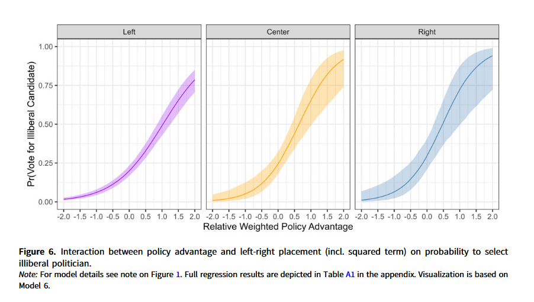
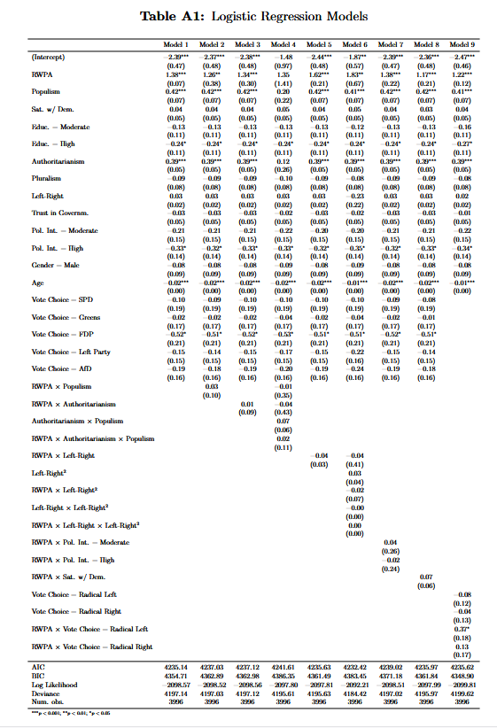

class: center, middle


```{css, echo=FALSE}
pre {
  max-height: 400px;
  overflow-y: auto;
}

pre[class] {
  max-height: 200px;
}
```

```{r, load_refs, include=FALSE, cache=FALSE}
# Initializes
library(RefManageR)

library(ggplot2)
library(dplyr)
library(readr)
library(nlme)
library(jtools)
library(mice)
library(knitr)
library(modelsummary)
library(kableExtra)
library(stringr)

BibOptions(check.entries = FALSE,
           bib.style = "authoryear", # Bibliography style
           max.names = 3, # Max author names displayed in bibliography
           sorting = "nyt", #Name, year, title sorting
           cite.style = "authoryear", # citation style
           style = "markdown",
           hyperlink = FALSE,
           dashed = FALSE)

library(rqog)
qogts <- read_qog(which_data="standard", data_type = "time-series")

```
```{r xaringan-themer, include=FALSE, warning=FALSE}
library(xaringanthemer,MnSymbol)
style_mono_accent(
  base_color = "#1c5253",
  header_font_google = google_font("Josefin Sans"),
  text_font_google   = google_font("Montserrat", "300", "300i"),
  code_font_google   = google_font("Fira Mono"),
  text_font_size = "1.6rem"
)

knitr::opts_chunk$set(warning = FALSE, message = FALSE)

```


Measurement choices can affect regression results in a lot of ways, but we will focus on three:

1. Scaling and intepretation

2. Nonlinear transformations

3. Stabilizing variance


---
###Example

The relationship between GDP and democracy isn't linear.

log(GDP) often works better.

---
###Linear Transformations: Scaling and Standardizing

The coefficient $(\beta_j)$ represents: *"Average change in Y per 1-unit change in X"*

But... 1 unit in what scale? Inches vs. centimeters vs. miles?

---

```{r, echo = TRUE, eval=TRUE, out.width="80%", fig.retina = 1, fig.align='center'}
# Simulated height-earnings example (from ROS Chapter 12)
set.seed(123)
n <- 1000
height_in <- rnorm(n, mean = 66.6, sd = 3.8)  # height in inches
height_cm <- height_in * 2.54                  # height in centimeters

# True relationship: earnings increase 6% per SD of height
earnings <- exp(9.55 + 0.06*scale(height_in)[,1] + rnorm(n, 0, 0.87))

# Compare coefficients
m_inch <- lm(earnings ~ height_in)
m_cm <- lm(earnings ~ height_cm)

heightms <- modelsummary(list("Inches" = m_inch, "Centimeters" = m_cm),
             stars = TRUE, gof_omit = ".*",  output = "kableExtra")%>%
  kable_styling(font_size = 14)
```

---

```{r, echo = FALSE, eval=TRUE, out.width="80%", fig.retina = 1, fig.align='center'}
heightms
```

---
###Solution: Standardize to make coefficients comparable:

* z-scores: $(z = (x - \bar{x})/sd(x))$

* Gelman's preference: Divide by 2 SDs (makes comparable to binary variables)

---
```{r, echo = TRUE, eval=TRUE, out.width="80%", fig.retina = 1, fig.align='center'}
library(rosdata)
library(modelsummary)
data(kidiq)  # from ROS package

# Problematic: Main effects at X=0
m_raw <- lm(kid_score ~ mom_hs + mom_iq + mom_hs:mom_iq, data = kidiq)

# Better: Center continuous variable
kidiq$c_mom_iq <- kidiq$mom_iq - mean(kidiq$mom_iq)
m_centered <- lm(kid_score ~ mom_hs + c_mom_iq + mom_hs:c_mom_iq, data = kidiq)

kidiqms <- modelsummary(
  list("Raw (hard to interpret)" = m_raw, 
       "Centered (interpretable)" = m_centered),
  stars = TRUE,  output = "kableExtra"
) %>%
  kable_styling(font_size = 12)
```


---

```{r, echo = FALSE, eval=TRUE, out.width="80%", fig.retina = 1, fig.align='center'}
kidiqms
```

---

Interpretation before centering:

    mom_hs coefficient: Effect when mom_iq = 0 (nonsensical!)

After centering:

    mom_hs coefficient: Effect at average mom_iq (meaningful!)

---
###The Logarithm: Workhorse Transformation

When to Use: Positive variables with right skew (GDP, income, population, campaign spending)

---

Three Common Forms:

$log(Y) \sim X$ (log-linear): "1-unit increase in X → constant % change in Y"

$Y \sim log(X)$ (linear-log): "1% increase in X → constant additive change in Y"

$log(Y) \sim log(X)$ (log-log): Constant elasticity (economics favorite)

---

```{r, echo = FALSE, eval=TRUE, out.width="80%", fig.retina = 1, fig.align='center'}
library(ggplot2)
set.seed(123)
x <- seq(1, 100, length.out = 100)

df <- data.frame(
  x = x,
  log_linear = exp(2 + 0.03*x),      # Y = exp(a + bX)
  linear_log = 10 + 15*log(x),       # Y = a + b*log(X)
  log_log = exp(1 + 0.8*log(x))      # Y = exp(a + b*log(X))
)

p1 <- ggplot(df, aes(x = x, y = log_linear)) +
  geom_line(color = "#3366CC", linewidth = 1) +
  labs(title = "log(Y) ~ X", 
       subtitle = "Exponential growth") +
  theme_minimal()

p2 <- ggplot(df, aes(x = x, y = linear_log)) +
  geom_line(color = "#CC3333", linewidth = 1) +
  labs(title = "Y ~ log(X)", 
       subtitle = "Diminishing returns") +
  theme_minimal()

p3 <- ggplot(df, aes(x = x, y = log_log)) +
  geom_line(color = "#33CC66", linewidth = 1) +
  labs(title = "log(Y) ~ log(X)", 
       subtitle = "Power law") +
  theme_minimal()

library(patchwork)
(p1 | p2 | p3) + plot_annotation(title = "Three Forms of Logarithmic Relationships")
```

---
###Interpreting Logged Coefficients

Rule of thumb for small coefficients $(|\beta| < 0.1)$:
$exp(\beta)\approx1+\beta$

---

For any coefficient:

```{r, echo = TRUE, eval=TRUE, out.width="80%", fig.retina = 1, fig.align='center'}
# Example from ROS: earnings ~ height (log scale)
beta <- 0.06
percent_change <- (exp(beta) - 1) * 100
cat("A coefficient of", beta, "on the log scale corresponds to a",
    round(percent_change, 1), "% increase on the original scale.\n")

# For larger coefficients
beta_large <- 0.37
percent_large <- (exp(beta_large) - 1) * 100
cat("\nA coefficient of", beta_large, "corresponds to a",
    round(percent_large, 1), "% increase (not 37%!).")
```

---
###Always remember:

Predictions on log scale: $(\hat{\log(y)} = X \beta)$

Back to original scale: $(\hat{y} = \exp(X \beta))$

---

```{r, echo = TRUE, eval=TRUE, out.width="80%", fig.retina = 1, fig.align='center'}
# Prepare data
library(dplyr)
library(tidyverse)
democracy_data <- qogts %>%
  filter(year == 2020) %>%
  select(country = cname,
         libdem = vdem_libdem,
         gdp_pc = wdi_gdpcappppcon2017) %>%
  drop_na() %>%
  filter(gdp_pc > 0, libdem > 0)

# Fit three different models
m_linear <- lm(libdem ~ gdp_pc, data = democracy_data)
m_logx <- lm(libdem ~ log(gdp_pc), data = democracy_data) 
m_loglog <- lm(log(libdem) ~ log(gdp_pc), data = democracy_data)

# Compare
dem.ms <- modelsummary(
  list("Linear" = m_linear, 
       "Log-X" = m_logx, 
       "Log-Log" = m_loglog),
  stars = TRUE,
  gof_map = c("nobs", "r.squared", "rmse"), output="kableExtra"
)%>%
  kable_styling(font_size = 14)
```


---

```{r, echo = FALSE, eval=TRUE, out.width="80%", fig.retina = 1, fig.align='center'}
dem.ms
```

---

Which is best? Let's check residuals...

```{r, echo = TRUE, eval=TRUE, out.width="80%", fig.retina = 1, fig.align='center'}
# Residual plots
p1 <- ggplot(democracy_data, aes(x = gdp_pc, y = resid(m_linear))) +
  geom_point(alpha = 0.5) +
  geom_smooth(se = FALSE, method = "loess", color = "red") +
  labs(title = "Linear Model Residuals", x = "GDP per capita", y = "Residuals") +
  theme_minimal()

p2 <- ggplot(democracy_data, aes(x = log(gdp_pc), y = resid(m_logx))) +
  geom_point(alpha = 0.5) +
  geom_smooth(se = FALSE, method = "loess", color = "red") +
  labs(title = "Log-X Model Residuals", x = "log(GDP per capita)", y = "Residuals") +
  theme_minimal()

p3 <- ggplot(democracy_data, aes(x = log(gdp_pc), y = resid(m_loglog))) +
  geom_point(alpha = 0.5) +
  geom_smooth(se = FALSE, method = "loess", color = "red") +
  labs(title = "Log-Log Model Residuals", x = "log(GDP per capita)", y = "Residuals") +
  theme_minimal()
```

---

```{r, echo = TRUE, eval=TRUE, out.width="70%", fig.retina = 1, fig.align='center'}
(p1 | p2) / p3
```

---

```{r transformations-table-styled, echo=FALSE, message=FALSE}
library(knitr)
library(kableExtra)

transform_data <- data.frame(
  Transformation = c("Square root", "Inverse", "Polynomial", "Logit"),
  "When to Use" = c("Count data, moderate right skew", 
                    "Extreme right skew, rates", 
                    "U-shaped relationships", 
                    "Proportions (0-1)"),
  "R Code" = c("`sqrt(y) ~ x`", 
               "`1/y ~ x`", 
               "`y ~ x + I(x^2)`", 
               "`qlogis(p) ~ x`"),
  Interpretation = c("Compresses high values less severely than log",
                     "Reciprocal relationship",
                     "Curvilinear effects (but beware of overfitting!)",
                     "Log-odds scale for probabilities")
)

transform_data %>%
  kbl(format = "html",
      caption = "Common Statistical Transformations",
      col.names = c("Transformation", "When to Use", "R Code", "Interpretation"),
      align = "llll") %>%
  kable_styling(font_size=12, bootstrap_options = c("striped", "hover", "condensed"),
                full_width = FALSE,
                position = "center") %>%
  column_spec(1, bold = TRUE, width = "5em")
```

---

```{r, echo = TRUE, eval=TRUE, out.width="80%", fig.retina = 1, fig.align='center'}
# Visual comparison
x <- seq(1, 100, length.out = 100)
df <- data.frame(
  x = x,
  linear = 10 + 0.5*x,
  sqrt = (10 + 0.5*x)^2,  # Inverse of sqrt transform
  log = exp(2 + 0.03*x)
)

transformationcomp <- ggplot(df %>% tidyr::pivot_longer(-x), 
       aes(x = x, y = value, color = name)) +
  geom_line(linewidth = 1) +
  scale_color_brewer(palette = "Set1") +
  labs(title = "Different Transformations Compress High Values Differently",
       x = "X", y = "Y (original scale)", color = "Transformation") +
  theme_minimal() +
  theme(legend.position = "bottom")
```

---

```{r, echo = FALSE, eval=TRUE, out.width="70%", fig.retina = 1, fig.align='center'}
transformationcomp
```

---
###Transformations vs. Generalized Linear Models (GLMs)

Transformations: Modify data to fit linear model

```{r, echo = TRUE, eval=FALSE, out.width="80%", fig.retina = 1, fig.align='center'}
lm(log(y) ~ x)  # Log transformation
```


---
###Transformations vs. Generalized Linear Models (GLMs)

GLMs: Modify model to fit data

```{r, echo = TRUE, eval=FALSE, out.width="80%", fig.retina = 1, fig.align='center'}
glm(y ~ x, family = poisson)      # Count data
glm(y ~ x, family = binomial)     # Binary data
glm(y ~ x, family = Gamma(link="log"))  # Positive continuous
```

---
Trade-offs:

1. Transformations: Simpler, easier to explain, works for many continuous outcomes

2. GLMs: More theoretically appropriate for binary/count outcomes

* Gelman & Hill's advice: Start with transformations for continuous outcomes, move to GLMs if needed.

---
#Building Models with Transformations: A Workflow

```{r, echo = TRUE, eval=FALSE, out.width="80%", fig.retina = 1, fig.align='center'}
# 1. VISUALIZE the raw relationship
ggplot(data, aes(x = gdp, y = democracy)) + 
  geom_point() + 
  geom_smooth(method = "loess")

# 2. TRY different transformations
m1 <- lm(democracy ~ gdp, data = data)
m2 <- lm(democracy ~ log(gdp), data = data)
m3 <- lm(log(democracy) ~ gdp, data = data)
m4 <- lm(log(democracy) ~ log(gdp), data = data)

# 3. CHECK residuals (should be patternless)
plot(resid(m2) ~ predict(m2))  # Ideally: random scatter

# 4. INTERPRET coefficients
# For m2: effect of 1% GDP increase = beta/100 units democracy
# For m4: elasticity = beta% democracy change per 1% GDP change

# 5. VALIDATE predictions on original scale
data$pred_m2 <- predict(m2)
data$pred_m4 <- exp(predict(m4))  # Remember to exponentiate!

# 6. COMPARE models
library(performance)
compare_performance(m1, m2, m3, m4, metrics = c("RMSE", "R2"))

Advanced: Interactions with Transformed Variables

Golden Rule: Center continuous variables before creating interactions!
```

---
###Zeros and Negatives

Some transformations fail at certain ranges.

$\log(0) = -\infty$, $\log(\text{negative}) = \text{undefined}$

Solutions: 
  1. $\log(x + 1)$ to eliminate zeros
  2. asinh(x) (inverse hyperbolic sine), a similar transformation that is defined for negative numbers


---
###When NOT to Transform

1. When original scale is substantively meaningful

2. When transformation obscures more than it reveals

3. Minor improvements in fit aren't worth interpretive complexity

4. When alternative approaches (GLMs, nonparametric models) are better

---
###Practical R Tools

```{r, echo = TRUE, eval=FALSE, out.width="80%", fig.retina = 1, fig.align='center'}
# Diagnostic plotting
library(ggplot2)
ggplot(data, aes(x = gdp, y = democracy)) + 
  geom_point() + 
  geom_smooth(method = "lm") +
  scale_x_log10() +  # Quick visual check
  scale_y_log10()

# Model comparison table  
library(modelsummary)
models <- list("Linear" = m1, "Log-X" = m2, "Log-Log" = m3)
modelsummary(models, stars = TRUE, output = "kableExtra")

# Marginal effects after transformation
library(margins)
margins(m2, at = list(gdp = c(1000, 10000, 100000)))

# Automatic transformation suggestion
library(MASS)
boxcox(m1)  # Suggests optimal power transformation

# Easy standardization
data$z_gdp <- scale(data$gdp)[,1]  # z-scores
data$gdp_2sd <- data$z_gdp / 2     # Gelman's divide by 2 SDs
```

---


---


---



---

