---
author:
- Jason Seawright
date: March 5, 2025
title: Ethics and the Responsible Conduct of Research
---

::: frame
:::

::: frame
What is research?

What is a human subject?

What makes research ethical?
:::

::: frame
### IRB Review

Formal institutional review is required for all human-subjects research
:::

::: frame
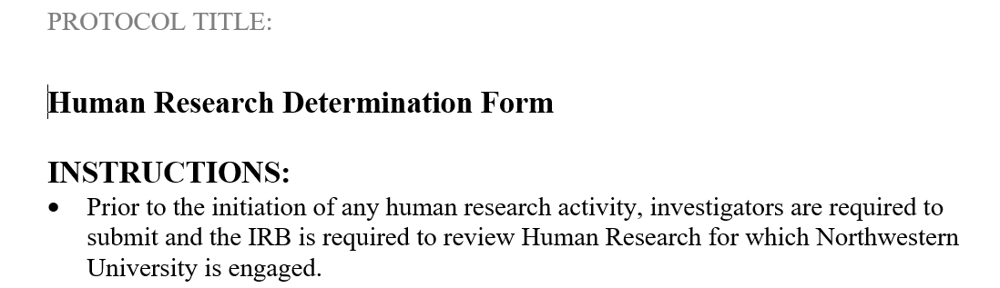{width="\\textwidth"}
:::

::: frame
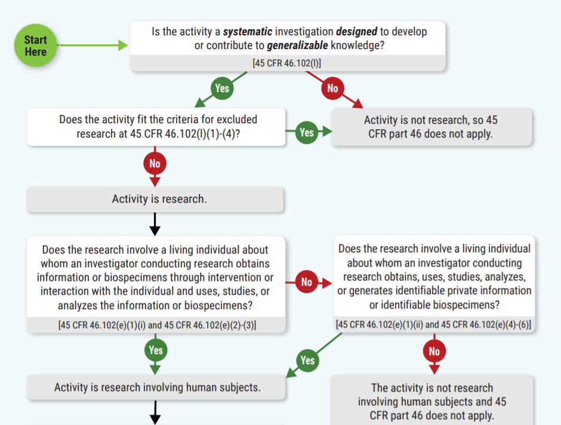{width="\\textwidth"}
:::

::: frame
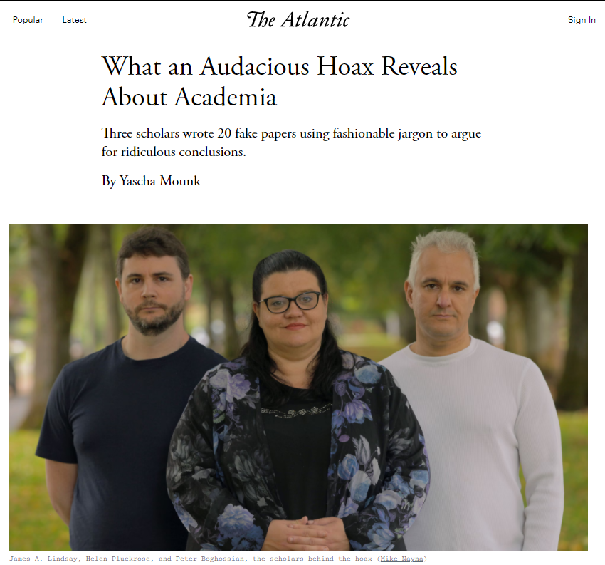{width="\\textwidth"}
:::

::: frame
{width="\\textwidth"}
:::

::: frame
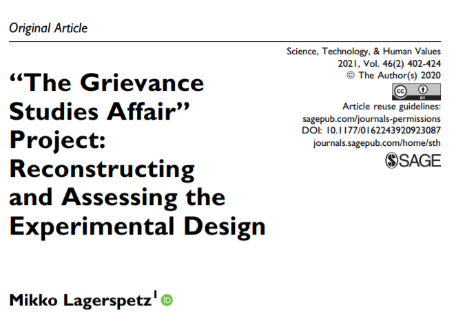{width="\\textwidth"}
:::

::: frame
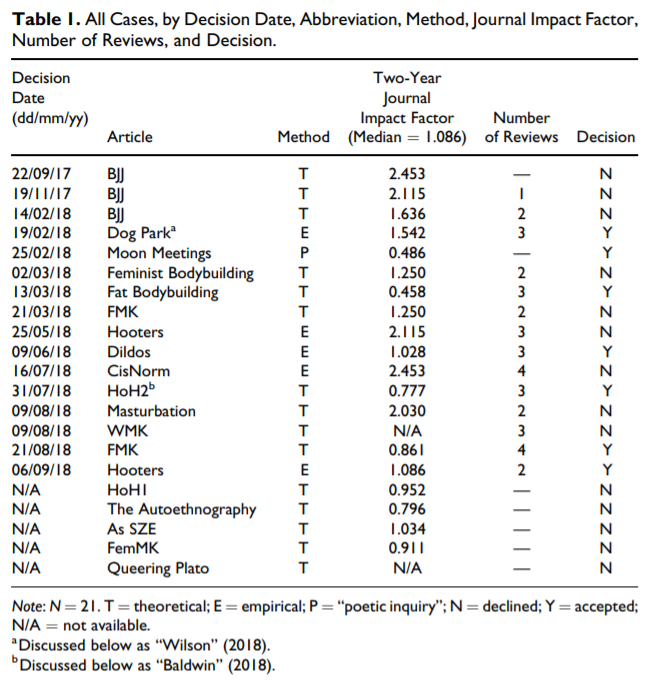{width="\\textwidth"}
:::

::: frame
### Kinds of IRB Review

-   Exempt review

    -   This is available for some kinds of low-risk surveys,
        interviews, and observation-based research

    -   It is also available for some kinds of low-risk experiments,
        involving benign behavioral interventions in conjunction with
        the collection of information from an adult subject through
        verbal or written responses (including data entry) or
        audiovisual recording if the subject prospectively agrees to the
        intervention and information collection
:::

::: frame
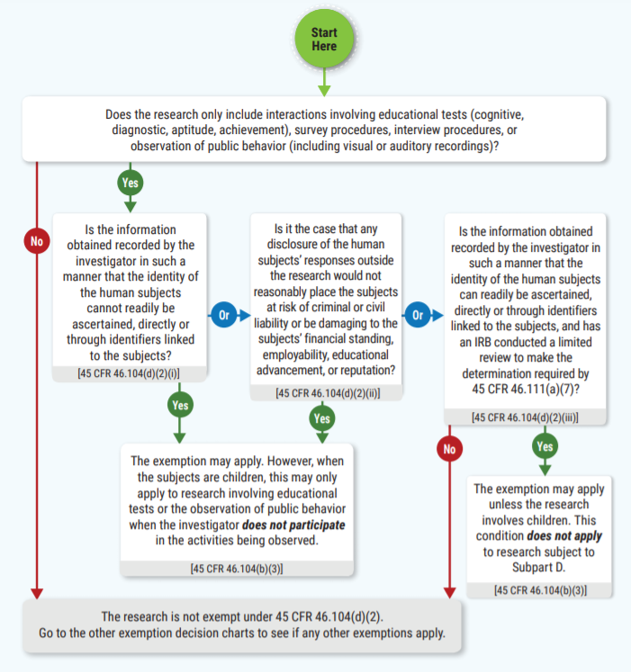{height=".9\\textheight"}
:::

::: frame
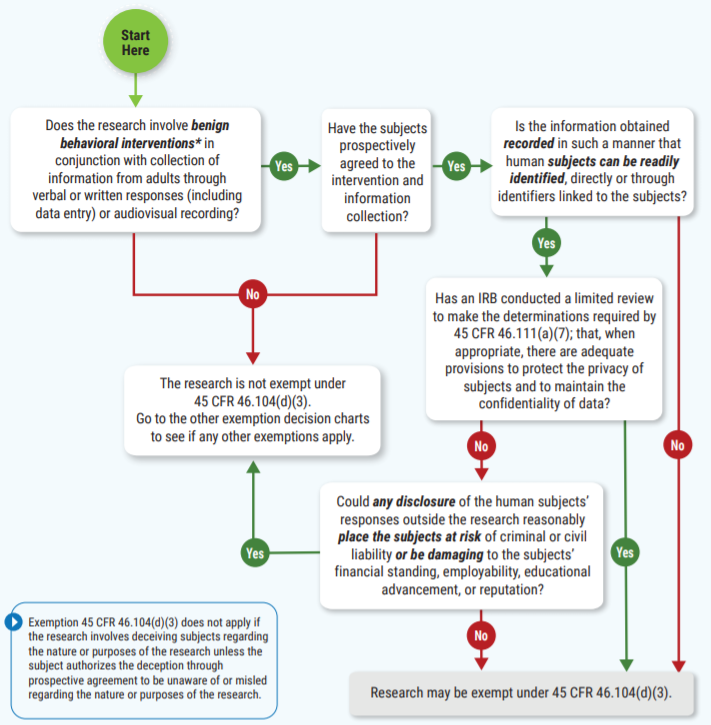{height=".9\\textheight"}
:::

::: frame
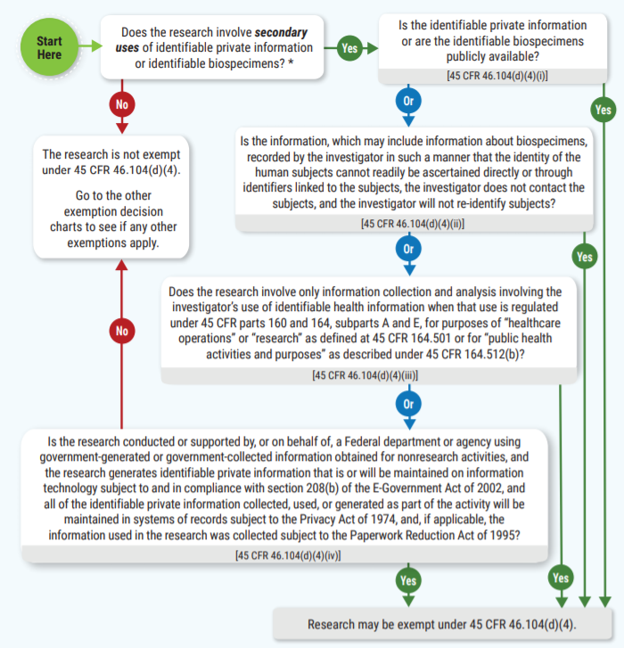{height=".9\\textheight"}
:::

::: frame
### Kinds of IRB Review

-   Expedited review

    -   Collection of data from voice, video, digital, or image
        recordings made for research purposes.
:::

::: frame
### Kinds of IRB Review

-   Expedited review

    -   Research on individual or group characteristics or behavior
        (including, but not limited to, research on perception,
        cognition, motivation, identity, language, communication,
        cultural beliefs or practices, and social behavior) or research
        employing survey, interview, oral history, focus group, program
        evaluation, human factors evaluation, or quality assurance
        methodologies.
:::

::: frame
### Kinds of IRB Review

-   Full review
:::

::: frame
### The IRB Process

<https://irb.northwestern.edu/submitting-to-the-irb/eirb/>
:::

::: frame
### The IRB Process

<https://irb.northwestern.edu/resources-guidance/protocol-templates-forms/docs/social-behavioral-protocol---protocol---583.docx>
:::

::: frame
If an IRB approves of our research, does that mean we are ethically all
set?
:::

::: frame
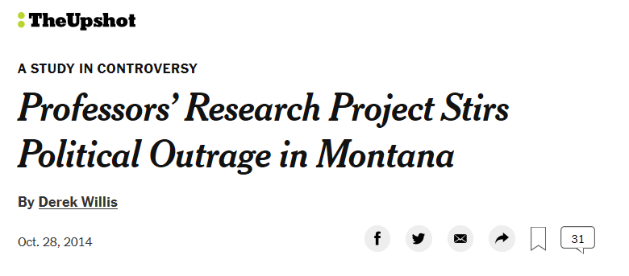{width="\\textwidth"}
:::

::: frame
{width="\\textwidth"}
:::

::: frame
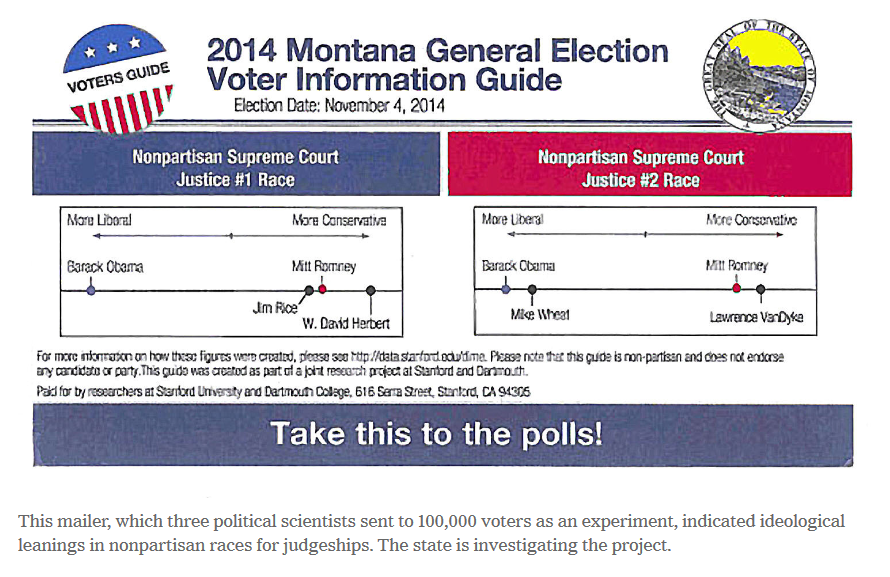{width="\\textwidth"}
:::

::: frame
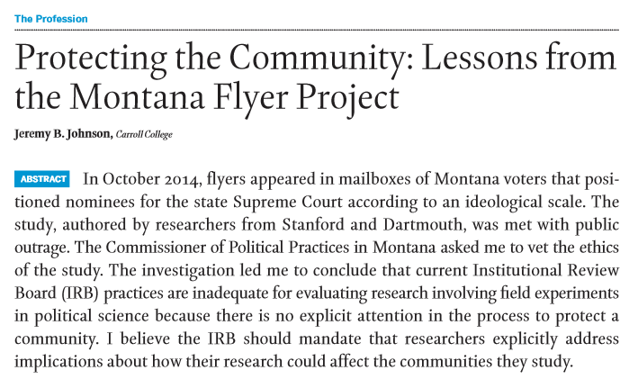{width="\\textwidth"}
:::

::: frame
### Fraud/Misconduct

-   Fabrication

-   Falsification

-   Plagiarism, etc.
:::

::: frame
### Fabrication

Inventing research data or analytic results from scratch, and
distributing them in some way.
:::

::: frame
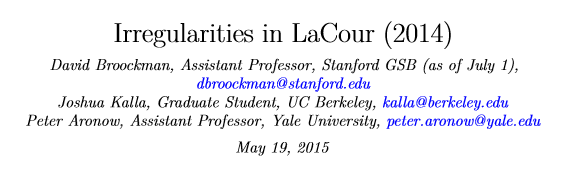{width="\\textwidth"}
:::

::: frame
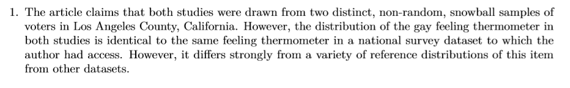{width="\\textwidth"}
:::

::: frame
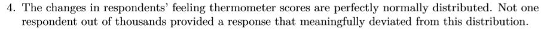{width="\\textwidth"}
:::

::: frame
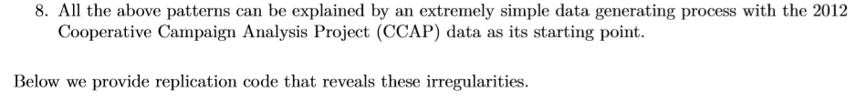{width="\\textwidth"}
:::

::: frame
{width="\\textwidth"}
:::

::: frame
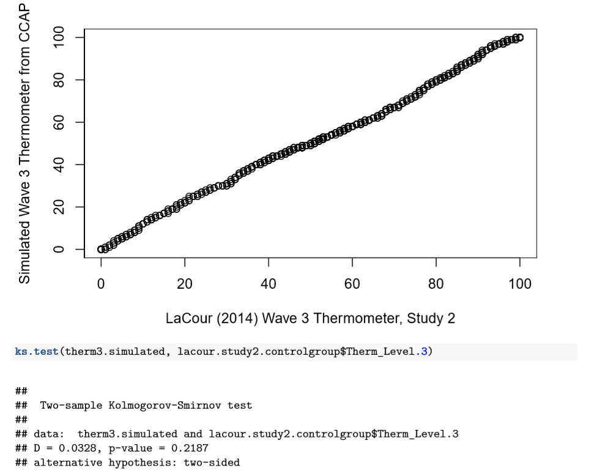{width="\\textwidth"}
:::

::: frame
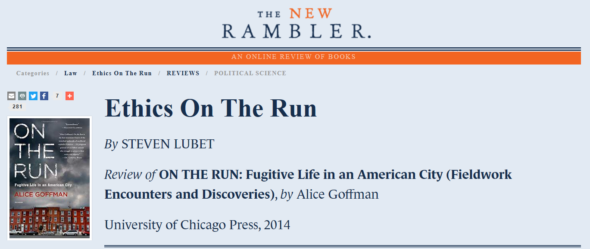{width="\\textwidth"}
:::

::: frame
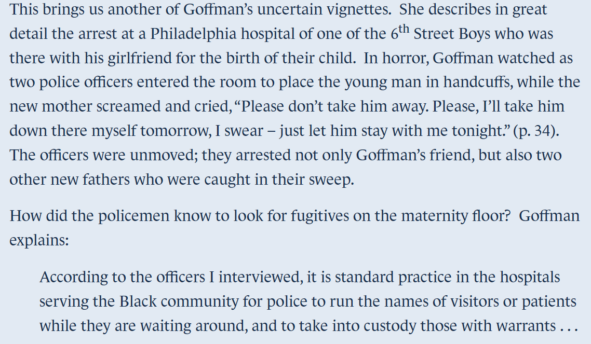{width="\\textwidth"}
:::

::: frame
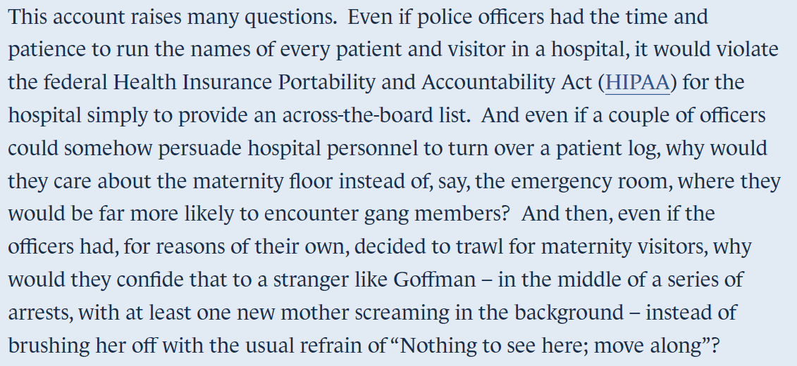{width="\\textwidth"}
:::

::: frame
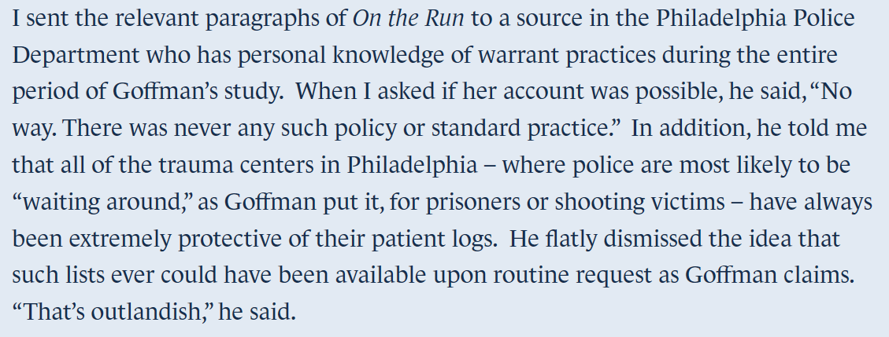{width="\\textwidth"}
:::

::: frame
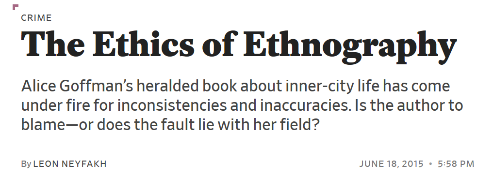{width="\\textwidth"}
:::

::: frame
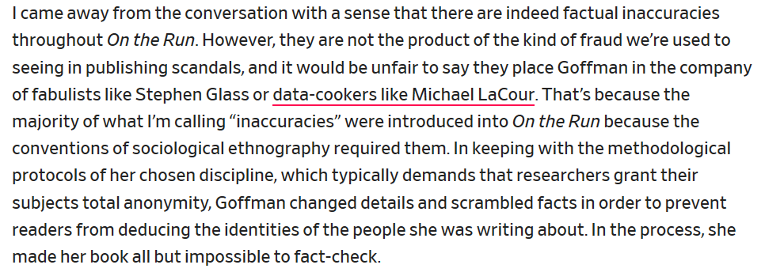{width="\\textwidth"}
:::

::: frame
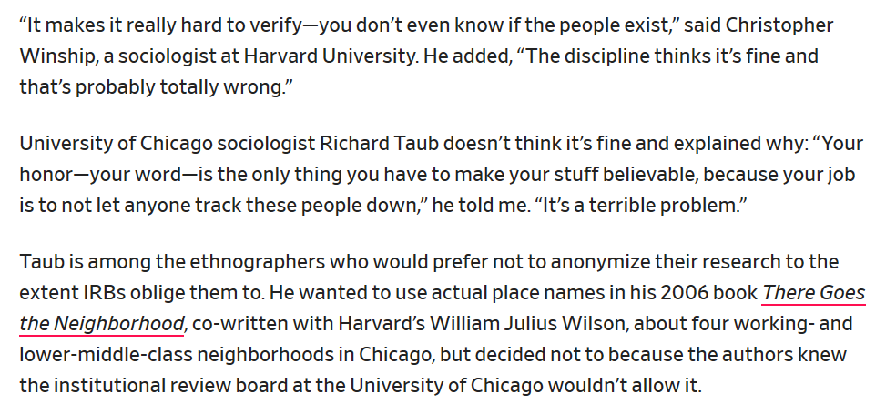{width="\\textwidth"}
:::

::: frame
### Falsification

Manipulating real data or analytic results to distort their meaning and
implications.
:::

::: frame
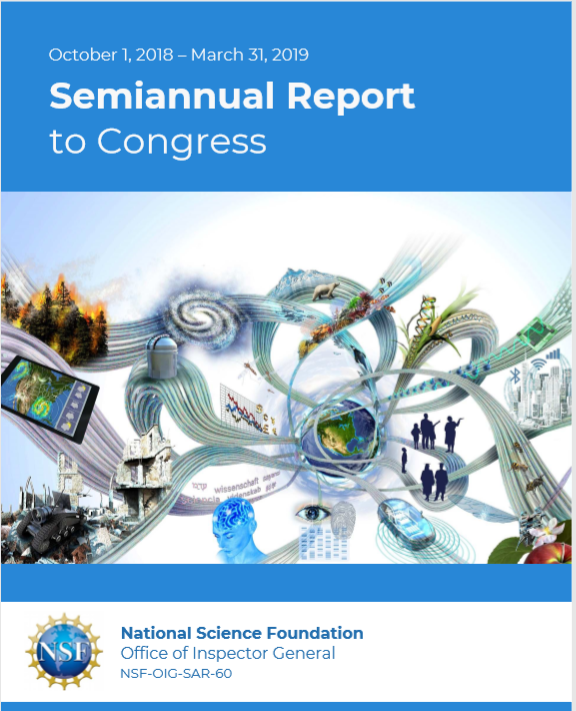{height="\\textheight"}
:::

::: frame
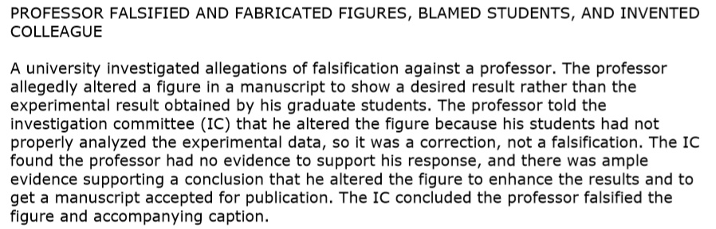{width="\\textwidth"}
:::

::: frame
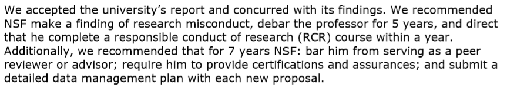{width="\\textwidth"}
:::

::: frame
### Human Subjects: Belmont Report

-   Respect for persons

-   Beneficence

-   Justice
:::

::: frame
### Human Subjects: Belmont Report

Respect for persons: informed consent
:::

::: frame
### Human Subjects: Belmont Report

Beneficence: maximize benefits and minimize risk
:::

::: frame
### Human Subjects: Belmont Report

Justice: protect vulnerable people and make sure costs and benefits of
research are distributed equitably
:::
